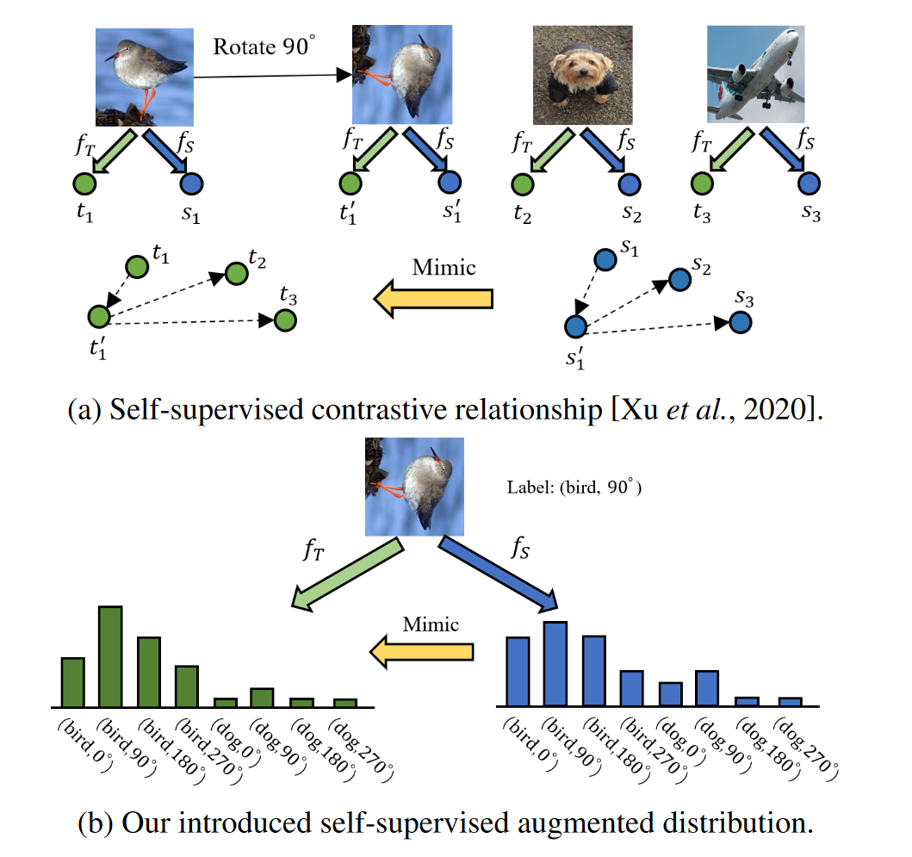
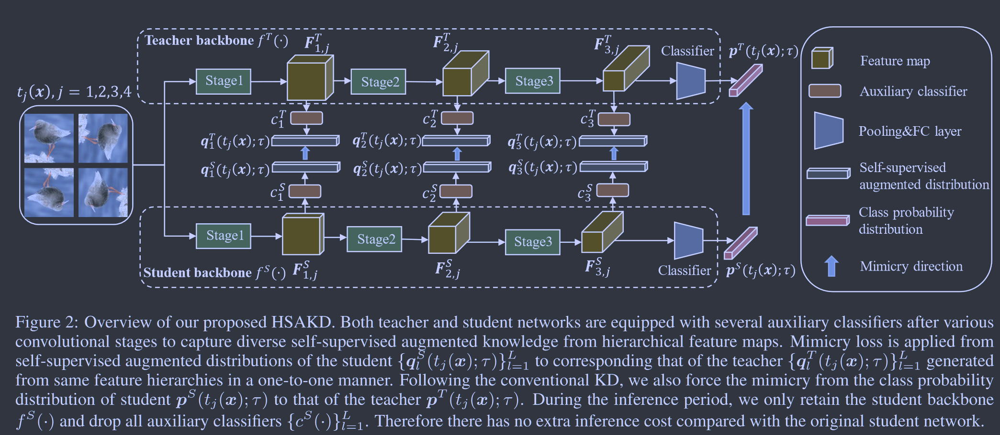

# Hierarchical Self-supervised Augmented Knowledge Distillation

**[IJCAI 2021](https://arxiv.org/abs/2107.13715)	[code in github](https://github.com/winycg/HSAKD)	CIFAR100  ImageNet	20240419**

这项工作认为基于对比学习的蒸馏会损害模型对原任务表征的学习性能，将先前工作提出的用于自蒸馏的联合标签分布增强应用到蒸馏中，并提出一个分组机制将教师模型在增强数据的联合分布输出教授给学生模型。

***2020PMLR Self-supervised Label Augmentation via Input Transformations***

## Introduction

最近的自监督对比知识取得了不错的效果，但强迫网络学习此类知识可能会损害原始类别识别任务的表征学习性能，因此我们采用一种代替自监督增强的任务来引导网络学习原本的任务和自监督辅助任务的联合分布。

> 引入一种自监督增强分布，将原始分类任务和辅助自监督任务的知识结合起来用于蒸馏
>
> 通过架构辅助分类器，提出一个一对一概率知识蒸馏框架，促进了全面的知识转移，并缓解了较大架构差距时语义不匹配的问题

## Method

### Self-supervised Augmented Distribution

给定一个输入样本$x\in \mathcal{X}, \mathcal{X}$是一个训练集。$z = \Phi(x;\mu) \in \R^d$为提取的特征向量，给定一个N类别的标签空间$\mathcal{N} = \{ 1, ..., N\}$，预测分布$p(x;\tau) = \sigma(g(z;w)/\tau) \in \R^N, w\in\R^{N\times d}$。

我们引入一个额外的自监督任务来增强传统监督对象的类别空间，学习这样的联合分布可以迫使网络同时从原始和辅助的自监督任务中收益来产生更多有意义的预测。定义M个图像变换$\{t_j\}^M_{j=1}$标签空间为$\mathcal{M} = \{ 1, ..., M\}$，我们将原任务与增强后的复合为一个统一的任务，标签空间为$\mathcal{K} = \mathcal{N} \otimes \mathcal{M},\otimes$表示笛卡尔积，|K| = N*M。

给定一个变换后的样本$\tilde{x}\in \{ t_j(x)\}^M_{j=1}$，$\tilde{z} = \Phi(\tilde{x};\mu) \in \R^d$为提取的特征向量，$q(\tilde{x};\tau) = \sigma(g(\tilde{z};w)/\tau) \in \R^{N*M}, w\in\R^{(N*M)\times d}$，$p\in\R^N, q\in\R^{N*M}$分别表示原始类概率分布和自监督增强的概率分布。

### Auxiliary Architecture Design

假设一个网络包括L个阶段，在每个阶段之后附加一个辅助分类器，来产生L个分类器$\{ c_l(·)\}^L_{l=1}$，cl(·)由卷积块、全局平均池化层和全连接层组成，第l层抽取的特征表示为$F_l$，在K上的联合分布$q(t_j(x);\tau) = \sigma(c_l(F_l)/\tau) \in \R^{N*M}$

### Training the Teacher Network

$$
\mathcal{L}^T_{ce\_SAD} = \frac{1}{M}\sum^M_{j=1}\sum^L_{l=1}\mathcal{L}_{ce}(q^T_l(t_j(x);\tau), k_j)
$$

kj表示联合空间中tj(x)的增强标签。
$$
\mathcal{L}_T = \mathbb{E}_{x\in\mathcal{X}}[\mathcal{L}_{ce}(p^T(x;\tau)) + \mathcal{L}^T_{ce\_SAD}  ]
$$
第一项是用于学习原始数据的交叉熵损失，第二项来学习增强后的知识，有助于获得更丰富的蒸馏知识。

### Training the Student Network

我们发现使用增强的标签来指导学生网络学习会损害网络性能，所以任务损失为：
$$
\mathcal{L}_{task} = \mathcal{L}_{ce}(p^S(x;\tau), y)
$$
然后引入师生模型之间关于原始数据和增强数据的模仿损失：
$$
\mathcal{L}_{kl\_p} = \frac{1}{M}\sum^M_{j=1}\tau^2D_{KL}(p^T((x;\tau) || p^S(x;\tau)) \\
\mathcal{L}_{kl\_q} = \frac{1}{M}\sum^M_{j=1}\sum^L_{l=1}\tau^2D_{KL}(q^T(t_j(x);\tau) || q^S(t_j(x);\tau)) \\
$$
总体损失表示为：
$$
\mathcal{S} = \mathbb{E}_{x \in \mathcal{X}}[\mathcal{L}_{task} + \mathcal{L}_{kl\_p} + \mathcal{L}_{kl\_q}]
$$
