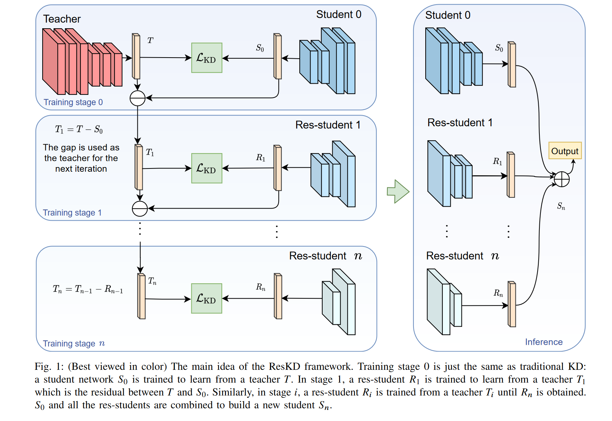
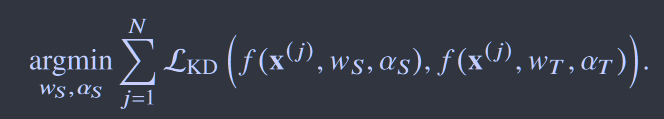
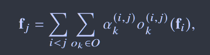
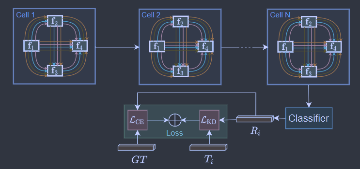
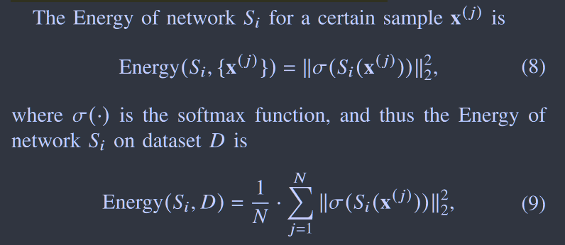
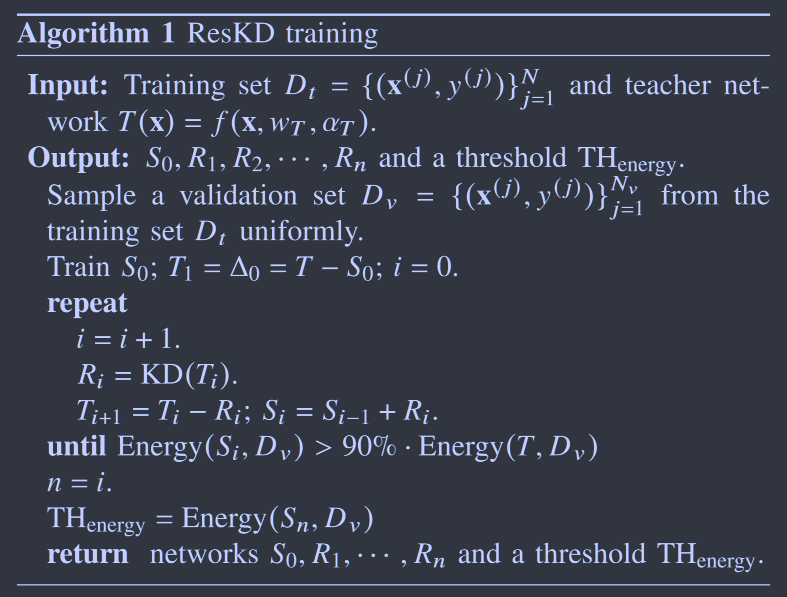
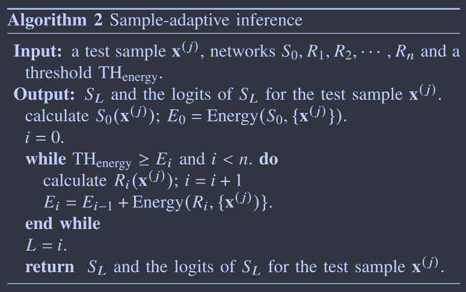

# ResKD: Residual-Guided Knowledge Distillation

[IEEE Transactions on Image Processing 2021](https://ieeexplore.ieee.org/abstract/document/9382121) 	**no code**

这项工作利用了ResNet的思想，认为师生模型之间的差距可以被视为知识来指导模型的学习，提出了一种残差引导的学习方法，使用一系列的残差学生模型来弥合师生模型之间的差距，残差学生模型由NAS搜索得到合适的结构，并且提出了一种能量熵来衡量模型之间的差异用于停止训练，最后在推理阶段提出一个自适应推理，根据不同难易程度的样本集成适量的残差学生网络来进行更快的推理。

## Introduction

**我们认为教师和学生模型之间的差异可以被视为知识来进行指导模型的学习**

在这项工作中我们首先利用教师网络训练一个学生网络$S_0$，然后训练一个更轻量级的网络，叫做res-student $R_1$ ，来学习师生模型之间的差异；$S_0$和$R_1$一起组成新的学生模型$S_1$，然后在学习一个更轻量的网络$R_2$，$S_1$与$R_2$构成$S_2$，一直重复这一过程得到学生模型$S_n$.

对于不同的样本，有的样本在$S_1$甚至是$S_0$上就有很高的置信度，因此在推理阶段引入样本适应策略，对于每个样本，如果$S_i$的置信度足够高，则截断不必要的res-student来节约成本

> 我们设计一种残差引导学习方法，该方法使用一系列残差学生来弥合学生网络和教师网络之间的差距
>
> 我们在推理时引入样本自适应策略，使我们框架能够适应不同的样本，从而节省额外res-student网络的开销
>
> 我们在不同数据集上评估我们的方法，并进行详细的实验来展示框架每个部分的重要性

## Method

教师模型为T，通过传统的蒸馏方法得到学生模型$S_0$，两者之间的差异通过$\Delta_0=T-S_0$来衡量，将$\Delta_0$视为新的老师来指导$R_1$学习，新的学生$S_1$则定义为$S_1=S_0+R_1$，重复该过程至达到某种停止条件，学生模型$S_n$定义如下
$$
S_n = S_0 + \sum_{i=1}^{n}R_i
$$
其中res-student的结构通过NAS搜索得到，$\alpha_s$为搜索参数

特征图$f_j$计算如下：$\alpha_k^{(i, j)}$为进行NAS操作$o_k^{(i,j)}$的权重

搜索算法来自于STACNAS

### 停止条件

定义一个能量概念来衡量老师和学生之间的差异：

当模型$S_i$的能量达到教师模型相当的水平时即可停止残差的学习。

### 样本自适应推理

当我们完成残差引导的学习过程，我们有$S_n = S_0 + \sum_{i=1}^{n}R_i$，$\Delta_{i-1}$表示$S_i$与T之间的差异，对于每个样本，有的样本容易识别，$\Delta_0$可能很小，有的样本困难，$\Delta_2$可能相当大，我们计算一个阈值来判断推理时i的取值：
$$
TH_{energy0} = Energy(S_n, D_v)
$$
当对于某个样本，$Energy(S_i, \{x^{(j)}\}) > TH_{energy}$，则抛弃掉剩余的残差网络，从而减少开销。

