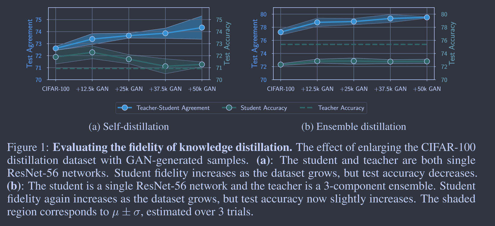
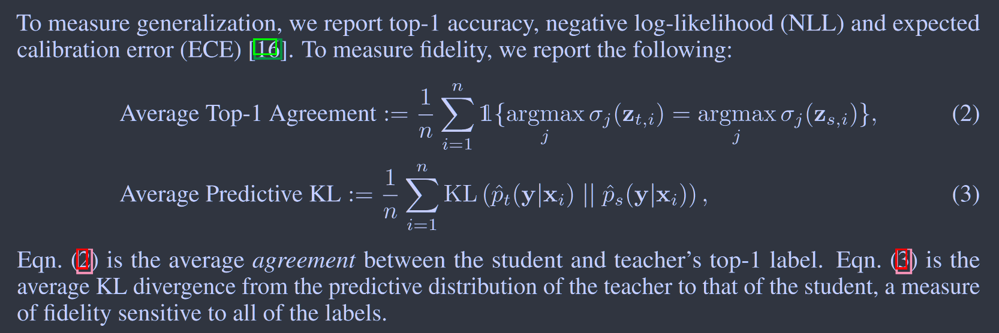
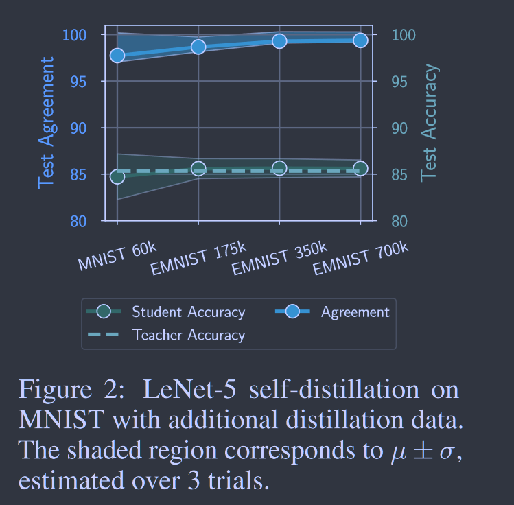
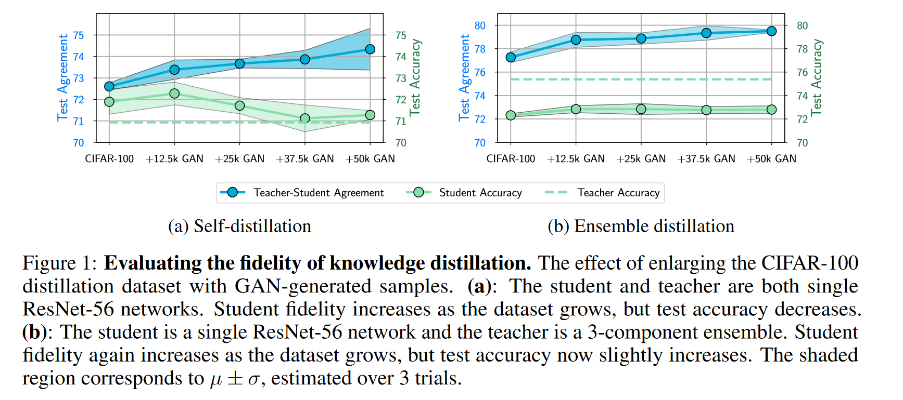
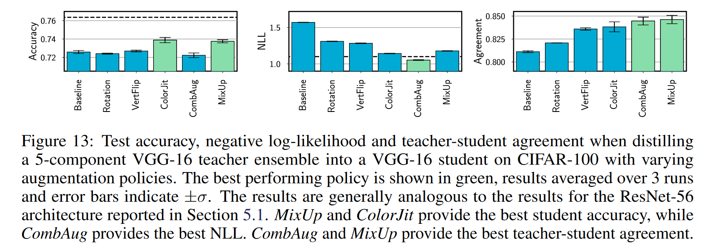
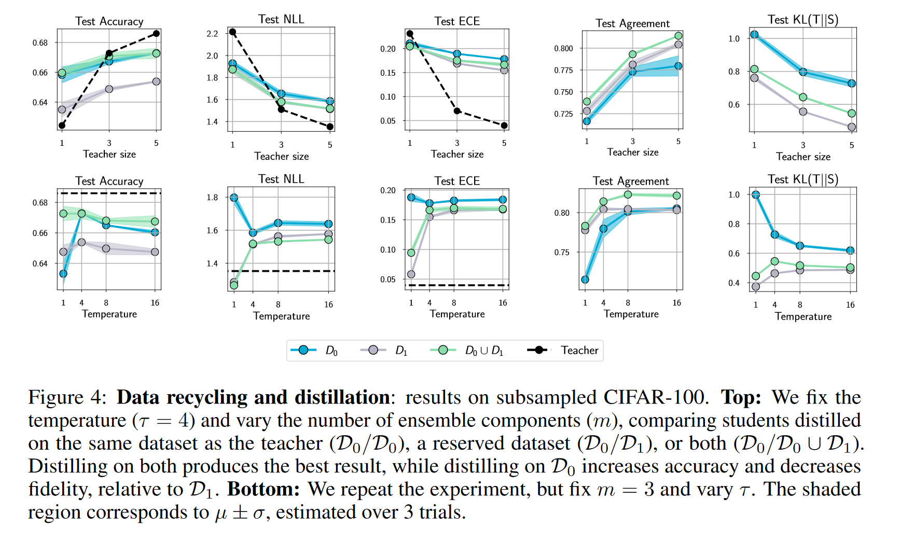
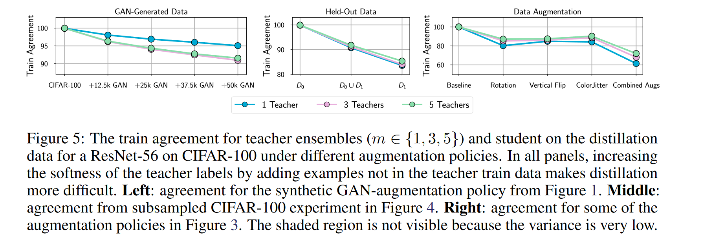
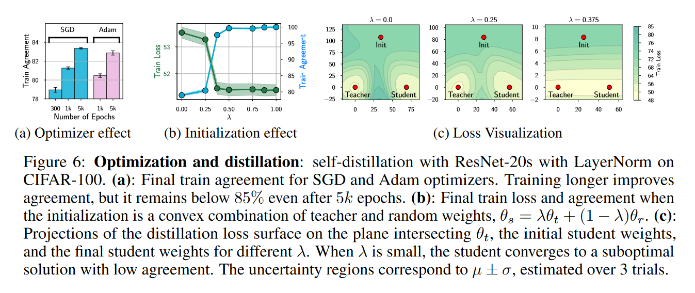

# Does Knowledge Distillation Really Work?

**[NeurIPS 2021](https://proceedings.neurips.cc/paper_files/paper/2021/hash/376c6b9ff3bedbbea56751a84fffc10c-Abstract.html)	[code in github](https://github.com/samuelstanton/gnosis)	CIFAR100 ImageNet	20240419**

*Samuel Stanton, Pavel Izmailov, Polina Kirichenko, Alexander A. Alemi, Andrew G. Wilson*

这项工作通过大量实验来探讨蒸馏效果不佳的原因，对可能的原因逐一实验排查，最终发现是由于优化方法限制了模型的收敛，在最后总结了本文的实验发现。

**启发：**结合近期工作发现，有少量工作致力于优化方法的研究，这可能是一个契机

## Introduction

我们将讨论师生模型的匹配度和泛化能力，匹配度表示学生匹配教师预测的能力，泛化表示学生在预测未知分布数据方面的表现，我们的实验证明要获得良好的匹配度的学生模型是非常困难的。

*Does knowldge distillation really work?*

- yes 他经常可以提高学生的泛化能力
- no 知识蒸馏往往不能名副其实，只能将很有限的知识从教师传给学生

## Knowledge Distillation Transfers Knowledge Poorly

### When is knowlegde transfer successful?

首先使用LeNet5在Mnist上做了简单的实验，实验表明当数据足够多时学生可以做出与教师相同的预测

然后提高实验难度，转移到CIFAR100和ResNet56上，并通过GAN来扩充数据集，与在Mnist上一致，随着蒸馏数据集的扩大，师生模型的匹配度会增大，但改进是有限的，远远没有达到接近99%的一致性。

随着数据集增长，学生的准确性会接近教师的准确性；不同的是当数据集较小时，学生准确性会高于教师准确性，提高师生模型的匹配度会降低学生的泛化性。

### What can self-distillation tell us about knowledge distillation in general?

根据2018PMLR BANs的说法，通过自蒸馏学生能超越老师的表现，这个结果只有在蒸馏失败的情况下才有可能，因为如果学生与教师完美匹配，那么学生就不可能超越老师。

我们从自蒸馏转向聚合蒸馏，师生模型的匹配度与泛化性正相关，但引入GAN生成的更多数据之后师生模型仍有较大的差距。

### If distillation already improves generalization, why care about fidelity?

我们的实验结果表明。提高师生的匹配程度是缩小师生之间泛化差异最直接的方法，即使只关心学生的准确性，匹配程度也应是自蒸馏要考虑的一个关键因素。

知识蒸馏这个名字意味着我们正在将知识从学生转移到学生身上，正是由于这恶鬼原因，KD经常将提高泛化能力与提高师生模型之间的匹配度混为一谈，明确这两个概念是理解KD如何工作以及如何提高的基础。

### Possible causes of low distillation fidelity

如果我们能在训练集上让师生模型相匹配，那么我们希望在测试机上也能匹配，CIFAR100失败的原因可能是：

- **学生能力**  即使在自蒸馏环境中，匹配程度也很低，因此我们可以排除学生容量作为主要的原因，且我们补充实验证明了增加学生容量对集成蒸馏的师生模型匹配程度影响很小
- **网络架构**  低匹配度可能与resnet架构有关，我们通过在VGG上进行实验，其匹配度也很低，排除了网络架构这一原因

- **数据集规模和复杂程度**  我们在ImageNet上进行了实验，证实了与数据集有关
- **数据域**  我们实验发现，在文本分类任务中，蒸馏的匹配度较低，因此匹配度也与数据域相关
- **可识别性**  匹配训练数据集上的教师预测并不会导致匹配测试数据集上的预测
- **优化问题**  我们无法很好的解决蒸馏优化的问题，学生不会再测试集上匹配老师可能是因为其再训练集上就不匹配

## Identifiability: Are We Using the Right Distillation Dataset?

### Should we do more data augmentation?

如果说可识别性差是导致匹配度低的主要原因，则蒸馏中使用更广泛的数据增强策略应该可以提高匹配度。

在实践中，数据增强不仅是提高可识别性，它还具有正则化效应，这使得优化变得更具有挑战性。数据增强确实可以提高匹配度，但这种带来的好处很小，大量的数据增强手段只能带来微小的匹配度提升。因此这不是造成匹配度差的主要原因。

### The data recycling hypothesis

若简单地给学生更多的标签没有显著的提升可能是没有给学生提供正确的标签，蒸馏过程中的额外数据增强确实给学生更多的教师标签来匹配，但也引入了教师的训练图像和学生蒸馏图像之间的分布偏移，即使是使用相同的增强策略，使用教师的训练数据进行蒸馏也违背了经验最小化的假设。

我们将cifar100分成两份，D0和D1，使用D0训练教师ResNet56，与学生模型进行比较，学生模型有三种，通过D0蒸馏的S0，通过D1蒸馏的S1，和通过D0和D1蒸馏的S01，学生接触不到真实标签，只有教师提供的标签。

S0获得了比S1更高的测试精度，但表现出更低的匹配度，因此匹配度的提高并没有导致模型很好的复制教师的准确性，因此对于较大的教师来说，匹配程度还不足与提高泛化能力，最好的一致性只有85左右吗，这与之前使用大量数据增强相比没有任何改善。

## Optimization: Does the Student Match the Teacher on Distillation Data?

### More distillation data lowers train agreement

在对利用GAN生成图像进行增强时，在测试集上一致性有所提高，但在训练数据集上，随着数据集的变大，一致性在下降。在使用更广泛更强的数据增强时，这种下降更明显。这表明使用大量增强或合成数据时，即使在训练数据集上，优化方法也无法实现高的一致性。

最优化问题破坏了蒸馏，要想找到一个在所有输入上都与老师匹配的学生，首先要找到一个在所有训练数据集上能够与老师匹配的学生。

值得注意的是，尽管训练一致性低，但在组合增强策略下测试的一致性要优于其他的策略，这一结果凸显了知识蒸馏中的权衡，学生需要许多教师标签与测试中的教师相匹配，但是引入不在教师训练数据中的示例会使得在蒸馏数据上匹配教师非常困难。

### Why is train agreement so low?

我们验证了通过更长时间的训练或是使用不同的优化器无法显著提高蒸馏的一致性，针对更长的训练周期能略微改进一致性，但是将轮次提高到5k也值提高了5%而已，理论上训练更多轮次能达到更高的一致性，但这与我们平日训练300轮次相比消耗了太多的资源。

我们还发现，如果学生在远离教师模型的位置初始化，优化器会收敛到蒸馏损失的次优值，产生一个与教师不一致的学生，而在初始化于教师靠拢的途中，有一个临界值，学生会收敛到接近100的一致性。

## Key Points

- 良好的学生准确性并不意味着良好的蒸馏一致性，泛化性最好的模型并不总是具有最好的一致性
- 在蒸馏集成模型时，学生的准确度与校准性存在相关性：尽管最高准确度的学生不一定是最准确的，但它始终是校准性最好的。
- 优化在蒸馏中具有挑战性，尽管学生有足够的能力在训练数据上相匹配，但由于优化方法的缺陷也无法做到这一点
- 优化的复杂性和蒸馏数据质量中间有一个权衡，将蒸馏数据集扩大到训练数据集之外，能使学生更容易确定正确的解决方案，但也会是原本就难以优化的问题变得更难以优化

