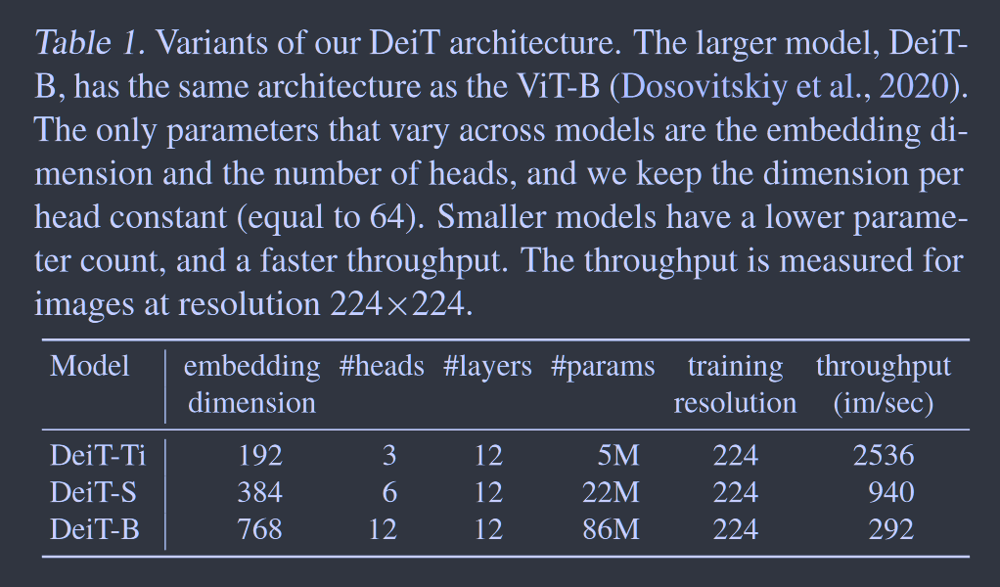
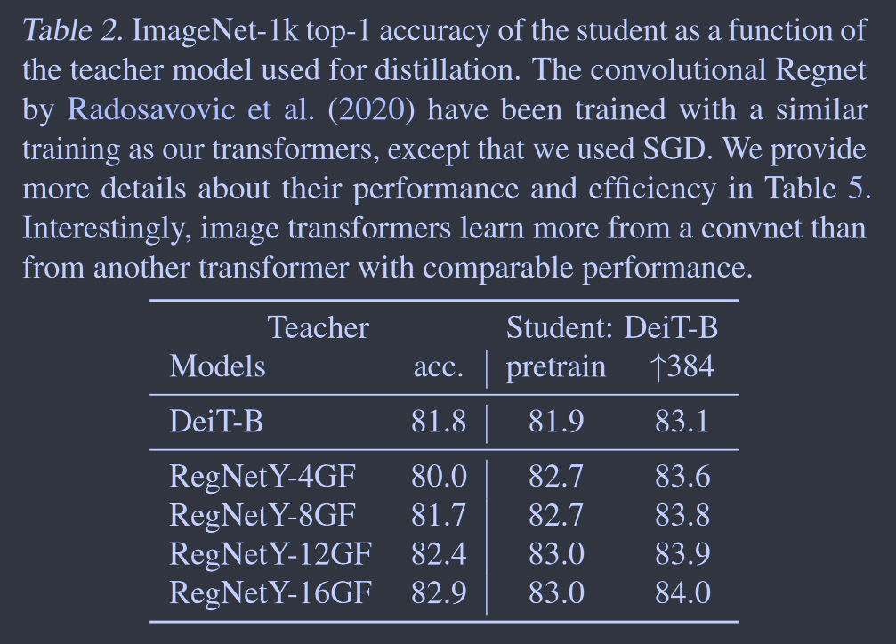
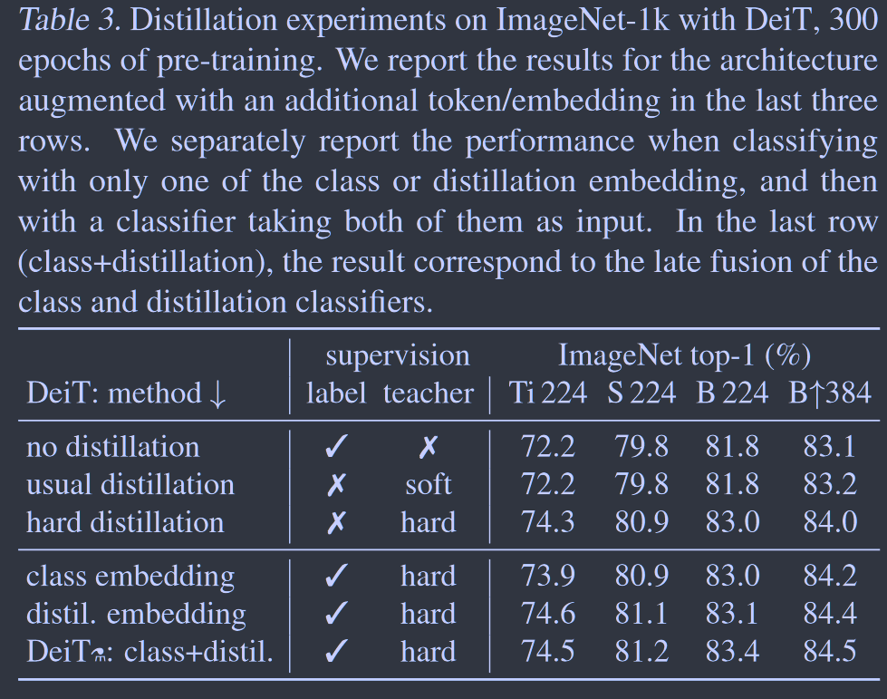

# Train Data-Efficient Image Transformers & Distillation Through Attention

**[NeurIPS 2021](https://proceedings.mlr.press/v139/touvron21a)	[code in github](https://github.com/facebookresearch/deit)	ImageNet  CIFAR10/100  Oxford102Flower  StanfordCARs iNaturalist-18/19	20240426**

*Hugo Touvron, Matthieu Cord, Matthijs Douze, Francisco Massa, Alexandre Sablayrolles, Herve Jegou* 

ViT提出时认为在没有大规模数据的情况下模型的训练不能很好的泛化，这项工作提出了一项解决方案，在一台8卡机上在仅使用ImageNet的情况下训练了53小时获得了非常具有竞争力的效果，通过蒸馏技术，在ViT上添加了一个蒸馏token用于接收来自卷积教师的知识，cls token 和 distill token 都经过softmax分类器后做损失，并且还提出一种新的蒸馏策略，称之为硬蒸馏，使用教师预测置信度最大值作为硬标签来进行蒸馏。

## Introduction 

ViT得出的结论是在数据量不足的情况下进行训练不能很好的泛化，训练涉及到大量的计算资源，我们在53小时+20小时可选的微调训练了ViT仅使用了一台八卡机，且仅使用ImageNet作为训练集。并且我们还提出一种蒸馏token，取代了先前关于ViT的蒸馏方法。

> 我们的神经网络不包含卷积层，可以在没有外部数据的情况下在ImageNet上最新的技术相比取得具有竞争力的结果。
>
> 引入基于蒸馏token的蒸馏框架，与类别token起到相同的作用但他旨在用于与教师模型交互。这种专用的蒸馏策略明显优于常规的蒸馏
>
> 我们能转移到不同的下游任务并取得具有竞争力的结果

## Method

假设我们由强大的图像分类器作为教师模型，其可以为卷积网络也可以是分类器的混合体，我们解决了如何通过这位老师来学习Transformer的问题，主要包括：硬蒸馏 vs 软蒸馏 和 经典蒸馏 vs token蒸馏

### Soft Distillation

$Z_t, Z_s$表示教师和学生模型的logits，$\tau$表示蒸馏的温度系数，$\psi$表示softmax函数：
$$
\mathcal{L}_{global} = (1-\lambda)\mathcal{L}_{CE}(\psi(Z_s), y) + \lambda\tau^2KL(\psi(Z_s/\tau), \psi(Z_t/\tau))
$$

### Hard-label Distillation

我们引入一种蒸馏的变体，将老师的输出置信度最大值作为硬标签。$y_t = argmax_cZ_t(c)$：
$$
\mathcal{L}_{global}^{hardDistill} = \frac{1}{2}\mathcal{L}_{CE}(\psi(Z_s), y) + \frac{1}{2}\mathcal{L}_{CE}(\psi(Z_s), y_t)
$$
对于给定的图像，与教师关联的硬标签可能会根据特定的数据增强而变化，这种选择比传统选择更好，且没有额外的参数，教师预测yt与真实标签y起到相同的作用。

### Label Smoothing

硬标签也可以转换为具有标签平滑的软标签，其中真实标签被认为具有$1-\epsilon$的概率，其余$\epsilon$在其余类别之间共享，我们固定$\epsilon=0.1$，值得注意的是我们只平滑真实标签而不会平滑教师提供的伪标签（例如硬蒸馏中的教师标签）

### Distillation Token

上图是我们提出的方法架构，我们添加了一个新的token，称为蒸馏token，其与其他token类似，通过自注意力与其他token进行交互，在最后一层由网络输出，通过蒸馏损失指导学习。

蒸馏token允许我们从教师的输出中学习。

### Fine-Tuning with Distillation

我们在更高分辨率的微调阶段同时使用真实标签和教师预测标签，使用具有相同分辨率的教师，通过***2019NeruIPS Touvron***等人提出的方法进行分辨率的对齐

### Classification with Our Approach: Joint Classifiers

测试时，Transformer产生的类别特征或蒸馏特征都与线性分类器相关联，我们添加两个分类器的softmax输出来进行预测。

## Experiment & Discussion

我们发现使用卷积教师比使用Transformer能产生更好的性能，且使用硬蒸馏效果明显好于软蒸馏

我们观察到分类token和蒸馏token分别收敛到不同的向量，且他们相似性较低，这说明蒸馏token确实给我们的模型带来了一些新的东西。