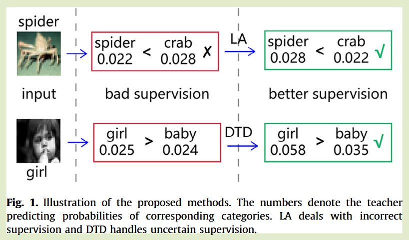
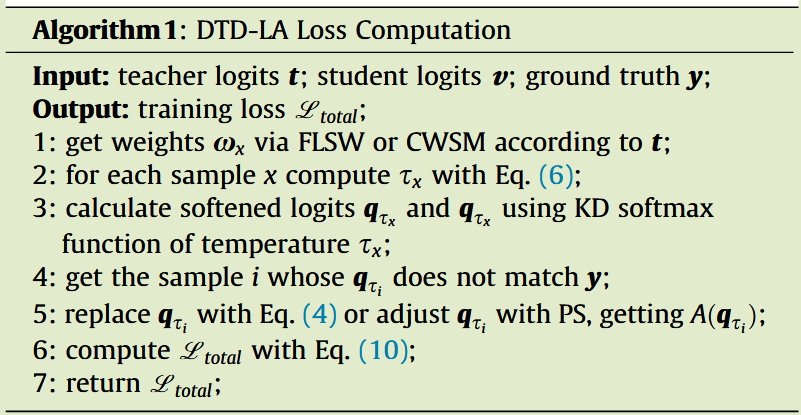

# Preparing lessons: Improve knowledge distillation with better supervision

[Neurocomputing 2021](https://www.sciencedirect.com/science/article/pii/S0925231221006603)	code	CIFAR CINIC-10 TinyImageNet	20240905

*Tiancheng Wen  Shenqi Lai  Xueming Qian*

针对先前Logits蒸馏方法，没有考虑教师错误预测和不确定预测的影响，这些知识会对学生模型造成误导，本文提出通过概率位移，交换错误预测和真实类别的Logits值来矫正错误预测，通过动态温度蒸馏，给出两种动态温度计算方法来缓解不确定预测的影响，从而得到性能更好的学生模型。

## Introduction

虽然教师模型在特定任务上表现良好，但**仍存在不正确或不确定的预测**，用这些知识去作为监督，可能会**导致学生模型在某些样本上表现不佳**。

先前工作很少关注这一问题，添加真实标签的交叉熵损失或使用教师集成能在一定程度缓解这种问题，但这不是从源头解决问题的方法。

本文为了获得更好的监督效果，提出两种简单通用的策略，**Logits调整LA和动态温度蒸馏DTD**，两者分别处理错误预测和不确定预测。

- 研究发现学生模型的错误近一半与教师模型的错误有关
- Logits Adjust 处理教师模型的错误预测，交换真实标签和误判标签的logit值，为学生模型生成完全正确的监督
- 提出动态温度蒸馏，以避免来自教师模型的过度不确定监督

## Method

### Genetic errors and logits adjustment

我们用**遗传错误表示学生的错误是由于教师的预测错误导致的**，当教师犯错时，学生自己很难改正错误，从而出现遗传错误。

**我们提出LA，试图修正教师的预测**，对教师软标签应用函数A()来修正，交叉熵损失函数：
$$
L_{LA} = \tau^2 H(A(q_\tau), p_\tau)
$$

其中$q_\tau,p_\tau$分别为教师和学生模型的预测输出，A()修正不正确的$q_\tau$，对正确的$q_\tau$不做处理。为了训练的稳定性只做尽可能小的修改。

我们不用KL散度而用交叉熵来优化对象，并且不需要使用真实标签y，因为$A(q_\tau)$是完全正确的。

**标签平滑是实现LA最简单的方案，**$l = \delta(k)$表示为样本k的真是标签分布的脉冲信号，LSR标签平滑表示为：
$$
l' = (1-\epsilon)\delta(k) + \epsilon/K
$$
K为类别数量。但是这种方案打破了教师logits的一般分布。

因此我们提出了另一种简单的方案，**称之为概率移位PS**，给定一个不正确的软目标，我们**简单的将真值和预测值互换**，以保证在真值标签处取得最大值。

与标签平滑LSR相比，PS保留了微小概率所涉及的范畴间差异，并且错误预测的类往往包含一些与真实类别相似的特征，比其他类别包含更多的信息。

### Dynamic temperature distillation

过度不确定的教师预测也会影响学生的表现，我们从**软标签和温度的角度分析该问题**，提出了一种动态温度蒸馏的方法，基本思想是让**温度系数在训练样本上变化，对于易混淆的样本，温度系数应当取较小的值**。易于区分的样本，更大的温度系数有利于利用类的分类信息：
$$
L_{DTD} = \alpha\tau^2_xKL(q_{\tau_x}, p_{\tau_x}) + (1-\alpha)H(y, p_{\tau_x = 1})
$$
$\tau_x$为样本温度系数：
$$
\tau_x = \tau_0 - w_x\beta
$$
易混淆的样本会获得更大的权重而得到更低的温度，从而更关注于易混淆样本，这也可以看做是难例挖掘。

我们**用师生模型的logits相似性来衡量样本学习难度**，因此有：
$$
w_x= (1-v\cdot t)^2
$$
当师生logits相似性较低时，vt值较大，对应的wx也更大，最终的温度系数较小。

**还可以用学生模型样本Logits的最大值来计算权重**：
$$
w_x= \frac{1}{v_{max}}
$$
当样本最大logits值置信度较低时说明样本易于混淆，此时wx值更大，对应温度更低。

### Compound loss function and algorithm

$$
L_{total} = \tau^2_xKL(A(q_{\tau_x}), p_{\tau_x})
$$

A()来修正错误预测，动态温度$\tau_x$来缓解易混淆样本的影响

