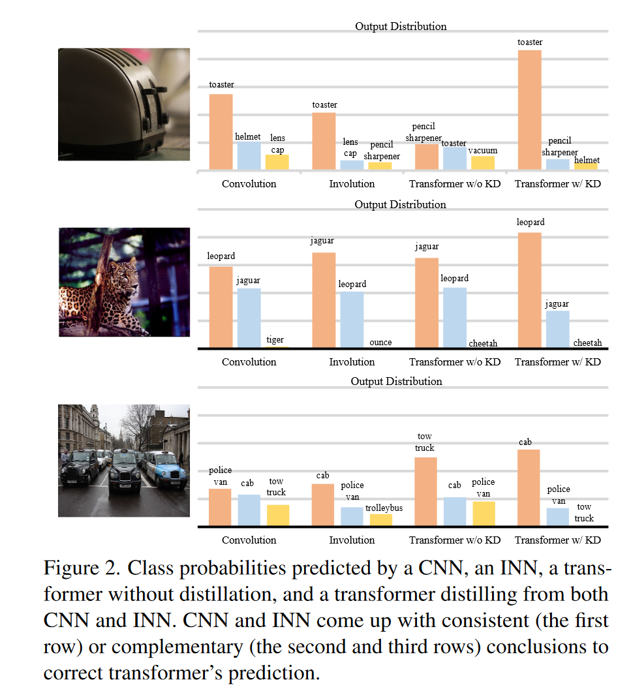
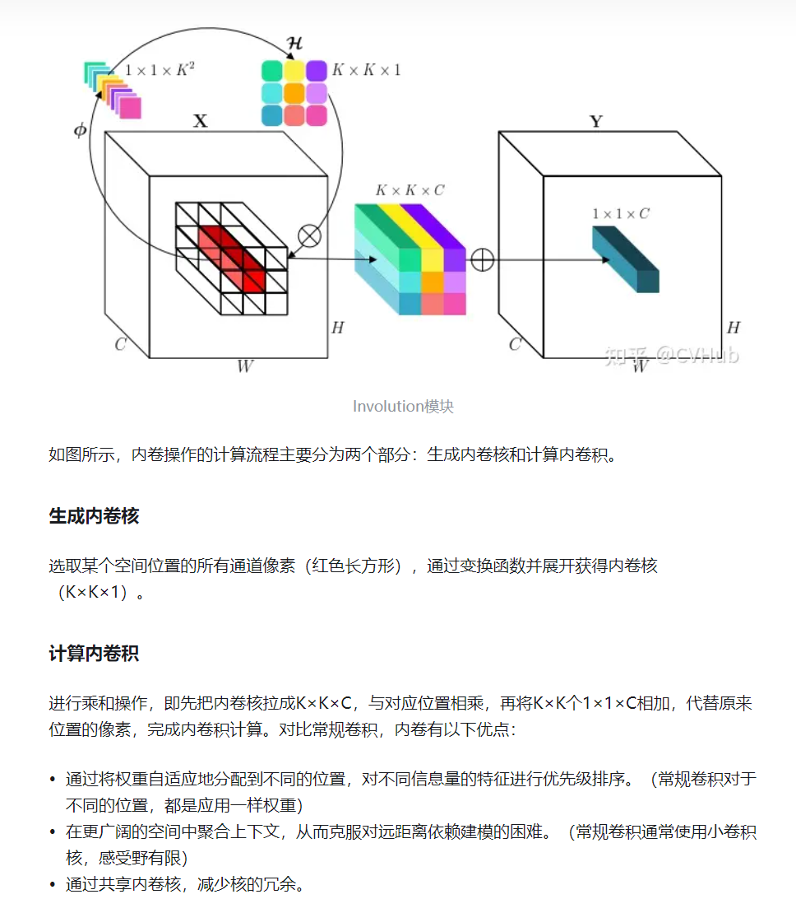
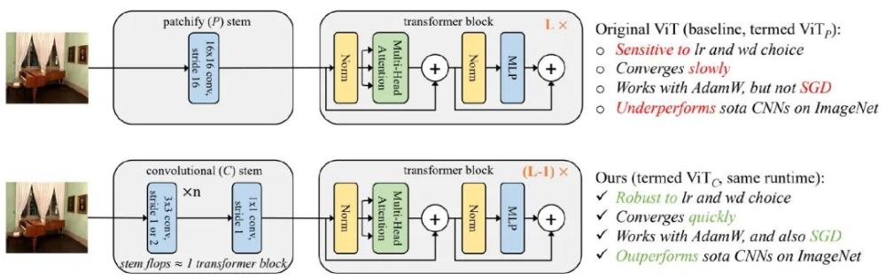
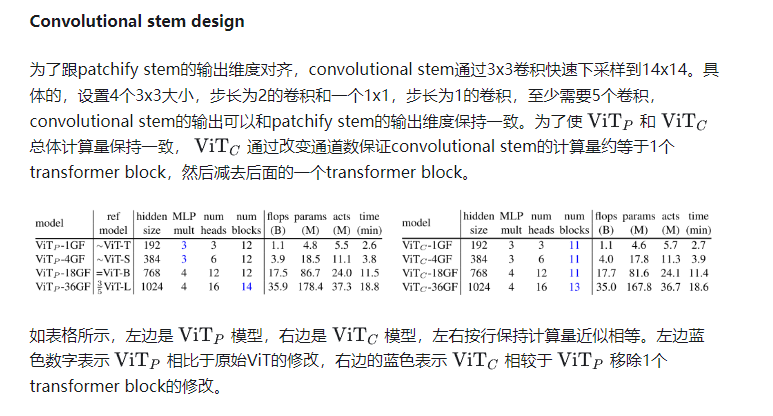
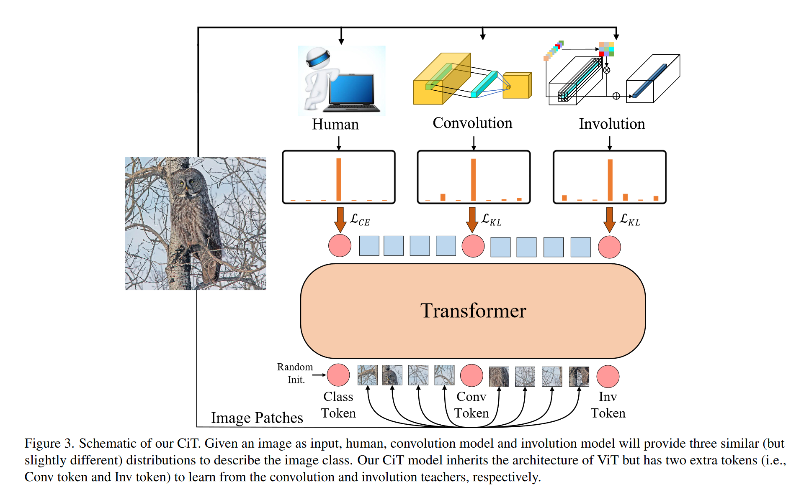
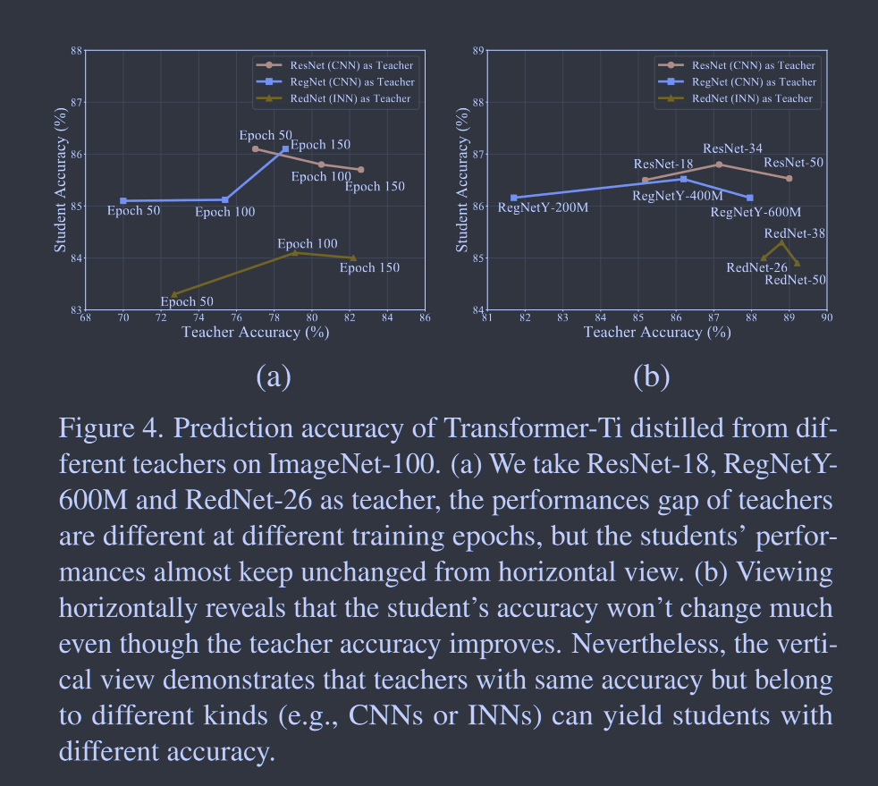
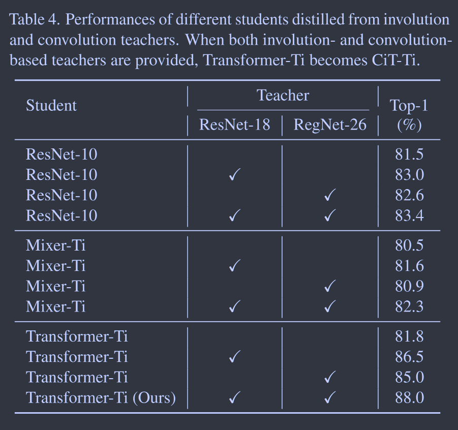
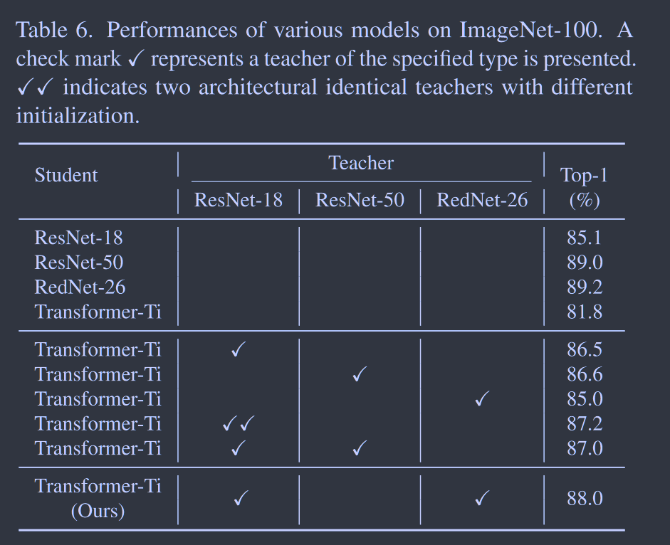

# Co-advise: Cross Inductive Bias Distillation

**[CVPR 2022](https://openaccess.thecvf.com/content/CVPR2022/html/Ren_Co-Advise_Cross_Inductive_Bias_Distillation_CVPR_2022_paper.html)	[code in github](https://github.com/OliverRensu/co-advise)	ImageNet  ImageNet-out	20240426**

*Sucheng Ren, Zhengqi Gao, Tianyu Hua, Zihui Xue, Yonglong Tian, Shengfeng He, Hang Zhao*

这项工作是对2021NeurIPS DeiT的改进，这项工作认为不同的教师模型具有不同的归纳偏差，而归纳偏差的影响要比一个模型的准确率更为关键，具有不同归纳偏差的教师网络可以从不同的视角看同一数据，因此这项工作引入卷积网络和内卷网络分别对ViT进行蒸馏，并在vit中添加卷积token和内卷token用来接收教师的知识，最终通过两个蒸馏损失和交叉熵损失来共同优化。

**介绍了内卷积INN 以及ViTal的stem结构**

## Introduction

这项工作研究了归纳偏差对知识蒸馏的影响， 使用不同归纳偏差设计的模型倾向于关注不同的模式，而具有不同归纳偏差的教师尽管在统一数据集上接收训练仍能获得不同的知识。先前工作DeiT[***2021NeurIPS***]给出了通过蒸馏技术来帮助ViT的训练。但其也有局限性，训练好的Transformer受教师的CNN归纳偏差影响过大，DeiT要求教师模型非常大，且提出的类别token和蒸馏token有着不同的目标但是公用同一套初始化。

因此我们认为一个高准确率的复杂模型并不能有效的教授一个好的学生Transformer，我们认为不同归纳偏差的教师能帮助数据做出互补的假设，从不同角度观察数据来获得不同的知识，提供了更精确、互补和全面的数据描述。因此我们引入了卷积网络和内卷网络作为教师分别对齐进行蒸馏。

> 教师模型的归纳偏差比准确性更重要
>
> 具有不同归纳偏差的CNN和INN倾向于学习互补的模式，ViT具有较少归纳偏差的一般模式可以从两者中学习知识
>
> 提供若干不同归纳偏差的教师，具有较小归纳偏差的学生更适合学习各种知识
>
> 知识蒸馏是学生Transformer的表现更类似于各种归纳偏差的教师

## Method

DeiT中教师是一个基于卷积的单一架构，受到教师知识的限制，一种想法是将多个具有不同初始化的教师组合在一起，然而那些具有相同架构的教师具有相同的归纳偏差，提供了相似的数据视角。

当教师具有不同的归纳偏差时，输出分布可能会有明显的差异，因为不同的归纳变差本质上使模型偏向于不同的模式，我们研究卷积结构ResNet和内卷积结构RedNet，其ImageNet上分类精度相似，但在分布外的ImageNet（添加各种扰动，如自然对抗、于一转换、图像损坏等）其性能表现不同。

这种显现表明，卷积和内卷结构可能关注不同的模式，将给学生模型带来不同的知识，交叉归纳偏差教师提供的知识可以更精确，更全面的描述数据。

Involution补充知识：

### Token Inductive Bias Alignment

先前工作使用随机初始化的标记来学习标签并从CNN老师那里提炼知识，然而随机初始化的标记在学习具有非常特定归纳偏差的卷积教师具有局限性，因此我们提出token归纳偏差对齐，使token明确具有不同的归纳偏差以便向相应的老师靠近。

我们由三类教师：类别教师、卷积token教师和内卷token教师，对于类别token，应用阶段的高斯初始化，这使得该token没有归纳偏差，为了在剩下两种token中引入相应的归纳偏差，我们将token生成和patch embedding结合起来，以前的方法是将图像切块通过先行投影将这些块投射到token中，我们引入卷积(convolution stem)和内卷(involution stem)来替代线性投影**（token对齐）**。

> stem 将ViT中Transformer之前的模块视为stem，原始ViT为线性投射层通常称为patchify stem，CNN堆叠卷积形式称为Convolutional stem
>
> 
>
> 

### Cross Inductive Bias Distillation

我们的损失目标是两个KL散度和一个交叉熵：
$$
\mathcal{L} = \lambda_0\mathcal{L}_{CE}(\sigma(z_{s_{class}}), y) + \lambda_1\tau^2_1\mathcal{L}_{KL}[\sigma(\frac{z_{s_{conv}}}{\tau_1}), \sigma(\frac{z_{t_1}}{\tau_1})] + \lambda_2\tau^2_2\mathcal{L}_{KL}[\sigma(\frac{z_{s_{inv}}}{\tau_2}), \sigma(\frac{z_{t_2}}{\tau_2})]
$$
$z_{s_{class}}, z_{s_{conv}}, z_{s_{inv}}$分别是类别token，卷积token和内卷token的输出

## Experiment & Discussion

仅提供一种教师模型时，会出现精度退化的问题，值得注意的是RegNetY-200M到RegNetY-600M教师模型精度提升了近7%但学生模型并没有什么提升，说明教师模型的精度并不是决定学生性能的关键因素。下组实验体现了多教师模型的归纳偏差的作用。

相似的模型结构只能提供相似的归纳偏差，带来的提升很少

