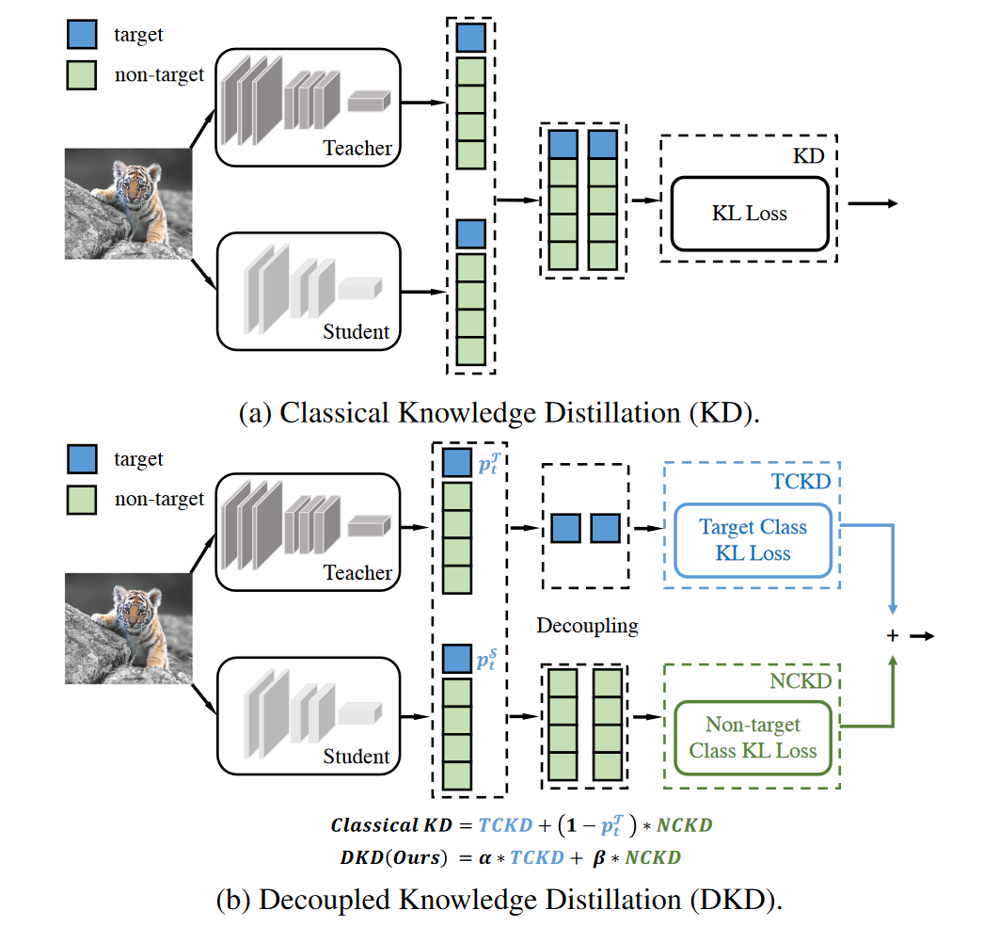

# Decoupled Knowledge Distillation

**[CVPR 2022](https://openaccess.thecvf.com/content/CVPR2022/html/Zhao_Decoupled_Knowledge_Distillation_CVPR_2022_paper.html)	[code in github](https://github.com/megvii-research/mdistiller)	CIFAR100  ImageNet  MS-COCO**

*Borui Zhao, Quan Cui, Renjie Song, Yiyu Qiu, Jiajun Liang*

这项工作从研究关于logit的蒸馏,logit的语义级别高于深度特征,作者认为传统的kd损失在logit蒸馏上效果不佳是因为受到了某些未知因素的抑制,因此这项工作重新审视传统的蒸馏,并将其进行解耦,以破除这种对于性能的限制.

## Introduction 

自从FitNets(2015ICLR)之后，大部分研究注意力都集中在从中间层特征提取知识，与基于logit的方法相比，特征蒸馏更胜一筹，因此对logit的蒸馏的研究几乎没有触及。然而基于特征的方法大部分都需要引入额外的计算和存储来提炼深度特征。

logit蒸馏应当达到与深度特征相当的性能，因为logit的语义级别高于深度特征，我们假设logit蒸馏的能力受到未知因素的限制，导致性能不理想。

我们从深入研究KD的机制来开始这项工作：我们将分类预测分为两个级别，目标类和所有非目标类的二元预测；每个非目标类的多类别预测。基于此我们将经典的KD损失重新标书为两部分，一种是针对目标类的二元logit蒸馏，另一种是针对非目标类的多类别logit蒸馏，我们安静其命名为目标分类知识蒸馏(TCKD)和非目标分类知识蒸馏(NCKD)。

TCKD通过二元logit来转移知识，只提供目标类的预测而非目标类的具体预测是未知的，一种合理的假设是TCKD转移了关于训练样本难度的知识，即描述了每个训练样本的难度；NCKD仅考虑非目标logit之间的知识，我们试验表明仅应用NCKD能够获得与经典KD相当或是更好的结果，这说明非目标logit中包含的知识至关重要。

经典KD是一个高度耦合的方法，这可能是logit蒸馏潜力有限的原因。我们提出解耦知识蒸馏DKD。

> 我们将经典KD分为TCKD和NCKD来研究logit蒸馏,分别分析证明两部分的效果
>
> 我们揭示了由高度耦合的公式引起的蒸馏局限性,将NCKD与教师置信度相结合会抑制知识转移的有效性.TCKD NCKD相耦合限制了平衡两个部件的灵活性
>
> 我们提出DKD来客服这些限制,且还证明DKD具有更高的训练效率和更好的特征转移性

## Method

### Classical KD

对于第t类的样本,分类概率可以表示为$p=[p_1,p_2,...,p_t,...,p_C] \in \R^{1\times C}$,pi表示第i个类的概率,C是类的数量,p中每个元素都可以通过softmax函数获得,zi表示第i个类别的Logit:
$$
p_i=\frac{exp(z_i)}{\sum^C_{j=1}exp(z_j)}
$$
为了区分与目标类别相关和无关的预测,我们定义:$\mathbf{b}=[p_t,p_{\textbackslash t}]\in \R^{1\times2}$表示目标类($p_t$)和所有其他非目标类($p_{\textbackslash t}$)的二元概率:
$$
p_t = \frac{exp(z_t)}{\sum^C_{j=1}exp(z_j)}; \ p_{\textbackslash t}=\frac{\sum^C_{k=1,k\neq t}exp(z_k)}{\sum^C_{j=1}exp(z_j)}
$$
我们令$\widehat{p} = [\widehat{p}_1, ...,\widehat{p}_{t-1},\widehat{p}_{t+1}, \widehat{p}_C] \in \R^{1 \times (C-1)}$来表示非目标类之间的概率,其中:
$$
\widehat{p}_i = \frac{exp(z_i)}{\sum^C_{j=1,j\neq t}exp(z_j)}=\frac{p_i}{p_{\textbackslash t}}
$$
经典KD表示为:
$$
KD = KL(\mathbf{p}^{\mathcal{T}} || \mathbf{p}^{\mathcal{S}}) = p_t^{\mathcal{T}}log(\frac{p_t^{\mathcal{T}}}{p_t^{\mathcal{S}}}) + \sum^C_{i=1,i\neq t} p_i^{\mathcal{T}}log(\frac{p_i^{\mathcal{T}}}{p_i^{\mathcal{S}}})
$$
因此:
$$
KD=p_t^{\mathcal{T}}log(\frac{p_t^{\mathcal{T}}}{p_t^{\mathcal{S}}}) + p_{\textbackslash t}^{\mathcal{T}} \sum^C_{i=1,i\neq t} \widehat{p}_i^{\mathcal{T}} (log\frac{\widehat{p}^{\mathcal{T}}_i}{\widehat{p}^{\mathcal{S}}_i} + log\frac{\widehat{p}^{\mathcal{T}}_{\textbackslash t}}{\widehat{p}^{\mathcal{S}}_{\textbackslash t}})=\underbrace{p_t^{\mathcal{T}}log(\frac{p_t^{\mathcal{T}}}{p_t^{\mathcal{S}}}) + p_{\textbackslash t}^{\mathcal{T}} log\frac{\widehat{p}^{\mathcal{T}}_{\textbackslash t}}{\widehat{p}^{\mathcal{S}}_{\textbackslash t}}}_{KL(\mathbf{b}^{\mathcal{T}}||\mathbf{b}^{\mathcal{S}})} + p_{\textbackslash t}^{\mathcal{T}} \underbrace{\sum^C_{i=1,i\neq t}\widehat{p}_{i}^{\mathcal{T}}log\frac{\widehat{p}^{\mathcal{T}}_i}{\widehat{p}^{\mathcal{S}}_i}}_{KL(\widehat{p}^{\mathcal{T}}||\widehat{p}^{\mathcal{S}})} \\
KD= KL(\mathbf{b}^{\mathcal{T}}||\mathbf{b}^{\mathcal{S}}) + (1-p^\mathcal{T}_t)KL(\widehat{p}^{\mathcal{T}}||\widehat{p}^{\mathcal{S}})
$$
其中$\sum^C_{i=1,i\neq t}p_{i}^{\mathcal{T}} = 1$,$KL(\mathbf{b}^{\mathcal{T}}||\mathbf{b}^{\mathcal{S}})$表示目标类别教师与学生二元概率之间的相似性,因此我们将其命名为目标类知识蒸馏TCKD,$KL(\widehat{p}^{\mathcal{T}}||\widehat{p}^{\mathcal{S}})$表示非目标类别中教师和学生概率之间的相似性,称为非目标类别知识蒸馏NCKD,因此:
$$
KD= TCKD + (1-p^\mathcal{T}_t)NCKD
$$
显然NCKD的权重与$p^\mathcal{T}_t$耦合,这是经典KD的局限性所在.

### Effects of  TCKD and NCKD

TCKD 转移有关训练样本难度的知识.TCKD通过二元分类传递暗知识,例如与$p^\mathcal{T}_t=0.75$的训练样本相比,$p^\mathcal{T}_t=0.99$的样本对学生来说可能更容易学习,当训练样本变得困难时其有效性会显现出来,我们通过施加强数据增强,带噪声的标签和困难数据集上验证了这一点.

NCKD是logit蒸馏起作用但受到极大抑制的重要原因.NCKD的权重与$p^\mathcal{T}_t$耦合,当教师置信度较高时,教师提供的信息应当更可靠更有价值,但是这种高置信度抑制了权重损失,这会限制知识转移的有效性.我们同样通过试验证明了这一猜想.

### Decoupled Knowledge Distillation

TCKD 和 NCKD都是不可或缺的,但是NCKD的权重与$p^\mathcal{T}_t$耦合会限制NCKD的有效性,在经典的KD损失中不允许我们修改每部分的权重来平衡重要性,因此我们提出解耦知识蒸馏,引入两个超参数来平衡TCKD和NCKD的权重:
$$
DKD = \alpha TCKD + \beta NCKD
$$
