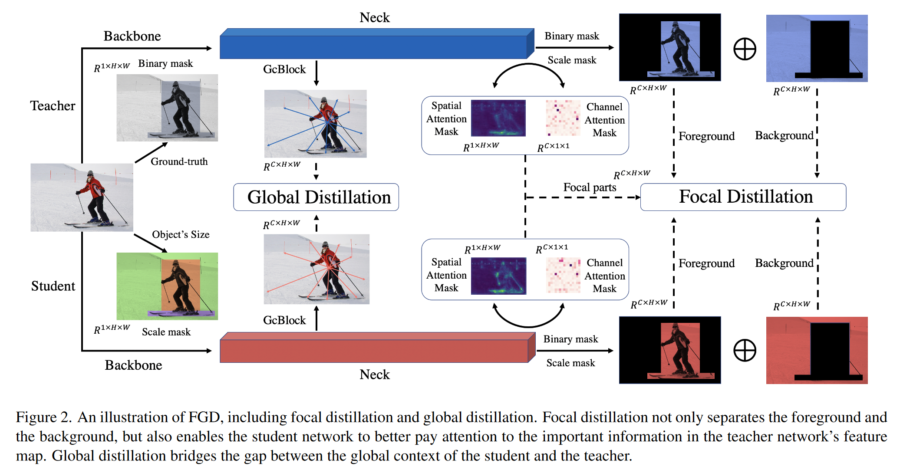
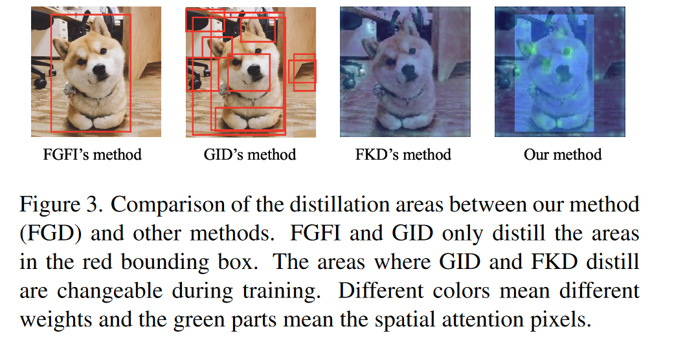
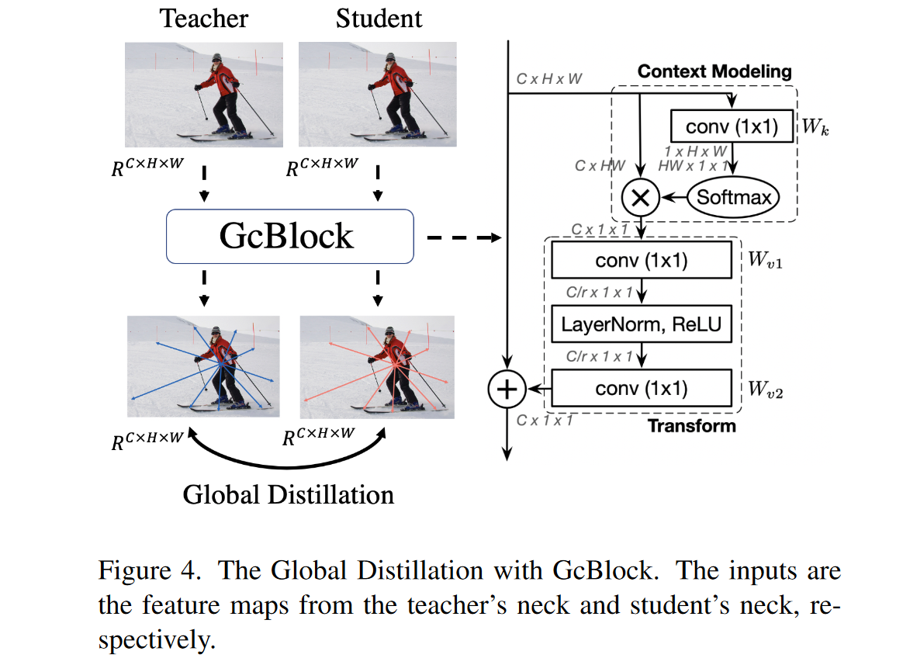

# Focal and Global Knowledge Distillation for Detectors

**[CVPR 2022](https://openaccess.thecvf.com/content/CVPR2022/html/Yang_Focal_and_Global_Knowledge_Distillation_for_Detectors_CVPR_2022_paper.html)	[code in github](https://github.com/yzd-v/FGD)	COCO	20240614**

*Zhendong Yang, Zhe Li, Xiaohu Jiang, Yuan Gong, Zehuan Yuan, Danpei Zhao, Chun Yuan;*

这项工作针对目标检测的蒸馏关键区域进行了研究，师生模型特征注意力图在前景和背景差异显著，且在通道之间也有很大差异，提出焦点蒸馏，利用空间和通道间注意力图生成掩码辅助学生学习；局部蒸馏隔断了前景和背景的联系，通过GcBlock捕获全局关系帮助学生学习。蒸馏损失只在特征图上计算，可以方便的应用于不同的探测器，最终在COCO上达到SOTA。

- 针对目标检测问题蒸馏关键区域的研究
- 提出焦点蒸馏，利用空间和通道间注意力图生成掩码辅助学生学习，关注重点区域
- 提出全局蒸馏，来弥补焦点蒸馏隔断的前景与背景之间的联系，通过GcBlock捕获全局关系

## Introduction

极端的前景背景类别不平衡是目标检测的一个关键点。尽管现有工作对这一问题进行了研究，但蒸馏的关键区域在哪尚不清楚，为了探究师生特征的差异，我们对空间注意力和通道注意力进行了可视化，师生特征的注意力图在前景差异非常显著而在背景中差异相对较小。

前景和背景一起蒸馏的性能最差，这表明特征图中不均匀的差异会对蒸馏产生负面影响。此外每个通道之间的注意力也有很大的差异，像素与通道之间也存在负面影响，因此我们提出焦点蒸馏，在分离前景和背景的同时还计算教师特征中不同像素和通道的注意力，让学生关注教师的关键像素和通道。

仅仅关注关键信息是不够的，全局上下文也起着重要的作用，提出全局蒸馏，利用G从Block提取不同像素之间的关系，然后从教师到学生进行蒸馏。

我们提出了焦点蒸馏和全局蒸馏FGD，所有损失只在特征图上计算，FGD可以在各种检测器上使用。

- 教师和学生关注的像素和通道是完全不同的，如果不加区分的提取像素和通道，性能并不好
- 提出了焦点蒸馏和全局蒸馏，使学生不仅能够关注教师的关键像素和通道，而且能够学习像素之间的关系。
- 在COCO上验证了我们的方法的有效性，包括onestage twostage 以及无锚点的方法，达到了SOTA

## Method

大多数检测器都使用FPN来利用多尺度语义信息，来自FPN的特征融合了来自主干的不同级别的语义信息，从教师迁移了这些特征知识，显著提高了学生的性能：
$$
L_{fea} = \frac{1}{CHW}\sum^C_{k=1}\sum^H_{i=1}\sum^W_{j=1}(F^T_{k, i, j} - f(F^S_{k, i, j}))^2
$$
f为对齐师生特征维度的投射层，HW表示特征高度宽度，C表示通道数，然而这类方法缺乏对不同像素之间全局关系的提炼，因此我们提出FGD，包括焦点蒸馏和全局蒸馏

### Focal Distillation 焦点蒸馏

我们提出焦点蒸馏来分离图像并引导学生关注关键像素和通道，首先设置一个二值掩码M来分离背景和前景：
$$
M_{i, j} = \begin{aligned}
\begin{cases}
1, & if\ (i, j)\in r\\
0, & Otherwise
\end{cases}
\end{aligned}
$$
r表示gt boxes，(i, j)分别为特征图的横纵坐标。尺度较大的目标由于像素较多会占据更多的损失，影响小目标的蒸馏，并且在不同的图像中，前景与背景的比例差距很大，因此为了平等对待不同的目标，平衡前景和背景的损失，我们设定一个尺度掩码S：
$$
S_{i, j} = \begin{aligned}
\begin{cases}
\frac{1}{H_rW_r}, & if\ (i, j)\in r \\
\frac{1}{N_{bg}}, & Otherwise
\end{cases}
\end{aligned} \\
N_{bg} = \sum^H_{i=1}\sum^W_{j=1}(1-M_{i,j})
$$
Hr Wr表示gt box的高度和宽度，若同一个像素属于不同目标，选择最小的框计算S。先前工作证明了关注关键像素和通道有助于基于CNN的模型获得更好的结果，我们给出计算注意力掩码的方式：
$$
G^S(F)=\frac{1}{C}·\sum^C_{c=1}|F_c| \\
G^C(F) = \frac{1}{HW}·\sum^H_{i=1}\sum^W_{j=1}|F_{i, j}|
$$
H W C 分别表示特征的高度、宽度和通道数，Gs和Gc分别表示空间和通道注意力图，注意力掩码：
$$
A^S(F) = H·W·softmax(G^S(F)/T) \\
A^C(F) = C· softmax(G^C(F)/T)
$$
T表示温度系数。 训练过程中使用教师的mask对学生进行指导，结合二值掩码S、尺度掩码S和注意力掩码As Ac，有特征损失：
$$
L_{fea} = \alpha\sum^C_{k=1}\sum^H_{i=1}\sum^W_{j=1}M_{i, j}S_{i, j}A^S_{i, j}A^C_{k}(F^T_{k, i, j} - f(F^S_{k, i, j}))^2 + \beta\sum^C_{k=1}\sum^H_{i=1}\sum^W_{j=1}(1-M_{i, j})S_{i, j}A^S_{i, j}A^C_{k}(F^T_{k, i, j} - f(F^S_{k, i, j}))^2
$$
$\alpha， \beta$为平衡前景和背景损失的超参数。并且我们使用注意力损失来迫使学生检测器模仿教师检测器的空间和通道注意力掩码：
$$
L_{at} = \gamma·(l(A^S_t, A^S_S) + l(A^C_t, A^C_S))
$$
l表示L1范数损失。总体的焦点损失：
$$
L_{focal} + L_{fea} + L_{at}
$$

### Global Distillation 全局蒸馏

焦点蒸馏迫使学生将注意力集中在关键部位，但这割断了前景和背景之间的联系。因此提出全局蒸馏，利用GcBlock捕获单张图像中的全局关系，迫使学生检测器从教师检测器中学习关系：
$$
L_{global} = \lambda·\sum(\mathcal{R}(F^T) - \mathcal{R}(F^S))^2 \\
\mathcal{R}(F) = F + W_{v2}(ReLU(LN(W_{v1}(\sum^{N_p}_{j=1}\frac{e^{W_kF_j}}{\sum^{N_p}_{m=1}e^{W_kF_M}}))))
$$
其中$W_k, W_{v1}, W_{v2}$表示卷积层，LN表示层归一化，Np表示特征中的像素数量，$\lambda$为超参数平衡损失

### Overall loss 总体损失：

$$
L = L_{original} + L_{focal} + L_{global}
$$

$L_{original}$为目标检测的原始损失，蒸馏损失只在特征图上计算，可以从检测器的颈部获得，可以方便的应用于不同的探测器。