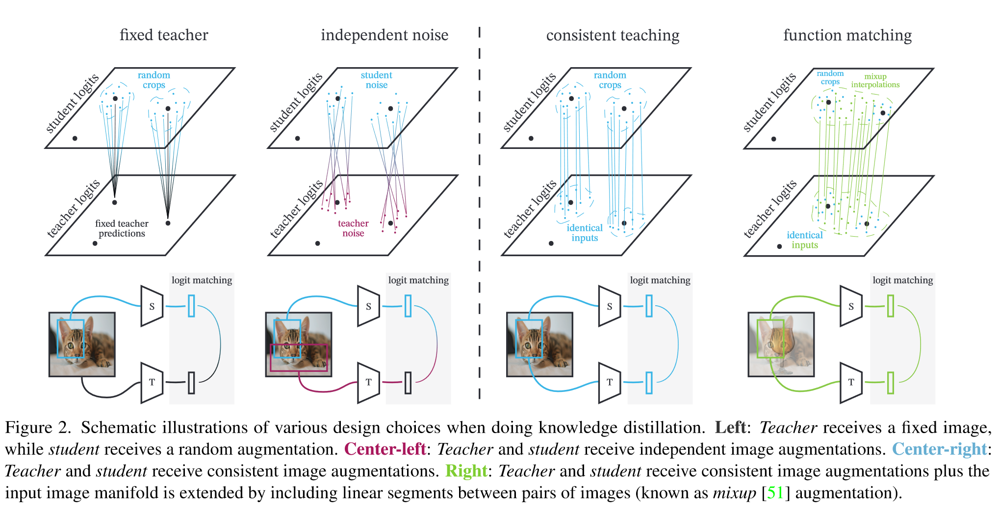
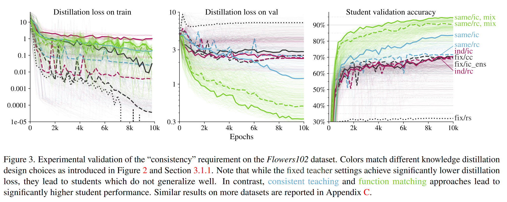
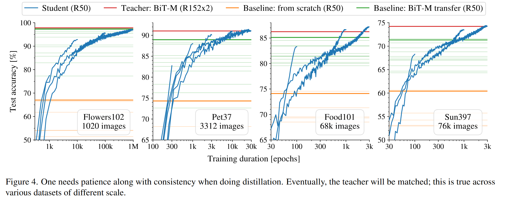

# Knowledge Distillation: A Good Teacher is Patient and Consistent

做了大量的实验 没看完

## Introduction

## Experiment

### Investigating the "consistent and patient teacher" hypothesis

我们通过实验验证了提出的假设，且实验表明功能匹配情况下的性能最佳

#### Importance of "consistent" teaching

我们证明了一致性标准，学生和教师看到相同的视图可以达到最佳学生表现。

**Fixed teacher.** 教师模型为原始图像，学生模型输入进行随机增强

**Independent noise.** 对师生模型分别施加两种独立的增强方式

**Consistent teaching.** 对输入进行一次随机裁剪，使用相同的裁剪用于师生模型的输入

**Function matching.** 使用mixup进行增强，并对师生模型的输入进行一致的增强

这些结果表明一致性是关键，所有不一致的蒸馏设置都在较低的分数上，一致的设定提高了学生的表现，其中FunMatch效果最好。

#### Importance of "patient" teaching

训练相对较短的但较为常见的100个epochs会导致比baseline差得多的表现