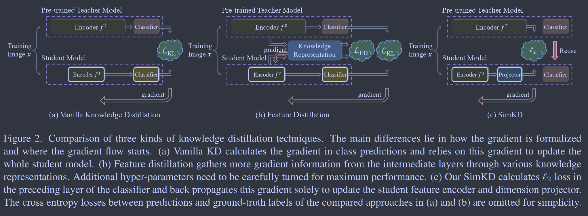
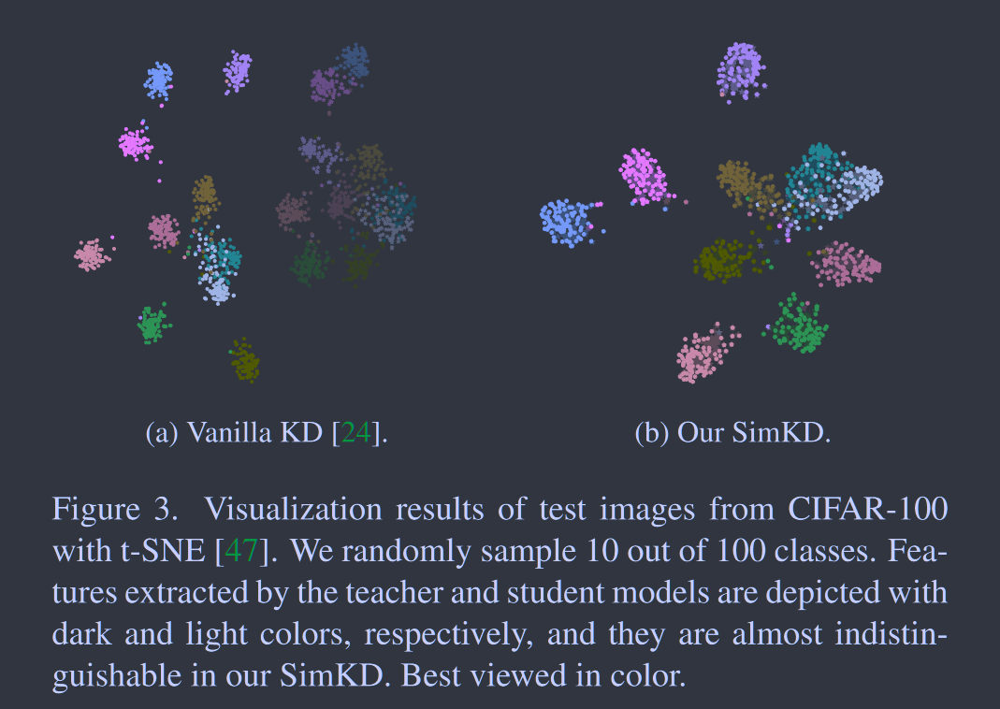

# Knowledge Distillation with the Reused Teacher Classifier

**[CVPR 2022](https://openaccess.thecvf.com/content/CVPR2022/html/Chen_Knowledge_Distillation_With_the_Reused_Teacher_Classifier_CVPR_2022_paper.html)	no code	CIFAR100  ImageNet	20240412**

*Defang Chen, Jian-Ping Mei, Hailin Zhang, Can Wang, Yan Feng, Chun Chen*

先前的工作致力于精心设计的知识表示。这项工作提出教师模型的强大性能不仅归功于前面的特征表达，最后的判别器也同样重要，基于这一假设，这项工作通过一个投射层简单对齐师生模型的特征，通过一个L2损失让学生特征去模仿教师的特征，直接使用教师模型的分类器进行学生模型的推理。

## Introduction

知识蒸馏的一个局限性是教师模型和蒸馏的学生模型之间的性能差异仍然显著，先前的工作致力于精心设计的知识表示。我们认为教师模型强大的类别预测不仅归功于这些表达特征，最后的判别器也同样重要，因此我们在分类器的前一层通过特征对齐训练学生模型，直接复制教师模型的分类器进行学生模型的推断。

## Method

### Vanilla Knowledge Distillation

给定k分类数据集中具有one-hot标签y的训练样本x，学生模型的倒数第二层的编码特征表示为$f^s = \mathcal{F}^s(x;\theta^s) \in \R^{C_s}$，该特征被传递到权重为$W^s\in \R^{K\times C_s}$的分类器中，得到logits $g^s = W^sf^s \in \R^K$，以及带有softmax激活的类别预测$p^s = \sigma(g^s/T) \in \R^K$
$$
p^s_i = \frac{exp(g^s_i/T)}{\sum^K_{j=1}exp(g^s_j/T)}
$$
其中$p^s_i/g^s_i$对应向量的第i个元素，T为温度系数。
$$
\mathcal{L}_{KD} = \mathcal{L}_{CE}(y, p^s) + T^2\mathcal{L}_{KL}(p^t, p^s)
$$

### Simple Knowledge Distillation

现有各种特征蒸馏方法被提出，主要是针对收集和传输来自中间师生层对的额外梯度信息，以更好的训练学生特征编码器。他们的成功很大程度上依赖于那些特别设计的知识表示以产生适当的归纳偏差。我们提出SimKD，摆脱了这些苛刻的要求并仍然取得了不错的结果。

SimKD的一个关键是分类器复用，我们直接借用预训练好的教师的分类器进行学生模型的推理，这样旧省去了计算交叉熵损失所需要的交叉信息，使得特征对齐称为梯度的唯一来源。

我们认为教师分类器中包含的判别信息是重要的，一个模型被要求处理具有不同数据分布的多个任务的情况，一般是冻结或共享一些浅层作为不同任务的特征提取器，微调最后一层来学习特定任务的信息，即任务不变信息可以共享，而特定任务的信息需要独立识别。对于在同一数据集上训练的不同能力的教师和学生模型的KD，我们认为数据中存在一些能力不变的信息，这些信息很容易从不同的模型中获得，而强大的教师模型中可能包含一些额外的关键能力信息，这些信息对于一个更简单的学生模型可能是难以获得的。我们假设大多数的特定能力信息包含在深层中，并期望重用这些层，甚至只有最终的分类器有助于学生的训练。

基于该假设，我们为学生模型提供了教师分类器进行推理，迫使器提取的特征与后续L2损失函数相匹配：
$$
\mathcal{L}_{SimKD} = ||f^t - \mathcal{P}(f^s)||^2_2
$$
$\mathcal{P}(·)$为简单的投影层，以确保师生模型的特征图能够对齐。这种简单的损失在先前的工作中就已经利用过了，但是我们的重点在于利用教师分类器的潜在价值，而不是通过一个复杂的损失函数来进行特征的对齐。

## Limitation and Future Work

我们的工作需要在特征维度不匹配时使用投射层进行维度的匹配，增加了模型的复杂度，如何开发一种无投层的替代品还需要进一步的研究；另一个限制是我们的技术仅适用于有监督的知识蒸馏，对于无监督的场景，开发我们的变体也是值得研究的方向。

