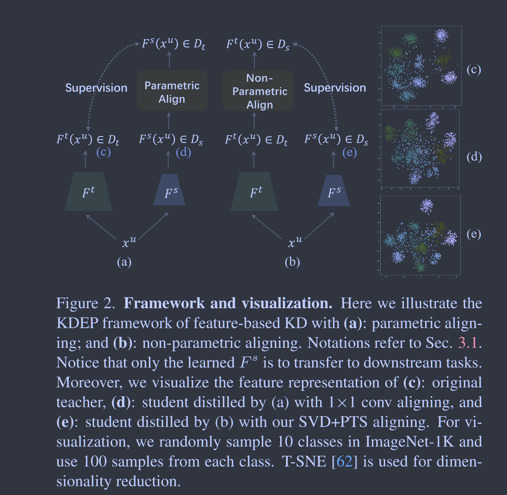
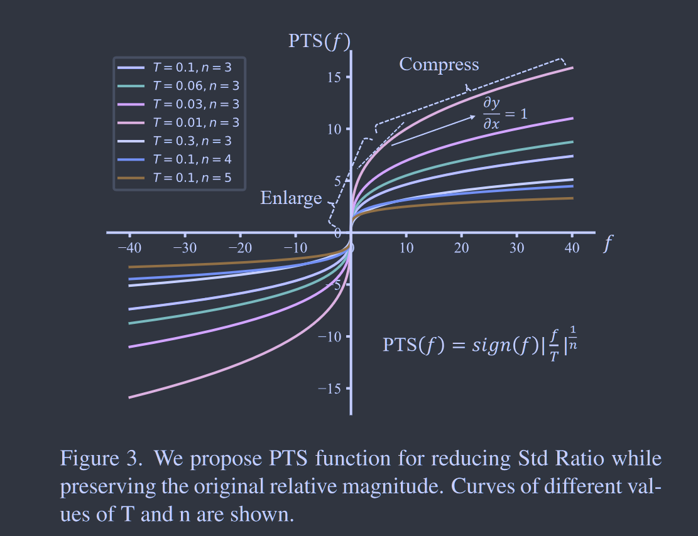
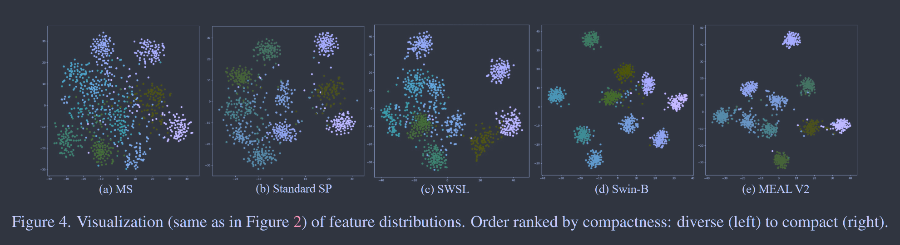
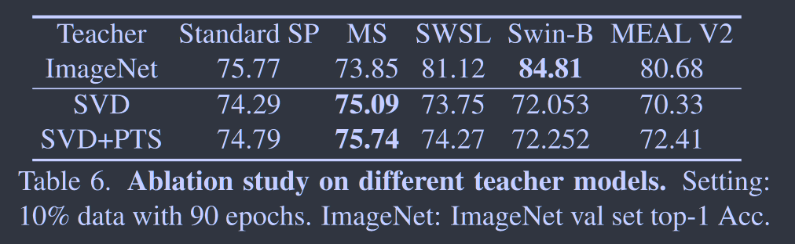

# Knowledge Distillation as Efficient Pre-training: Faster Convergence, Higher Data-efficiency and Better Transferability

**[CVPR 2022](https://openaccess.thecvf.com/content/CVPR2022/html/He_Knowledge_Distillation_As_Efficient_Pre-Training_Faster_Convergence_Higher_Data-Efficiency_and_CVPR_2022_paper.html)	[code in github](https://github.com/CVMI-Lab/KDEP)	ImageNet-1k CIFAR CUB DTD Caltech256 VOC12 ADE20k COCO	20240517**

*Ruifei He, Shuyang Sun, Jihan Yang, Song Bai, Xiaojuan Qi*

这项工作致力于直接使用预训练的模型进行蒸馏学习，我们发现在师生模型之间添加可学习模块来匹配师生维度会将表示学习转化为一个间接的过程，损害表示学习性能。我们提出非参数的对齐方式，通过奇异值分解SVD来完成师生模型的对齐，SVD会导致通道之间特征方差差异较大，会影响网络的学习优化，提出指数温度缩放PTS来减少方差的差异并保持原始特征的相对幅度。KDEP表现出更宽的收敛速度，更高效的数据效率和更好的可移植性。

## Introduction

随着预训练数据规模的增加和私有数据的不可访问性，在大型数据集上预训练所有架构变得效率低下或不可能.这项工作中我们提出知识蒸馏作为高效的预训练KDEP，将教师从大规模数据中获得的特征提取能力转移到学生模型中。

我们的处理一个潜在的间接特征学习问题，即蒸馏的监督不是直接应用于将要转移的特征提取器，而是应用于在其之后添加并与之共同优化的新的可学习模块，从而将表征学习转化为间接过程。下图所示基于1*1卷积对齐的KD并未能遵循教师的特征表示，预训练模型只能提供次优的迁移学习性能。

我们提出KDEP，研究用于对齐特征维度的非参数化方法以避免间接的特征学习，我们发现奇异值分解SVD通过压缩特征而将信息损失降至最低而有效。然而SVD处理特征会触发分量支配效应，即通道之间特征差异很大，这会干扰网络的优化，因此提出一个指数温度缩放PTS来减少方差差异，同时保留原始的相对幅度。我们的方法没有添加任何的可学习参数，只使用来自教师倒数第二层特征（全局池化之后），这对于特征表示学习更为通用。

## Method

给定一个教师模型$F^t$在大规模数据集D上预训练和一组未标注的实例$D_u = \{x^u_i\}^{N_u}_{i=1}$，我们的目标是训练一个学生模型$F^s$以便在各种下游任务上很好的泛化，由于我们的任务是关注特征表示学习，而不是将模型专注于特定的任务，因此师生模型产生的是特征表示而不是任务特定的logit，记$F^l(x^u_i), F^s(x^u_i)$形状为$D_t, D_s$， KDEP可以描述为：
$$
\frac{1}{N_u}\sum^{N_u}_{i=1}\mathcal{L}(F^t(x^u_i), F^s(x^u_i))
$$
基于特征KD的方法存在师生模型特征维度不匹配的问题，我们发现增加一个参数模块例如1*1的卷积，对KDEP来说是次优的，而我们提出的非参数化SVD要更高效。

我们非参数特征维度对齐后的统计量不同于普通的DCNN，我们研究了集中修正机制并将其归纳为一

个转换模块。

我们提出一个开放性的问题来讨论，什么是KDEP的好老师？我们实验表明更强的模型不一定是更好的教师，我们发现特征分布的紧凑型是一个至关重要的指标。

### Aligning Feature Dimensions

受间接学习问题的启发，我们提出了几种变体的非参数特征维度对齐，以往的参数化方法增加了一个参数化，将师生模型特征维度对齐，我们提出非参数的方法将Dt投影到Ds，从而可以直接作为监督。我们研究了通道选择，插值和SVD。SVD凭借保持尽可能多的信息能力脱颖而出。

pre ReLU蒸馏特征位置已经被先前工作证明能够显示出改进的效果，我们沿用这一设定。

### Transformation Module

SVD虽然有效压缩了信息损失不明显的特征，但也给优化带来了困难，SVD对齐后不同特征方差具有数量级差异，普通DCNN的特征方差通常在同一数量级内，我们将std ratio定义为所有训练样本的倒数第二个特征中所有特征中最大的标准差到最小的标准差，我们发现SVD的std ratio比普通的std ratio大十倍以上。

因此L2损失倾向于以方差最大的特征通道为指导而导致次要特征欠拟合(***方差较大的特征计算L2特征时以平方来衡量误差，会被放大从而使之更关注于此而忽略次要特征***)，我们将来自教师的每个特征通道的值看作是一个随机变量T，在SVD后具有零均值。我们证明了每个特征通道的L2损失的数学期望随教师特征通道的std单调递增，这解释了向std ratio大的教师学习的困难

#### Theorem 1.

给定两个独立的正态分布随机变量$T\sim N(0, \sigma^2), S\sim N(0, \sigma^2_s)$, 则$F(\sigma) = \mathbb{E}[(T-S)^2$单调递增。

#### Proof 1.

$$
F(\sigma) = \int^{+\infty}_{-\infty}\int^{+\infty}_{-\infty}(t-s)^2P(t, s)dtds = \frac{1}{\sqrt{2\pi}\sigma}\int^{+\infty}_{-\infty}e^{\frac{-t^2}{2\sigma^2}}(t^2+\sigma^2_s)dt = \sigma^2 + \sigma^2_s \\
\frac{dF(\sigma)}{d\sigma} = 2\sigma>0
$$

因此我们提出通过变换模块将SVD后的std ratio降低到DCNNs的正常范围，先前的工作使用了一种简单的尺度归一化SN，该方法将每个特征通道按其对应的std进行划分，以确保每个通道具有相似的特征尺度，我们对齐进行变体实验，直接对每个通道进行特征变换来匹配svd之前特征的最大标准差，称之为标准差匹配SM，SN和SM都是按照通道进行变换的局部变换可能无法保持不同特征通道之间的原始相对大小。

为了在不损害原始相对大小的情况下匹配统计信息，我们提出使用一个全局非递减的转换函数，该函数可以减小标准差比率而保持相对大小。具体来说，我们通过一个类似于 logits KD [29] 的温度参数 T 来控制值的范围，然后应用一个保留符号的幂运算。我们将这个函数称为 Power Temperature Scaling（PTS），具体如下所示：
$$
PTS(f) = sign(f)|\frac{f}{T}|^{\frac{1}{n}}
$$
n是指数的参数，f位输入值，PTS可以在全局非减的情况下放大小值和压缩大值，从而达到匹配正态统计量和保持相对大小的目的

### Teacher Selection

我们进一步探讨了如何位KDEP选拔一名好老师。我们测试了以下范式：

- 标准的监督预训练SP ImageNet-1k ResNet50
- 具有额外数据的SP ImageNet-22k COCO
- 使用无标签数据的预训练 探索了一种半监督预训练的R50 SWSL
- 蒸馏模型  我们使用在Imagenet-1k 上蒸馏训练的MEAL v2 R50

我们实验发现更强大的模型并不一定能取得更好的KDEP表现，这与先前工作发现的更准确的教师可能会产生更差的蒸馏产生共鸣。

我们结合可视化的结果发现，特征的紧凑性和KDEP性能之间存在很强的相关性，紧凑的特征表示不利于作为一个好的教师，而多样化的特征表示会产生更好的结果。

## Limitations

KDEP的性能很大程度上依赖于合适的教师模型，如何获得这种教师还需要进一步研究，我们发现特征分布的紧凑型可以作为一个重要的指标。
