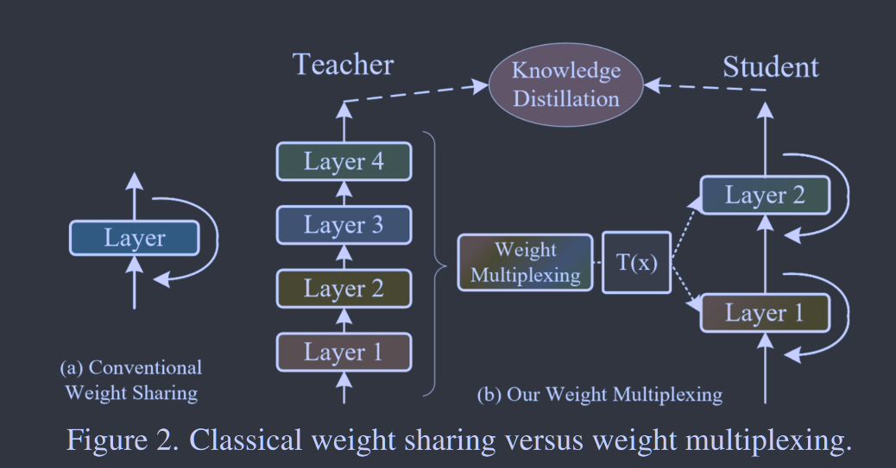
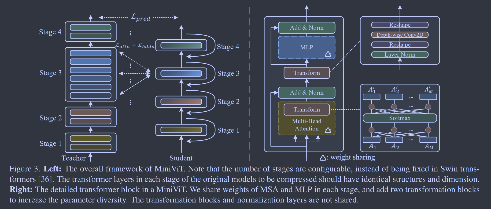

# MiniViT: Compressing Vision Transformers with Weight Multiplexing

**[CVPR 2022](https://openaccess.thecvf.com/content/CVPR2022/html/Zhang_MiniViT_Compressing_Vision_Transformers_With_Weight_Multiplexing_CVPR_2022_paper.html)	[code in github](https://github.com/microsoft/Cream)	CIFAR  Flowers StanfordCars Oxford-IIITPets CoCo2017	20240607**

这项工作研究了权重共享技术，权重共享直接利用到vision Transformer上会带来训练不稳定和性能下降的问题，提出了使用权重复用和权重蒸馏来缓解这些问题，权重复用在MHA的softmax前后插入线性层，在MLP中插入转换模块，这些参数不共享来提高参数的多样性；权重蒸馏考虑了输出的logit、自注意力的QKV矩阵和MLP的关系矩阵，通过这两个模块来缓解权重共享技术在视觉Transformer中的弊端。

- 权重共享技术利用到ViT中
- 提出权重复用：在MHA的softmax前后插入线性层，在MLP中插入转换模块
- 提出权重蒸馏：输出的logit、自注意力的QKV矩阵、MLP的关系矩阵

## Introduction

vision Transformer数以亿计的参数消耗了大量的存储和内存，这使得这些模型不适合设计有限计算资源的场景。

权重共享是一种简单有效的压缩模型尺寸的技术，这种技术可以在不严重损害性能的情况下显著减小模型大小，提高参数效率，然而这种技术在ViT中没有得到很好的探索。

直接使用跨层权重共享会带来两个严重的问题：

- 训练不稳定，Transformer层之间的权重共享使训练变得不稳定，甚至随着共享层数量的增加而导致训练崩溃。
- 性能下降，与原始模型相比，权重共享的ViT性能显著下降

我们发现不同层的权重完全相同是导致问题的主要原因。并且还发现梯度的L2范数变大，在权重共享后的不同层之间波动导致训练不稳定。

我们提出称为权重复用(weight multiplexing)的方法来解决上述问题，有权重转换和权重蒸馏组成，关键思路是对共享权重进行转换，使得不同层的权重略有不同。为了进一步减轻性能下降，我们提出了权重蒸馏，来将预训练中的信息转移到小模型中。

- 我们系统地研究了视觉Transformer中权重共享的功效，并分析了权重共享带来问题的根本原因
- 提出一种名为MiniViT的压缩框架，MiniViT可以在不损失精度的情况下实现较大的压缩比，MiniViTal的性能可以很好的转移到下游基准测试中

## Method

### Weigh Multiplexing  权重复用

权重共享技术直接应用于ViT中会引发训练不稳定和性能下降的问题，主要原始是不同层权重的严格一致性和梯度的L2范数变大且在不同Transformer块中波动。

另外我们根据CKA(Central Kernel Alignment 一种相似性度量)，权重共享后的特征图与原始模型的相关性较低。

受电信号多路复用技术的启发，提出一种用于Transformer的权重复用技术：

- 在多个Transformer块中共享权重，可以看作是多路复用中的组合过程
- 在每一层引入转换来模拟解复用的过程
- 应用知识蒸馏来增加压缩后模型之间特征表示的相似性

$$
Z_{i+1} = f(Z_i;\theta,\theta'_i), i=0,..., L-1
$$

$\theta'_i$表示第i个Transformer中变换块的权重，$\theta'_i$中的参数量远小于$\theta$

#### Weight Transformation 权重转换

我们将变换层加在注意力矩阵和前馈神经网络上，这种转换允许每一层都不同，提升参数多样性和模型的表示能力，转换层的参数与其他层不共享。

##### Transformation for MHA

为了提高参数的多样性，我们分别在自注意力模块softmax之前和之后插入了两个线性变换：
$$
h_k = A'_kV_k = \sum^M_{n=1}F^{(1)}_{kn}A_nV_k \\
A_n = Softmax(\sum^M_{m=1}F^{(2)}_{nm}\frac{Q_mK_m^T}{\sqrt{d}})
$$
$F^{(1)}, F^{(2)}\in \R^{M\times M}$分别是softmax之前和之后的线性变换层，这种线性变换可以使每个注意力矩阵不同，同时将注意力头之间的信息组合在一起增加参数方差。

##### Transformation for MLP

进一步对MLP进行轻量变换，以提升参数的多样性，输入$Y = [y_1, ..., y_d]， y_l$表示第l个位置向量的所有token，我们引入线性变换d将Y转换为$Y'=[C^{(1)}y_1, ..., C^{(d)}y_d], C^{(1)}, ..., C^{(d)}\in \R^{N\times N}$是线性层的权重矩阵，ViT中的MLP层可以重新表述为：
$$
H = \sigma(Y'W^{(1)} + b^{(1)})W^{(2)} + b^{(2)}
$$
通过这些转换，权重共享层可以恢复预训练模型的行为，缓解训练的不稳定性和性能下降的问题。

#### Weight Distillation 权重蒸馏

为了压缩大型预训练模型并解决权重共享引起的性能下降问题，进一步采用权重蒸馏知识将从大型模型转移到小型和紧凑模型，我们考虑了三种蒸馏：logit蒸馏、自注意力蒸馏和隐状态蒸馏。

##### Prediction-Logit Distillation

$$
\mathcal{L}_{pred} = CE(softmax(\frac{z_s}{T}), softmax(\frac{z_t}{T}))
$$

zs,zt分别为学生和老师的预测logit，T为温度系数，我们设置为1

##### Self-Attention Distillation

我们对自注意力模块中的Q K V应用了交叉熵损失：$Q = [Q_1, ..., Q_M] \in \R^{N\times Md},\ \ K, V\in \R^{N\times Md}$同理，令S1， S2， S3分别表示QKV，$R_{ij} = softmax(S_iS_j^T/\sqrt{Md})$， 显然R12为自注意力矩阵A：
$$
\mathcal{L}_{attn} = \frac{1}{9N}\sum^N_{n=1}\sum_{i, j\in \{1, 2, 3\}}CE(R^s_{ij, n}, R^t_{ij, n})
$$
$R_{ij,n}$表示Rij的第n行

##### Hidden-State Distillation

为隐藏状态(MLP输出的特征)生成关系矩阵，$H\in\R^{N\times d}$表示Transformer MLP的隐藏状态，基于隐藏层关系矩阵的蒸馏损失定义为：
$$
\mathcal{L}_{hddn} = \frac{1}{N}\sum^N_{n=1}CE(R^s_{H, n}, R^t_{H, n})
$$
$R_H = softmax(HH^T/\sqrt{d}), R_{H, n}$表示RH的第n行

综上所述，最终的蒸馏损失为：
$$
\mathcal{L}_{train} = \mathcal{L}_{pred} + \beta\mathcal{L}_{attn} + \gamma\mathcal{L}_{hddn}
$$
$\beta, \gamma$我们分别取1， 0.1

### Compression Pipeline

#### Stage 1

生成具有权重转换的紧凑型架构， 给定一个大型预训练的视觉Transformer模型，首先在除LayerNorm之外的每个相邻transformer层之间共享参数，通过在softmax层之间之后插入一个微小的线性层来对每一层进行权重转换；并在MLP层中插入转换层。这些线性层和转换层权重不共享

#### Stage 2

用权重蒸馏训练压缩模型，利用上述定义的蒸馏损失将大型预训练模型的知识转移到小模型中，在师生架构都为transformer架构是才会执行，其他情况只保留logit蒸馏项