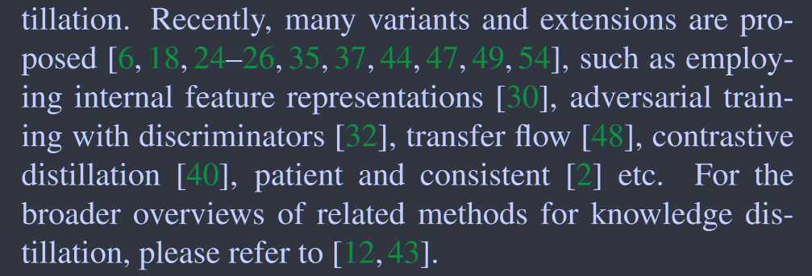
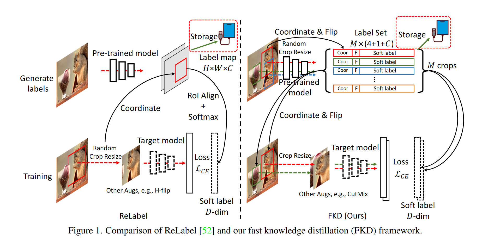

# A Fast Knowledge Distillation Framework for Visual Recognition

**[ECCV 2022](https://link.springer.com/chapter/10.1007/978-3-031-20053-3_39)	[code in github](https://github.com/szq0214/FKD)	20240412**

*Zhiqiang Shen  Eric Xing* 

这项工作针对传统蒸馏框架与普通模型训练相比多了教师模型推理的开销，先前工作针对这一问题的处理缺乏一致性，并且繁琐的后处理过程也引入了不必要的开销，这项工作针对保存全局标签图因随机数据增强带来的不一致性进行了修正，提出在教师模型进行推理的阶段保存数据增强以及输出结果等信息，在训练学生模型时采用相同的增强策略，并复用其输出结果进行训练。

## Introduction

尽管KD在监督分类和自监督表示学习许多视觉任务中被认为是有用的工具，传统的KD的主要缺点是其机制，通过庞大的教师网络进行转发时消耗了大部分的计算开销，使得整个学习过程效率低下，代价高昂。如何减少或共享不同时期的教师网络的前向过程称为加速KD框架的核心。

一种方案是预先生成一个概率向量作为输入数据对应每幅图像的软标签，在不同训练阶段重复利用他们，然而在现代网络训练中，通常采用各种数据增强策略，尤其是随机裁剪策略，这会导致数据的不一致性。

为了解决这个不一致性的问题，同时保留软标签的优势，先前工作ReLabel被提出来存储预训练的教师模型的全局标签映射，以便通过RoI对齐重新利用而不需要重复通过教师网络。然而由于教师输入过程不同，该策略与传统KD略有区别，教师网络通常采用随机缩放的方式进行训练，在ReLabel中，全局标签图是通过输入到全局图像中得到的，在输入图像采用随即缩放不能像蒸馏过程那样准确地反应软分布；RoI对齐不能保证分布于教师的输出完全一致。

这项工作提出快速知识蒸馏FKD，来克服不匹配的问题，并进一步避免软标签上信息丢失，在标签生成阶段，直接将来自多个随机裁剪的软概率存储到标签文件中，以及坐标和其他数据增强策略信息。

在训练过程中，我们将存储的坐标返回到输入中，以生成裁剪后的输入，以便通过网络使用相应的软标签进行损失计算。我们的基于区域的生成过程和每个输入区域获得的软标签与传统的KD完全相同，这意味着在标签创建过程不会丢失任何信息；我们的训练阶段速度更快，因为没有Roi对齐或是softmax等任何后处理。我们可以进一步在一个小批量中分配来自同一个图像的多个区域，来减小数据加载的负担。

> 我们提出快速知识蒸馏框架FKD，实现了与传统蒸馏相同的高水平性能，同时保持了与非KD训练相同的训练速度和效率，而没有信息损失。
>
> 在图像分类框架中，可以在一个小批量中对一张图像进行多区域采样，以方便数据加载和加快训练速度同时不牺牲性能

## Related Work

## Method

### Fast Knowledge Distillation

FKD旨在解决蒸馏框架复杂教师模型带来的计算消耗。

#### Label Generation Phase

遵循随机裁剪策略，我们从一幅图像中随机裁剪出M个区域，并对其进行反转增强等操作，然后将其输入到教师模型中生成对应的软标签向量Pi，即$P_i = T(R_i)$， Ri为经过F变换后的区域，T是与寻来你的教师网络，i为区域索引。用软标签P存储所有的区域坐标和增强超参数F用于接下来的训练阶段。

#### Training Phase

训练阶段我们不像传统的图像分类策略那样随机生成裁剪区域，而是直接加载标签文件，为特定的区域分配数据增强策略。在交叉熵损失下$\mathcal{L} = \sum_iP_ilogS_\theta(R_i)$，$S_\theta(R_i)$表示学生网络在输入区域Ri的预测

### Higher Label Quality

#### Distance Analysis

我们通过熵距离来分析各种形式标签的质量，并对他们相互之间的交叉熵矩阵进行度量。考虑三种标签：人工标注的one-hot标签、ReLabeld生成的标签和FKD标签。

我们发现$(\mathcal{D}^{CE}_{R\rightarrow F} = -P_{FKD}logP_{reLabel}) > (\mathcal{D}^{CE}_{R\rightarrow O}\ or \ \mathcal{D}^{CE}_{F\rightarrow O})$, $\mathcal{D}^{CE}_{R\rightarrow F}$表示Relabel与FKD之间的交叉熵值，我们观察到FKD与ReLabel之间的差异甚至要大过于One-hot标签之间的差异，两者的差距相当显著