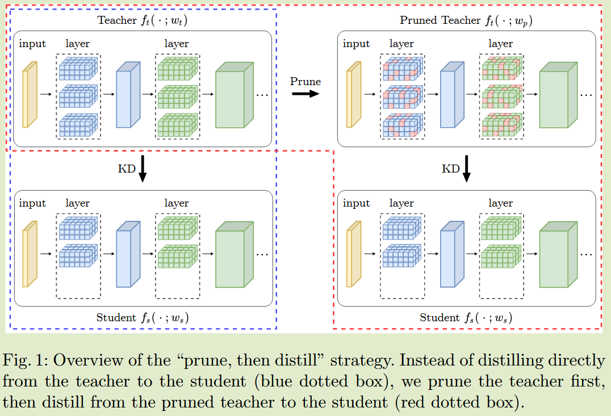

# Prune Your Model Before Distill It

## Introduction

最近的研究表明，学生友好的教师更适合来提取知识，因为其提供了更多的可迁移知识；我们提出先剪枝后蒸馏的方案，剪枝后的教师模型起到正则化器的作用

我们的方法包括三个步骤：

- 训练教师网络
- 剪枝教师网络
- 将剪枝后的网络蒸馏到更小的学生网络

我们设计实验验证了学生从经过修建的教师网络那里学到的知识普遍优于未修建的教师

- 我们提出了一个新的框架，剪枝后蒸馏，在进行知识蒸馏之前对教师网络进行剪枝
- 我们通过实验验证了对教师进行非结构化剪枝可以提高知识蒸馏的性能
- 从剪枝教师中蒸馏其有效性是由于标签平滑正则化

## Method

#### 剪枝后的教师作为正则化器

令$\{(x_i, y_i)\}^N_{i=1}$为数据集，标签集合为$y_i\in\{1, 2, ..., K\}$，我们期望一个输出K维概率分布的分类模型，$f_{true}(x_i) \in \R^K$是one-hot编码向量， $f_{true}(x_i)[y'] = 1$为真实标签，$f_{true}(x_i)[y'] = 0$为所有其他标签，$f_t(x;w)$为教师网络的输出，教师网络训练的损失函数表示为：
$$
L_{CE}(w) = \frac{1}{N}\sum^N_{i=1}H(f_{true}(x_i), f_t(x_i;w))
$$
同理学生网络的输出为$f_s(x;\tilde{w})$，损失函数表示为：
$$
L_{CE}(\tilde{w}) = \frac{1}{N}\sum^N_{i=1}(1-\alpha)H(f_{true}(x_i), f_s(x_i;\tilde{w})) + \alpha H(f_t(x;w_t), f_s(x;\tilde{w}))
$$
先前工作证明了KD等价于标签平滑正则化LSR，作者表明了：
$$
L_{KD}(\tilde{w}) = \frac{1}{N}\sum^N_{i=1}H(f^{(\alpha)}_m(x_i;w_t), f_s(x_i;\tilde{w}))
$$
$f^{(\alpha)}_m(x_i;w_t) = (1-\alpha)f_{true}(x) + \alpha f_t(x;w_t)$，KD等价于标签分布$f^{(\alpha)}_m(x_i;w_t)$的标签平滑正则化

我们还考虑了教师使用正则化器R(w)进行训练的情况，最小化得到正则化教师$f_t(·;w_p)$:
$$
L_{REG}(w) = \frac{1}{N}\sum^N_{i=1}H(f_{true}(x_i), f_t(x_i;w)) + R(w)
$$
我们的方法分为四个步骤：

- 对原始网路进行训练，得到$f_t(·;w_t)$
- 应用非结构化剪枝，得到剪枝后的网络$f_t(·;w_p)$
- 根据剪枝后的网络$f_t(·;w_p)$每一层的稀疏性构造$f_s$
- 将裁剪好的网络$f_t(·;w_p)$蒸馏提取给学生模型$f_s(·;w_s)$
