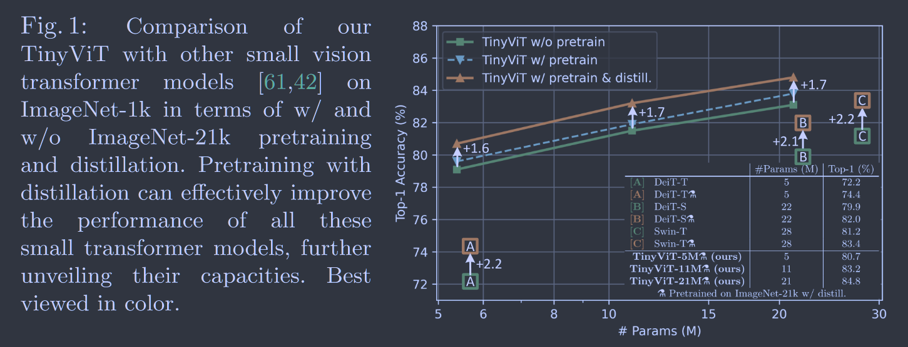
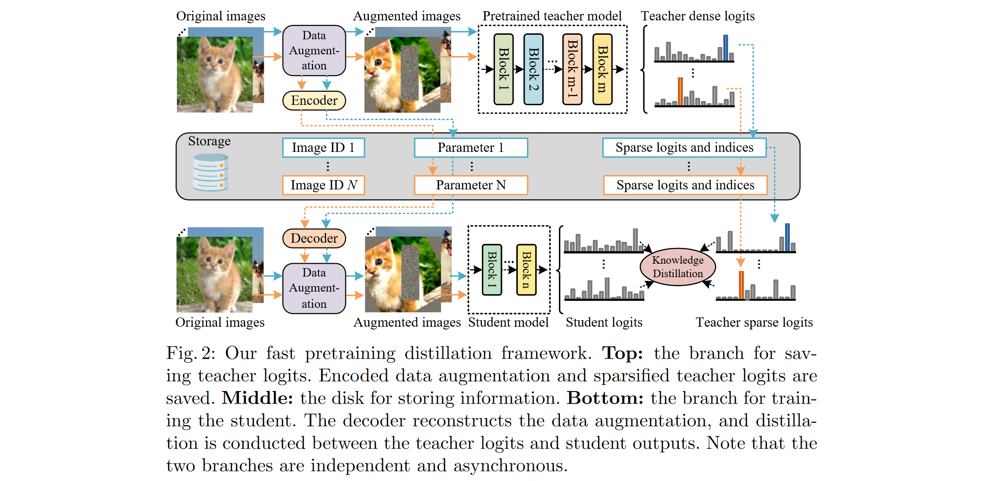

# TinyViT: Fast Pretraining Distillation for Small Vision Transformers

**[ECCV 2022](https://link.springer.com/chapter/10.1007/978-3-031-19803-8_5)	[code in github](https://github.com/microsoft/Cream/tree/main/TinyViT)	ImageNet21k	20240607**

*Kan Wu, Jinnian Zhang, Houwen Peng, Mengchen Liu, Bin Xiao, Jianlong Fu & Lu Yuan* 

Vision Transformer模型效果很好但规模太大难以部署到计算有限的平台上使用，提出一种蒸馏方法来预训练小的Transformer模型，使其能够从海量的预训练知识中获得性能的提升，由于大的教师模型直接推理占用大量资源，将教师模型推理与学生模型蒸馏分离，提出稀疏logit编码和数据增强编码存储来存储教师模型的推理结果，并通过模型收缩方法得到最优的Tiny-ViT架构模型。

- 将 ViT 的预训练知识蒸馏到较小的Tiny-ViT模型中
- 提出了稀疏logit编码和数据增强编码来增加存储效率
- 通过模型收缩方法得到最优的学生模型架构（Tiny-ViT）

## Introduction

Vision Transformer / Swin Transformer 取得了很好的效果，但如此大的模型不适用于计算预算有限的应用。小模型是否可能从来海量数据中吸收知识进一步提升能力？

我们提出了一种快速的知识蒸馏方法来预训练小模型，并证明小模型也可以在大模型的指导下获得海量预训练数据的红利。小模型的直接预训练存在性能饱和的问题，我们在预训练的过程中施加蒸馏，使用强大的模型作为教师，大规模预训练数据的潜力可以在小模型中解锁。

- 提出一个快速预训练蒸馏框架，充分利用大模型预训练数据来释放小模型的能力，这是第一个探索小模型预训练的工作
- 发布了一系列Tiny ViT模型，在计算量和精度之间取了折中，此类模型在下游任务上表现出良好的迁移能力

## Method

### Fast Pretraining Distillation  快速预训练蒸馏框架

海量数据直接对小模型进行预训练没有带来太大的收益，我们借助知识蒸馏来提升小模型预训练模型的力量，与以往关注微调阶段蒸馏不同，我们关注预训练蒸馏，这不仅可以让小模型从大规模模型中学习，还可以提高他们对下游任务的迁移能力。

在每次迭代中，很多计算资源消耗在大教师模型的推理中，并且大教师模型会占用大量GPU内存，减小学生模型的批尺寸，我们提出一个快速预训练蒸馏框架，预先存储了数据增强和教师预测的信息，在训练过程中重复使用存储的信息来进行蒸馏，省略了大模型前向计算的资源消耗和内存占用。**（推理与蒸馏分开）**

给出数学上的形式化描述：对于输入图像x和一个强数据增强A（RandAugment  CutMix），教师模型的输出$\hat{y} = T(A(x))$, T(·)和A(x)分别表示教师模型和增强的图像，增强具有随机性，每一次迭代的每幅图像都要保存为一个数据对$(A, \hat{y})$

训练学生模型时，我们只需要从存储文件中恢复数据对$(A, \hat{y})$：
$$
\mathcal{L} = CE(\hat{y}, S(A(x)))
$$
我们的训练框架是无标签的，只使用教师模型生成的软标签进行训练，可以利用大量现成的无标签数据进行预训练。我们观察到基于gt的蒸馏会引起轻微的性能下降，我们推测ImageNet21K中的标签并不是互斥的（椅子和家具，马和动物），onehot标签并不能准确的描述一个物体。

#### Sparse soft labels  稀疏软标签

模型输出logit C维度较大时，例如ImageNet21k，C=21841，需要消耗大量的存储空间来保存所有图像的稠密logit，因此我们将其稀疏化，只保存最重要的topK：

${\hat{y}_{\mathcal{I}(k)}}^K_{k=1}\in\hat{y}$，以及其索引：${\mathcal{I}(k)}^K_{k=1}$，训练时我们从保存数据恢复的标签定义为：
$$
\hat{y}_c = \begin{aligned}
\begin{cases}
\hat{y}_{\mathcal{I}(k)} & if\  c = \mathcal{I}(k) \\
\frac{1-\sum^K_{k=1}\hat{y}_{\mathcal{I}(k)}}{C-K} & otherwise
\end{cases}
\end{aligned}
$$
$\hat{y}_c = [\hat{y}_1, ...,\hat{y}_c, ..., \hat{y}_C]$为恢复的教师logit，稀疏因子K较小，$K \ll C$，可以将存储量降低一个数量级，我们实验证明稀疏存储与稠密存储蒸馏性能相同

#### Data augmentation encoding  数据增强编码

数据增强涉及到一组参数d，例如旋转角度或裁剪坐标，每次迭代每幅图像的d都不相同，直接保存内存低效，我们用单个参数$d_0 = \mathcal{E}(d)$对其进行编码，$\mathcal{E}(·)$为编编码器（如上图所示），在训练过程中加载d0对其进行解码$d = \mathcal{E}^{-1}(d_0), \mathcal{E}^{-1}()$为解码器。

解码器通常选择一个伪随机数发生器PCG。

### Model Architectures   模型架构

我们使用渐进模型收缩方法缩小一个大的模型种子，提出一个Tiny-ViT家族，我们从大模型入手，定义一组基本的收缩因子，在每一步通过调整收缩因子，在当前模型周围生成更小的候选模型，我们选择同时满足参数量和吞吐量约束的模型。为了便于目标检测等需要多尺度的密集检测任务，我们采用分层ViT作为基本框架。

块向量模型由两个卷积组成，较早层的卷积由于其强大的归纳偏差能够有效学习低级表示。后三个阶段由Transformer块构建，并以注意力窗口来减小计算成本。

使用渐进模型收缩方法得到Tiny ViT模型家族。

## Analysis and Discussion

使用Florence来清洗数据集中的错误标签

