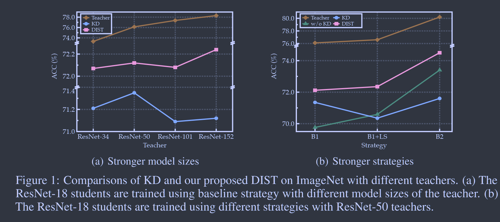
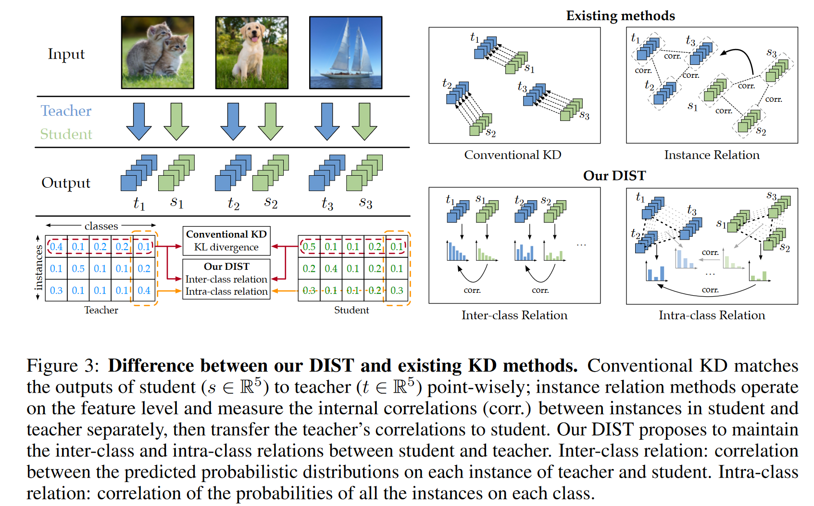

# Knowledge Distillation from A Stronger Teacher

**[NeurIPS 2022](https://proceedings.neurips.cc/paper_files/paper/2022/hash/da669dfd3c36c93905a17ddba01eef06-Abstract-Conference.html)	[code in github](https://github.com/hunto/DIST_KD)	CIFAR100  ImageNet	20240419**

*Tao Huang, Shan You, Fei Wang, Chen Qian, Chang Xu*

这项工作针对师生模型差距较大时KD优化性能不良的问题进行了讨论，学生模型推理时关注的是教师输出的相对排名而不是确切的概率值，因此本文提出引入样本和类别之间的类内相似性和类间相似性，并且只针对排名而不需要完全相同使用KL散度并不合理，引入皮尔森系数作为新的距离度量。

## Introduction

现有工作针对学生和教师模型差异较大时学生模型学习不良的问题，大多数是针对模型大小的修改，这缺乏对使用更大教师训练对KD影响的透彻分析，通用的解决方案是解决更强教师带来的KD优化问题而不是单独处理不同类型的强教师。

> 除了扩大模型规模外，还可以通过高级训练策略(标签平滑 数据增强等)来获得更强的教师，但更强的老师，学生在普通蒸馏上表现可能会下降，甚至要比从头开始训练还要糟糕
>
> 将教师和学生的训练策略换到更强的策略时，他们之间的差距会变得更大，蒸馏效果甚至不如直接训练
>
> 保持教师和学生之间的预测关系是关键的，知识从教师传给学生，我们更关心的是教师对其预测的相对排名，而不是其预测输出的具体值。这种预测相关性有利于放宽KL散度的精确匹配而更多的提炼内在关系

## Method

### Catastrophic Discrepancy with a Stronger Teacher

我们实验观察到以下几点：

> 与resnet18相比，resnet50的输出不会因为更强的训练策略而发生太大的变化，这意味着表示能力限制了学生的表现，且随着差异变大，学生完全匹配教师的输出往往更具有挑战性
>
> 当教师和学生模型使用更强的策略进行训练时，教师和学生之间的差异会更大，当我们采用更强的策略进行知识蒸馏，KD损失和任务损失之间的错位会更严重来干扰训练

### DIST: Distillation from A Stronger Teacher

预测的置信度分数表示教师对所有类别的偏好，然而在推理时我们只关心他们之间的关系，即教师输出的相对排名而不是确切的概率值。因此对于度量标准$d(·,·):\R^C\times \R^C \rightarrow \R^+$，在KL散度中，完全匹配表示为d(a, b) = 0，当且仅当a=b，我们引入更宽松的匹配，添加额外的映射$\phi(·)\ \psi(·):\R^C \rightarrow \R^C$:
$$
d(\phi(a), \psi(b)) = d(a, b), \forall a, b
$$
d(a, b)=0不需要ab完全相同，映射函数$\phi\ \psi$应当是单调的且不会影响语义信息和推理结果，一个简单的单调映射是正线性变换：
$$
d(m_1a+n_1, m_2b+n_2) = d(a,b)
$$
在预测的缩放和偏移单独变化时，这个度量可能是不变的，为了更好的结果，我们使用的皮尔森距离度量：
$$
d_p(u, v):=1- \rho_p(u, v) \\
\rho_p(u, v) := \frac{Cov(u, v)}{Std(u)Std(v)} = \frac{\sum^C_{i=1}(u_i-\overline{u})(v_i-\overline{v})}{\sqrt{\sum^C_{i=1}(u_i-\overline{u})^2(v_i-\overline{v})^2}}
$$
> 皮尔逊相关系数有一个重要的数学特性是，因两个变量的位置和尺度的变化并不会引起该系数的改变，即它该变化的[不变量](https://zh.wikipedia.org/wiki/不变量) (由符号确定)。也就是说，我们如果把X移动到a + bX和把Y移动到c + dY，其中a、b、c和d是常数，并不会改变两个变量的相关系数.  --[wikipedia](https://zh.wikipedia.org/zh-cn/%E7%9A%AE%E5%B0%94%E9%80%8A%E7%A7%AF%E7%9F%A9%E7%9B%B8%E5%85%B3%E7%B3%BB%E6%95%B0)

$\rho(u,v)$表示皮尔森相关系数，Cov(u, v)是u、v的协方差，$Std(u),\overline{u}$分别表示其标准差和均值，因此我们定义类间相似性，对每对预测输出$Y_{i,:}^{(s)}, Y_{i,:}^{(t)}$，损失函数定义为：
$$
\mathcal{L}_{inter}:=\frac{1}{B}\sum^B_{i=1}d_p(Y_{i,:}^{(s)}, Y_{i,:}^{(t)})
$$

### Better Distillation with Intra-Relations

除了类间关系，我们还转移了每个实例中多个类中的关系，这个分数表明了类别之间的相似性，例如一只猫的图像分类为狗的分数要比分类为飞机的分数要高。

预测矩阵中每一行为对batch中每个样本的预测分数，每一列为该类别在所有样本上的预测分数(试想对于某个样本属于类别a，但是对于另一个类别b的样本在类别a的预测值也很高，可以说明a b两个样本相类似)，定义类内相似性：
$$
\mathcal{L}_{intra}:=\frac{1}{C}\sum^C_{j=1}d_p(Y_{:,j}^{(s)}, Y_{:,j}^{(t)})
$$
***2023CVPR Multi-level Logit Distillation 在批次间和类别间蒸馏也用到了该思想***

总体损失由分类损失、类内损失和类间损失组成：
$$
\mathcal{L}_{tr} = \alpha\mathcal{L}_{cls} + \beta\mathcal{L}_{inter} + \gamma\mathcal{L}_{intra}
$$
