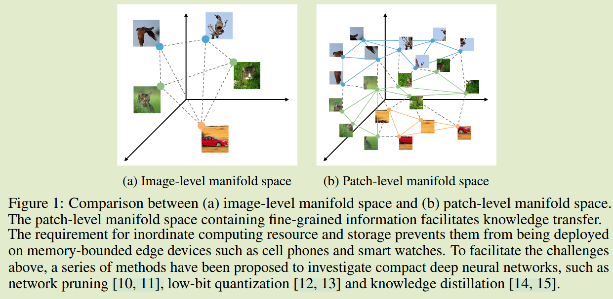
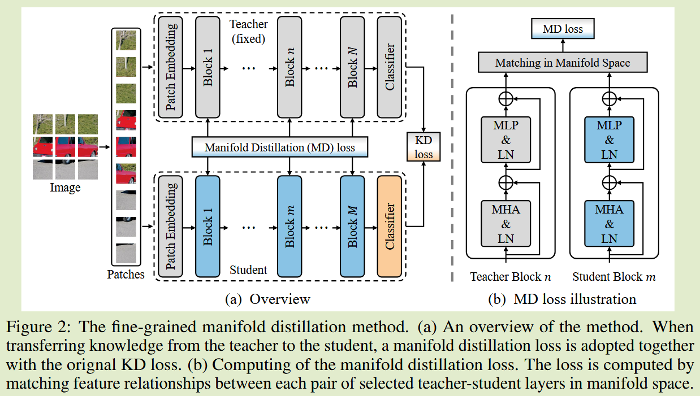
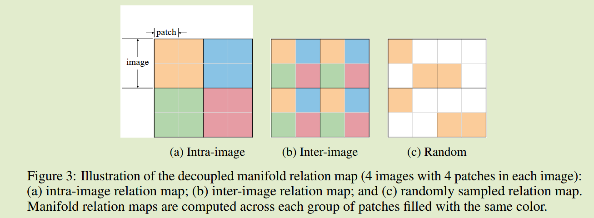

# Learning Efficient Vision Transformers via Fine-Grained Manifold Distillation

**[2022 NeurIPS](https://proceedings.neurips.cc/paper_files/paper/2022/hash/3bd2d73b4e96b0ac5a319be58a96016c-Abstract-Conference.html)	no code	ImageNet  CIFAR  COCO	20241016**

*Zhiwei Hao, Jianyuan Guo, Ding Jia, Kai Han, Yehui Tang, Chao Zhang, Han Hu, Yunhe Wang*

本文认为先前的流形方法都是针对CNN设计的并没有充分利用ViT的特点，即块级之间的特征，而Patch块能够以更细粒度的方式来描述流形空间，能够更好的促进知识的转移，本文提出一种流形蒸馏方法，将ViT的每个层看作是投影层，在每个层中将patch块形成的向量构建成流形关系图，训练模型最小化师生模型之间的流形距离，然而这一过程会消耗巨大的计算资源，因此对流行关系进行解耦：图像间流形损失、图像内流形损失和随机采样流形损失，其中第三者是为了缓解解耦带来的信息损失

## Introduction

现有的流形蒸馏方法是针对CNN方法设计的，无法利用ViT的块级信息，patch块能够以更细粒度的方式描述流形空间，这些信息可以显著促进知识转移。

因此我们提出一种在patch级别和batch级别的细粒度流形蒸馏方法，将ViT视为将输入逐层映射到多个流形空间的投射层，在每一层收集块的向量表示来建立流形关系图，并训练学生和教师的关系图进行匹配，为了降低计算复杂度，将关系图解耦为3个部分

- 我们提出一种细粒度的流形蒸馏方法，在ViT之间传递块级和批次级的流形信息
- 我们使用三个解耦项来描述流形空间，显著简化计算复杂度
- 实验表明了我们方法的有效性，并且我们也证明了软标签蒸馏和固定学生深度的重要性

## Method

#### 细粒度流形蒸馏

我们将ViT看作一个特征投影，将图像块逐层嵌入到一系列平滑的流形空间，我们旨在教会学生层输出与教师层具有相同级别流形结构特征，对于批量大小为B的样本，将学生层和教师层的特征分别表示为$F_S\in \R^{B\times N\times D_S}, F_T \in \R^{B\times N\times D_T}$,Ds DT为隐藏层的维度，N为层数，我们在最后一个维度上进行归一化来计算流形结构：
$$
M(\psi(F_S)) = \psi(F_S)\psi(F_S)^T \\
\psi: \R^{D_1\times D_2 \times D_3} \rightarrow \R^{D_1D_2\times D_3}
$$
我们训练最小化$M(\psi(F_S))$和 $M(\psi(F_S))$之间的距离：
$$
L_{mf} = ||M(\psi(F_S)) - M(\psi(F_T))||^2_F
$$
然而该过程会消耗巨大的计算资源，我们必须要简化计算，受正交分解启发，将流形关系映射解耦为三个部分，图像内关系、图像间关系和随机采样关系映射

图像内和图像间关系映射损失表示为：
$$
L_{intra} = \frac{1}{B}\sum^B_{i=1}||M(F_S[i,:,:]) - M(F_T[i,:,:])||^2_F \\
L_{inter} = \frac{1}{N}\sum^N_{j=1}||M(F_S[:,j,:]) - M(F_T[:,j,:])||^2_F
$$
为了缓解解耦带来的信息损失，我们通过在随机采样的图像块上计算关系图来图像内流形和图像间流形，我们对重构特征$\psi(F)$中的K行进行采样，得到$F^r\in \R^{K \times D}$，并计算随机采样的patch级流形损失:
$$
L_{random} = ||M(\psi(F_S^r)) - M(\psi(F_T^r))||^2_F
$$
因此总体损失表示为：
$$
L = L_{KD} + \sum_lL_{mf-decouple} \\
L_{mf-decouple} = \alpha L_{intra} + \beta L_{inter} + \gamma L_{random}
$$
