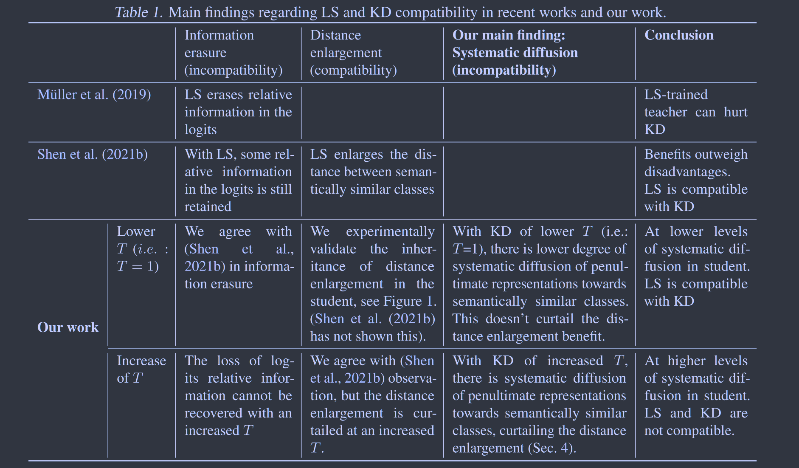

# Revisiting Label Smoothing and Knowledge Distillation Compatibility What was Missing?

NeurIPS 2022

这项工作讨论了标签平滑与蒸馏的关系，并对先前两项工作之间的矛盾给出了解释

*Is label smoothing truly incompatible with knowledge distillation: An empirical study.*

*When does label smoothing help?* 

## Introduction

我们发现教师模型经过标签平滑处理后，在知识蒸馏时较高的温度会将学生倒数第二层的表示扩散到语义相似的类别中，这种扩散从根本上减少了从教师模型那里蒸馏知识得到的好处，使得KD在高温下无效。我们进行大规模的KD实验来研究这种现象，并提出一个扩散指数来量化这种现象，这种扩散以一种系统的方式操纵给定类别的学生的倒数第二层的表示以一种类别相似性的方式。

