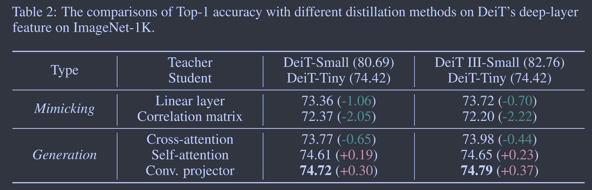
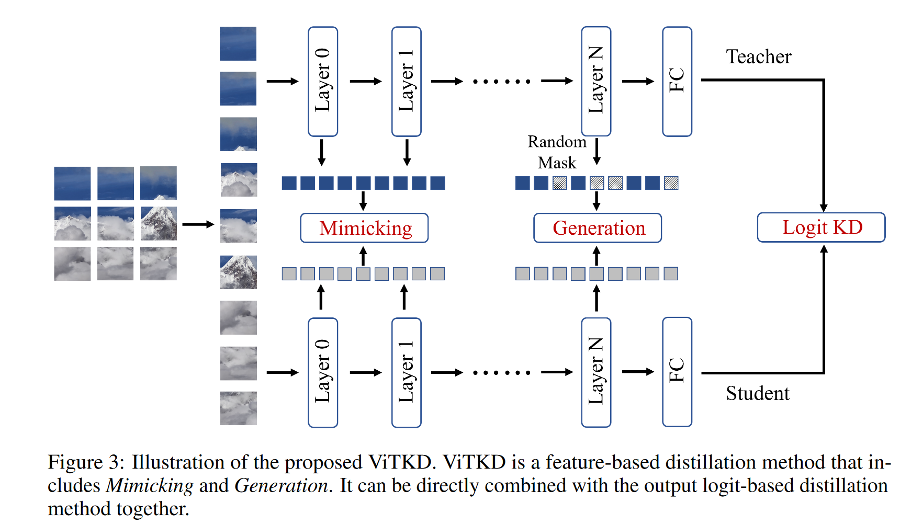

# ViTKD: Practical Guidelines For ViT Feature Knowledge Distillation

**[arXiv2209](https://arxiv.org/abs/2209.02432)	[code in github](https://github.com/yzd-v/cls_KD)	ImageNet	20240607**

*Zhendong Yang, Zhe Li, Ailing Zeng, Zexian Li, Chun Yuan, Yu Li*

这项工作研究了ViT模型浅层和深层特征的分布特征，提出不同层需要不同的蒸馏策略，对于浅层使用基于模仿的线性特征蒸馏，对于深层特征使用基于Mask的生成式蒸馏。

- ViT不同层具有不同的特征分布，使用相同的蒸馏策略不合理
- 浅层使用基于模仿的蒸馏策略
- 深层使用基于Mask掩码的蒸馏策略

## Introduction

我们研究了如何将知识蒸馏技术应用到基于ViT的模型中，CNN中基于Logit的方法可以直接迁移到ViT中，而基于中间特征的方法由于两种架构之间的巨大差异，很难直接迁移。

我们探究了ViT中的特征，在浅层注意力主要集中在对角线上，其主要专注于自己，师生模型都有相似的模式，而在深层，教师和学生注意力差异较大，其各自由几个稀疏的token决定，这种差异学生很难直接模仿老师的最终特征，不同层可能需要不同的方法。

## Motivated

我们采用模仿和生成对DeiT进行蒸馏试验。

使用模仿策略时，将学生和教师的embedding通过线性层和相关矩阵来进行对齐；使用生成策略时，随机屏蔽学生的标记，使用一个生成块来恢复特征。包括交叉注意力块、自注意力块和卷积投影。

我们实验发现，对于深层蒸馏，生成比模仿更合适，模仿教师最后一层特征会那个会损害学生的表现。

对于浅层蒸馏，生成方案token之间的语义关系很弱，很难用掩码特征中获得完整特征，模仿学习效果很好

蒸馏时我们发现FFN特征要优于MHA特征

## Method

我们的特征蒸馏遵循CNN的设定：
$$
\mathcal{L}_{fea} = \sum^C_{k=1}\sum^H_{i=1}\sum^W_{j=1}(\mathcal{F}^T_{k, i, j} - f(\mathcal{F}^S_{k, i, j}))^2
$$
FT,FS 分别表示教师模型和学生模型的特征图，f(·)为投影层来匹配师生模型的维度，H W C 分别表示特征图的高度 宽度 通道数。

### Mimcking For Shallow Layers  对于浅层的模仿学习

学生和教师的特征维度可以表示为：$\mathcal{F}^S \in \mathcal{R}^{N\times D_S}, \mathcal{F}^T \in \mathcal{R}^{N\times D_T}$,我们用一个线性层来对齐其特征维度：
$$
\mathcal{L}_{lr} = \sum^N_{i=1}\sum^D_{j=1}(\mathcal{F}^T_{i,j} - fc(\mathcal{F}^S)_{i,j})^2
$$
N D分别表示补丁标记的个数和教师特征的维数。我们引入一个相关矩阵来描述不同补丁标记之间的相应，并强制学生学习教师特征的相关矩阵，这种情况我们不需要适配层来对齐特征维度，相关矩阵表示为：
$$
\mathcal{M} = \frac{\mathcal{FF}^{T}}{\sqrt{D}}
$$
$\mathcal{F} \in \mathcal{R}^{N\times D}$表示师生特征，D表示特征维度，关系矩阵维度师生模型相同$\mathcal{M}\in \mathcal{R}^{N\times N}$，关联矩阵之间的蒸馏损失：
$$
\mathcal{L}_{rm} = \sum^N_{i=1}\sum^N_{j=1}(\mathcal{M}^T_{i,j} - \mathcal{M}^S_{i,j})^2
$$

### Generation For Deep Layers  对于深层的生成学习

使用一个线性层对齐师生模型特征维度，设置一个随机掩码$Mask\in\mathcal{R}^{N\times 1}$来替换原有的token：
$$
\hat{\mathcal{F}}^S_{i} = \begin{aligned}
\begin{cases}
masked\ token,&if\ r_i<\lambda \\
original\ token,& Otherwise
\end{cases}
\end{aligned}\\

Mask_{i} = \begin{aligned}
\begin{cases}
1,&if\ r_i<\lambda \\
0,& Otherwise
\end{cases}
\end{aligned}
$$
$r_i, i\in[0, N-1]$表示在[0,1]均匀分布中的随机数，$\lambda$为超参数，我们实验设置为0.5，我们通过一个生成模块G利用掩码特征生成教师完整特征：
$$
\mathcal{G}(\hat{\mathcal{F}}^S) \rightarrow \mathcal{F}^T
$$
我们利用CAE的交叉注意力块、MAE的自注意力块和MGD的卷积投影块。计算masked token的蒸馏损失：
$$
\mathcal{L}_{gen} = \sum^N_{i=1}\sum^D_{j=1}Mask_i(\mathcal{F}^T_{i,j} - \mathcal{G}(\hat{\mathcal{F}}^S_{i,j}))^2
$$

### ViTKD

我们对前两层采用线性层方法进行蒸馏，最后一层用卷积投影块进行蒸馏，总体损失表示为：
$$
\mathcal{L} = \mathcal{L}_{ori} + \alpha\mathcal{L}_{lr} + \beta\mathcal{L}_{gen}
$$

## More Analyses

### Do we need to distill the middle layers?

我们实验发现浅层特征尤其时第一层特征要比中间层对学生模型的蒸馏更有帮助，结合浅层和中间层性能提升仅有0.2%

### Teachers with the same architecture as the student are appropriate

师生模型要选择相同的架构，我们实验发现不同的架构会导致学生模型性能退化，DeiT与CaiT浅层和深层的注意力分配差异很大，这对学生学习是困难的

### Sensitivity study of hyper-parameters

实验表明我们的ViTKD对超参数不敏感
