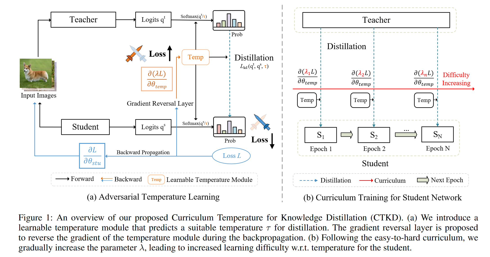
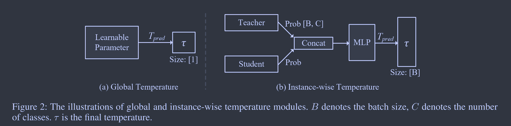
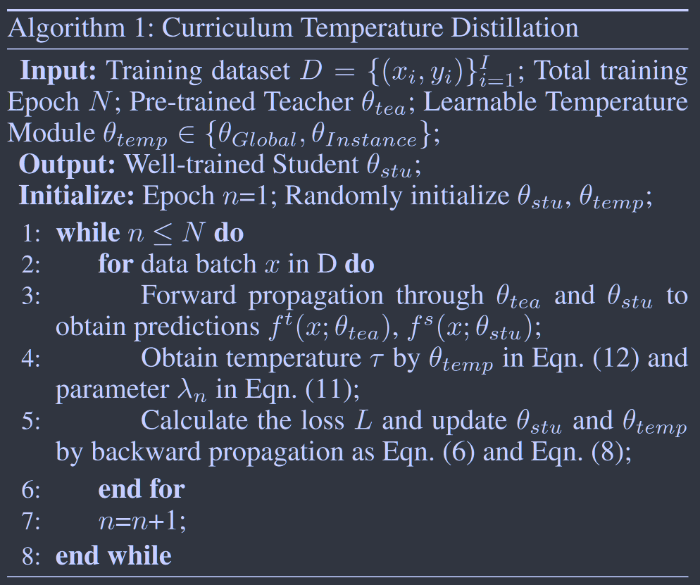

# Curriculum Temperature for Knowledge Distillation

[AAAI 2023](https://ojs.aaai.org/index.php/AAAI/article/view/25236)	[code in github](https://github.com/zhengli97/CTKD)	CIFAR100	20240412

*Zheng Li  Xiang Li  Lingfeng Yang  Borui Zhao  Renjie Song  Lei Luo  Jun Li  Jian Yang*

这项工作对蒸馏中的温度系数进行了研究，先前工作忽略了温度系数的作用，经验化的将其设定为一个固定值。在真实的师生教育中，往往遵循就易到难的过程，这项工作提出引入课程学习的概念，利用温度系数来实现学习任务由易到难的模拟，引入了GAN的优化思路来学习温度系数的大小。这是一个即插即用的组件，几乎可以应用在目前所有的蒸馏学习方法之中。

## Introduction 

传统的知识蒸馏通过最小化softmax层中固定温度的教师/学生模型得到的两个预测之间的KL散度损失来实现。温度控制着分布的平滑程度，能决定损失最小化过程的难易程度。现有的工作忽略了温度的作用，经验性的将其设为固定值。

在我们人类的教育中，教师总是用简单的课程来训练学生，随着学生的成长课程逐渐呈现更复杂的概念。这种模式启发了机器学习算法。我们提出一种基于课程的方法，称为课程温度知识整理CTKD，通过一个动态的、可学习的温度系数，逐步提高学生的学习难度来提升蒸馏的性能。通过可学习的温度系数，在设计的课程下对学生进行训练，遵循由易到难的原则，通过调节温度系数，增加蒸馏损失导致学习的难度增加。

> 提出在学生的训练过程中使用反向梯度对抗学习动态温度超参数来最大化师生之间的蒸馏损失。
>
> 提出一种简单而有效的课程，通过一个动态的、可学习的温度系数，由易到难的组织蒸馏任务

**课程学习：**是一种通过组织学习任务顺序逐渐增加网络难度来训练网络的方式。

## Method

给定标签数据集$D=\{ (x_i, y_i)\}^I_{i=1}$，传统蒸馏损失表示为：
$$
L_{kd}(q^t, q^s, \tau) = \sum^I_{i=1}\tau^2KL(\sigma(q^t_i/\tau), \sigma(q^s_i/\tau)) \tag{1}
$$

### Adversarial Distillation

对传统的蒸馏任务，对学生模型的优化过程可以表示为：
$$
\underset{\theta_{stu}}{min}\ L(\theta_{stu}) = \underset{\theta_{stu}}{min} \sum_{x\in D}\alpha_1L_{task}(f^s(x;\theta_{stu}), y) + \alpha_2L_{kd}(f^t(x;\theta_{tea}), f^s(x;\theta_{stu}), \tau) \tag{2}
$$
为了通过动态温度来控制学生的学习难度，受GAN是的启发，我们提出对抗性地学习一个动态温度模块$\theta_{temp}$，该模块预测一个适合当前训练的温度，该模块在于学生相反的方向上进行优化，旨在最大化学生于教师之间的蒸馏损失，两者进行极大极小值的博弈：
$$
\underset{\theta_{stu}}{min}\ \underset{\theta_{temp}}{max}\ L(\theta_{stu}, \theta_{temp}) = \underset{\theta_{stu}}{min}\ \underset{\theta_{temp}}{max}\ \sum_{x\in D}\alpha_1L_{task}(f^s(x;\theta_{stu}), y) + \alpha_2L_{kd}(f^t(x;\theta_{tea}), f^s(x;\theta_{stu}), \theta_{temp}) \tag{3}
$$
我们采用交替算法求解上述优化问题，固定一组变量求另一组变量：
$$
\hat{\theta}_{stu} = arg\ \underset{\theta_{stu}}{min}\ L(\theta_{stu}, \hat\theta_{temp}) \tag{4}
$$

$$
\hat{\theta}_{temp} = arg\ \underset{\theta_{temp}}{max}\ L(\hat\theta_{stu}, \theta_{temp}) \tag{5} \\
$$

优化更新过程如下：
$$
\theta_{stu} \leftarrow \theta_{stu} - \mu\frac{\partial L}{\partial \theta_{stu}} \tag{6}\\
$$

$$
\theta_{temp} \leftarrow \theta_{temp} + \mu\frac{\partial L}{\partial \theta_{temp}} \tag{7}
$$

### Curriculum Temperature

我们引入课程学习的思想，通过$\lambda$讲蒸馏任务从易到难来组织任务：
$$
\theta_{temp} \leftarrow \theta_{temp} + \mu\frac{\partial (\lambda L)}{\partial \theta_{temp}} \tag{8}
$$
训练初期学生模型能力有限，需要学习基础知识，初始$\lambda$设置为0，使得最开始学生模型能够专注于任务而不受任何拘束，逐步提高$\lambda$的值提高蒸馏的难度，使学生能够学习到更高级的知识：

> 给定温度系数$\tau$，蒸馏损失逐渐增加：
> $$
> L_{kd}(\tau_{n+1}) \geq L_{kd}(\tau_n) \tag{9}
> $$
> $\lambda$逐步增加：$
> $$
> \lambda_{n+1} \geq \lambda_n \tag{10}
> $$
> 

我们通过余弦函数来修改第En次训练$\lambda$的值：
$$
\lambda_n = \lambda_{min} + \frac{1}{2}(\lambda_{max}-\lambda_{min})(1+cos((1+\frac{min(E_n, E_{loops})}{E_{loops}})\pi) \tag{11}
$$
$E_{loops}$为难度尺度变化的超参数，通常$\lambda_{max}, \lambda_{min}, E_{loops}$分别设置为1， 0， 10

### Learnable Temperature Module

我们提出两个版本的可学习温度模块

#### Global-T 

全局版本只有一个可学习参数，对所有实例预测只有一个$T_{pred}$，如图a所示，这种不会给蒸馏过程带来额外的计算开销，因为只有单个可学习参数。

#### Instance-T

为了获得更好的蒸馏性能，一个全局温度对所有的情况是不准确的，我们提出了Instance-T的变体，他单独预测了所有实例的温度，例如128个样本对应128个温度值。我们提出利用概率分布的统计信息来控制自身的平滑性，引入两个MLP层，以师生模型的预测值作为输出，来计算温度系数，该模块会自动学习原始分布和平滑分布之间的隐含关系。为了保证温度系数的非负性：
$$
\tau = \tau_{init} + \tau_{range}(\delta(T_{pred}))
$$
$\tau_{init}$表示温度的初始值，$\tau_{range}$表示温度的范围， $\sigma(·)$为sigmoid函数，Tpred为预测值。$\tau_{init}, \tau_{range}$设为1， 20。

与全局版本相比，实例版本具有更好的表示能力，能够获得更好的蒸馏性能。

