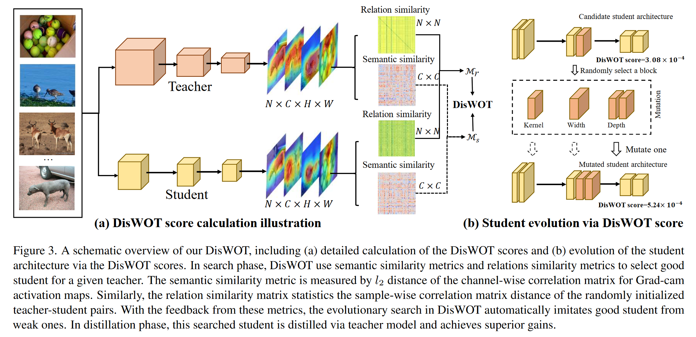
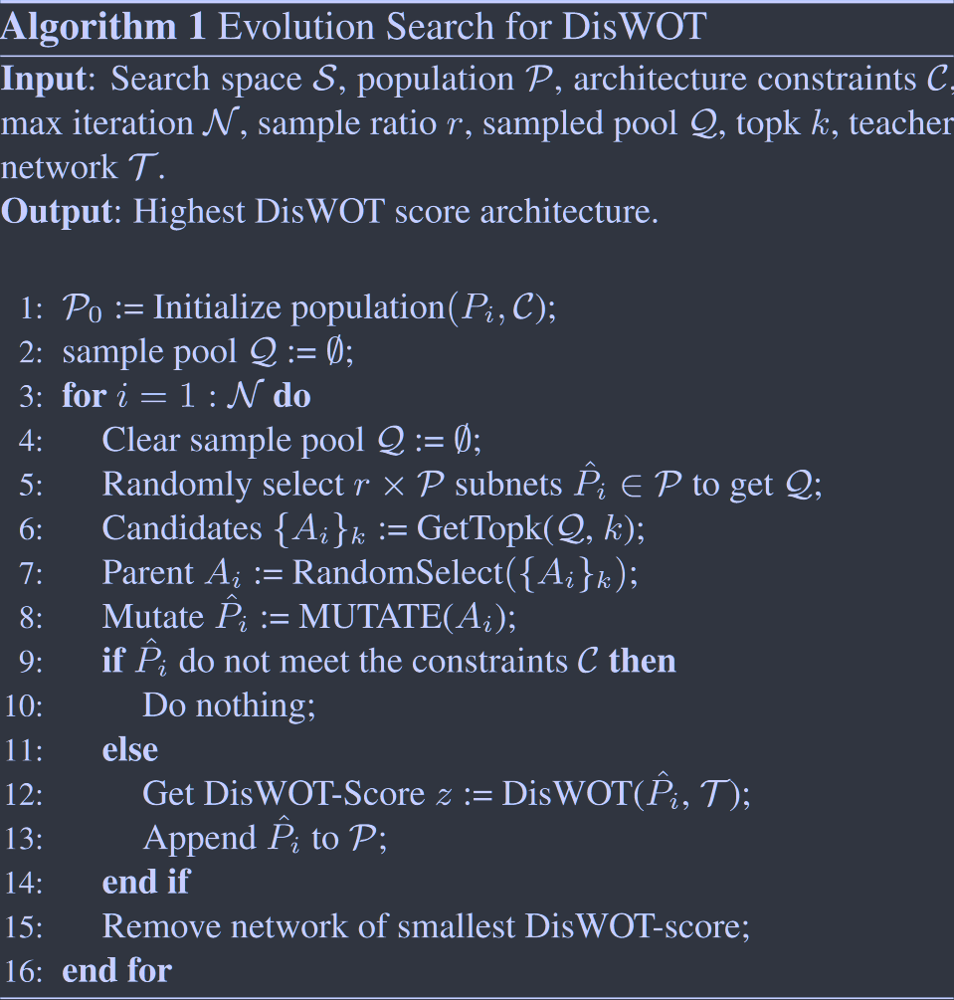

# DisWOT: Student Architecture Search for Distillation Without Training

**[CVPR 2023](https://openaccess.thecvf.com/content/CVPR2023/html/Dong_DisWOT_Student_Architecture_Search_for_Distillation_WithOut_Training_CVPR_2023_paper.html)	[code in github](https://github.com/lilujunai/DisWOT-CVPR2023)	CIFAR10/100  ImageNet**

*Peijie Dong, Lujun Li, Zimian Wei*

针对师生模型差距大的情况下蒸馏性能不佳的问题，给出了一种基于进化算法的学生模型搜索策略，考虑了类别和样本之间的相似性，通过免训练的搜索架构得到最优的学生架构，在与预定义的教师模型进行蒸馏学习。

## Introduction

随着师生模型之间的差距增加，现有的KD方法无法改善结果，大教师相比相对较小的教师会导致更差的学生模型。先前方法针对这个问题提出提前停止以及使用助教、架构搜索等方法。但是这些方法在提高蒸馏性能方面效果不佳、或是引入额外的巨大的训练成本。我们从免训练框架搜索的角度解决这个问题，为给定的教师模型找到最佳的学生架构，为了更好的语义匹配，DisWOT利用关于特征语义和样本关系的来选择更好的学生模型。

在特征语义相似性度量方面，我们指出随机初始化的模型可以很好的定位物体，并通过CAM生成定位热图作为可靠的语义信息；对定位热图的通道相似性矩阵进行了度量，L2距离作为度量标准；对于输入样本，不同的模型对其关系的判别能力是不同的，为了提高关系知识的匹配能力，使用样本关系关联矩阵的L2距离作为相似性度量。最后使用具有语义和关系相似性度量的进化算法搜索学生架构，在搜索到的学生架构和预定义的教师之间执行蒸馏操作。

> 与基于训练的学生架构搜索需要单独训练或权重共享训练不同，我们的方法在搜索阶段不需要训练学生模型，且我们初始化使用小批量数据，计算效率高。
>
> 我们的方法是一种教师感知的蒸馏搜索，比传统的NAS有更好的预测蒸馏精度
>
> 我们的方法利用神经网络之间的高阶知识距离，来连接知识蒸馏和零代理的NAS

## Method

该框架由两个主要阶段组成，最优学生网络搜索和高阶知识蒸馏。在搜索阶段，我们使用神经架构搜索为预定义的教师网络获得一个最优的学生网络，我们提出一个DisWOT的面训练代理，来准确的对庞大的学上网络进行排序，以更高的效率进行评估。在蒸馏阶段，对搜索到的学生网络进行蒸馏在训练，模仿教师网络中的高阶知识。

### Search for Optimal Student Network

#### Semantic Similarity Metric
***CVPR2016 CAM***  
我们的目标是设计无训练的学生架构，以更好的匹配具有计算约束的教师模型，我们分析随机初始化的师生模型的目标定位性能。我们使用CAM映射[***2016CVPR CAM***]来定义语义对象区域，给定一个小批量数据，我们将教师网络T的全局平均池化层GAP之前的高层特征图定义为$A_T\in R^{B\times C_T \times H_T \times W_T}$其中B为batchsize，CT表示输出通道数量，HT WT为空间维度。引入$A^c_T\in R^{N\times H_T\times W_T}$作为第c个通道的特征图，对学生Si同理有$A_{S_i} \in R^{B\times C_S \times H_S \times W_S}, A^c_{S_i}\in R^{N\times H_S\times W_S}$，计算学生网络和教师网络第n个类的Grad-CAM映射，有：
$$
G_T = \sum^{C_T}_{c=1}w^T_{n,c}A^c_T;\ G_{S_i} = \sum^{C_S}_{c=1}w^S_{n,c}A^c_{S_i}
$$
其中$w^T\in R^{N\times C_T} , w^S\in R^{N \times C_S}$为师生网络最后一个全连接层的权值，N代表类别数量，$w^T_{n,c}, w^S_{n,c}$表示其第n行第c列的元素。为了量化类别判别定位图的交集，我们提出语义相似性度量Ms，作为师生网络CAM图上的互相关：
$$
\mathcal{G}^T = \frac{G_T·(G_T)^T}{||G_T·(G_T)^T||_2}, \ \mathcal{G}^S = \frac{G_S·(G_S)^T}{||G_S·(G_S)^T||_2} \\
\mathcal{M}_s = ||\mathcal{G}^T - \mathcal{G}^{S_i}||_2
$$

#### Relation Similarity Metric
***ICCV2019 Similarity-Preserving KD***  
为了缩小师生差距，提高关系蒸馏性能，我们使用相关矩阵作为样本度量来搜索最优的学生网络。对激活映射图$A_T\in R^{B\times C_T \times H_T \times W_T}, A_S^i\in R^{B \times C_i \times H_i \times W_i}$,师生网络中的小批量样本的相关矩阵：
$$
\mathcal{A}^T = \frac{(\widetilde{A}_T)·(\widetilde{A}_T)^T}{||(\widetilde{A}_T)·(\widetilde{A}_T)^T||_2} , \ \mathcal{A}^{S_i} = \frac{(\widetilde{A}_S)·(\widetilde{A}_S)^T}{||(\widetilde{A}_S)·(\widetilde{A}_S)^T||_2}
$$
其中$\widetilde{A}_T \in R^{B\times CHW}$为AT的变形，潜在学生的相似性度量:
$$
\mathcal{M}_r = ||\mathcal{A}^T - \mathcal{A}^{S_i}||_2
$$

#### Training-Free Evolutionary Search

基于以上度量，我们提出一个免训练进化搜索算法来高效地从搜索空间A中发现最优学生$\alpha^*$：
$$
\alpha^* = \underset{\alpha\in \mathcal{A}}{arg\ min} (\mathcal{M}_s + \mathcal{M}_r)
$$

#### Theoretical Understanding

根据VC理论：
$$
R(f_s) - R(f_r) \leq O(\frac{|\mathcal{F}_s|_C}{n^{\alpha_{sr}}}) + \epsilon_{sr} \\
R(f_t) - R(f_r) \leq O(\frac{|\mathcal{F}_t|_C}{n^{\alpha_{tr}}}) + \epsilon_{tr}
$$
其中$f_s\in\mathcal{F}_s, f_t\in\mathcal{F}_t, f_r\in\mathcal{F}_r$分别为学生函数、教师函数和目标函数。R为误差，$O(·), \epsilon$分别为估计误差和逼近误差。前者与统计过程有关而后者为$\mathcal{F}_s$对于$f_r\in \mathcal{F}_r$的逼近误差。 $|·|_C$为函数类容量测度，n是数据点的个数。在蒸馏学习中，学生网络利用教师网络作为监督信号，有：
$$
R(f_s) - R(f_t) \leq O(\frac{|\mathcal{F}_s|_C}{n^{\alpha_{st}}}) + \epsilon_{st}
$$
$\alpha_{st},\epsilon_{st}$与学生从教师学习的过程有关，关联上述方程组：
$$
R(f_s)-R(f_t)+R(f_t)-R(f_r) = R(f_s) - R(f_r) \leq O(\frac{|\mathcal{F}_s|_C}{n^{\alpha_{st}}}) + \epsilon_{st} + O(\frac{|\mathcal{F}_t|_C}{n^{\alpha_{tr}}}) + \epsilon_{tr}
$$
当学生模型在蒸馏过程中受益时，其误差上界小于直接训练的情况：
$$
O(\frac{|\mathcal{F}_s|_C}{n^{\alpha_{st}}} + \frac{|\mathcal{F}_t|_C}{n^{\alpha_{tr}}}) + \epsilon_{st} + \epsilon_{tr} \leq O(\frac{|\mathcal{F}_s|_C}{n^{\alpha_{sr}}}) + \epsilon_{sr}
$$
基于先前工作的假设有：$\epsilon_{st} + \epsilon_{tr} \leq \epsilon_{sr}$，我们致力于最小化$O(\frac{|\mathcal{F}_s|_C}{n^{\alpha_{st}}} + \frac{|\mathcal{F}_t|_C}{n^{\alpha_{tr}}})$来提高蒸馏的性能，更好的表示可以在固定数据量的情况下获得更快的学习速率，因此当学生网络和教师网络能力差距越大时$\alpha_{st}$值越小，误差项就越大，因为我们的目标时搜索最优的学生网络使得$\alpha_{s_it} \leq \alpha_{s_ot}，s_i,s_o $，分别是所有的候选网络和最佳网络

### Distillation with High-Order Knowledge

我们发现寻找的度量指标其实是蒸馏过程的最小化优化目标，将教师的语义和样本关系蒸馏迁移为语义蒸馏和样本关系蒸馏：
$$
\mathcal{L_M}_s = \frac{1}{c^2}||\mathcal{G}^T - \mathcal{G}^S||_2 ;\ \mathcal{L_M}_r = \frac{1}{b^2}||\mathcal{A}^T - \mathcal{A}^S||_2
$$
最后我们将这些损失项嵌入到蒸馏框架中，称之为DisWOT：
$$
\mathcal{L}_{DisWOT} = \mathcal{L}_{CE}(f_S\mathcal{L}_{DisWOT}, Y)  + \mathcal{L}_{KL}(f_S, f_T)  \\
\mathcal{L}_{DisWOT\dagger} = \mathcal{L}_{DisWOT} + \mathcal{L_M}_s + \mathcal{L_M}_r
$$
