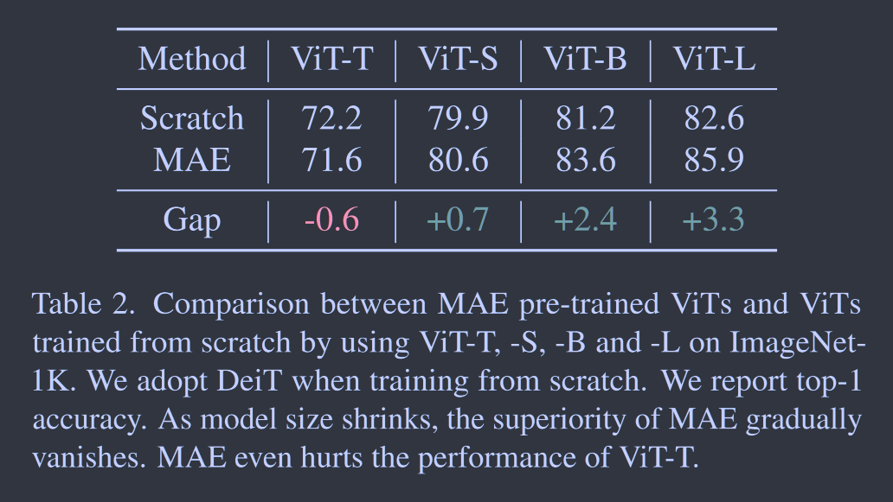
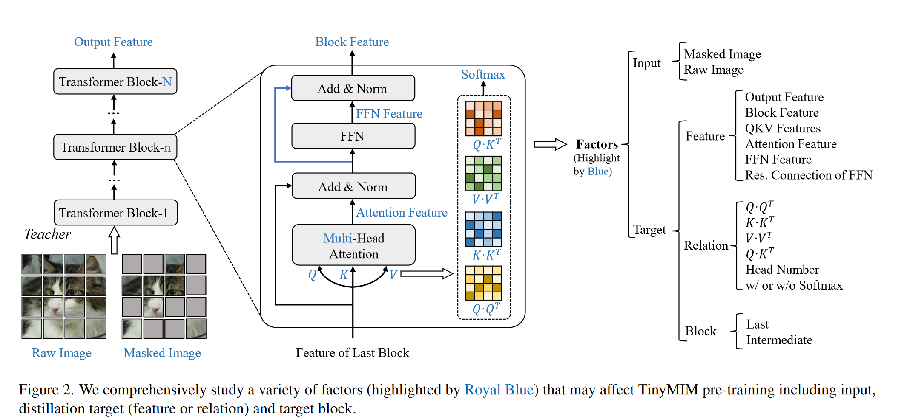
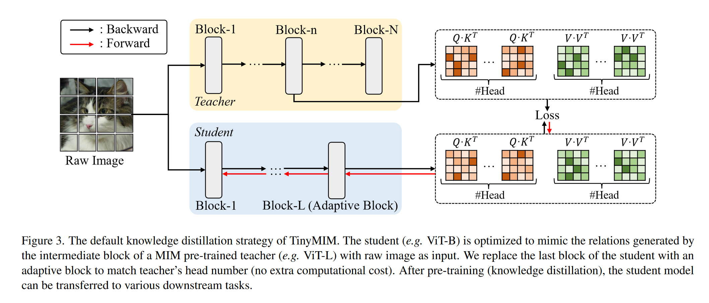

# TinyMIM: An Empirical Study of Distilling MIM Pre-trained Models

**[CVPR 2023](https://openaccess.thecvf.com/content/CVPR2023/html/Ren_TinyMIM_An_Empirical_Study_of_Distilling_MIM_Pre-Trained_Models_CVPR_2023_paper.html)	[code in github](https://github.com/OliverRensu/TinyMIM)	ImageNet  ADE20k	20240426**

*Sucheng Ren, Fangyun Wei, Zheng Zhang, Han Hu*

这项工作提出了用Masked Image Modeling MIM来进行大模型的蒸馏，实验发现当模型较小（ViT-T）时使用MIM会损害模型精度，我们想要通过蒸馏技术将MIM的知识转移到较小的网络中，实验探究了对不同因素进行蒸馏带来的效果提升，结果表明对Transformer中的QKV关系token进行蒸馏要比直接蒸馏cls token特征图要好，并借鉴了先前工作认为的模型差异较大蒸馏效果退化的经验，采用顺序蒸馏策略，先从Vit-B蒸馏到ViT-S再到ViT-T.

## Introduction

我们发现MIM预训练针对相对较大的模型才有效，当模型大小小到Vit-Tiny时，MIM甚至会损害分类精度，因此我们想要探究小模型是否也能从MIM预训练模型中收益？

这项工作中我们提出了TinyMM，使用蒸馏技术将大型的MIM预训练模型的知识转移到较小的模型中，我们考虑了蒸馏目标，数据增强，网络正则化，辅助损失等发现：

- 关于蒸馏目标，蒸馏关系token比蒸馏分类token和特征图更有效；使用中间层作为目标要比最后一层更好，并且对不同的下游任务最佳层可能不同。
- 关于数据和网络正则化，弱增强和正则化是首选，使用添加掩码的图像比使用原图像效果要差；相对较小的drop path率要更好，（教师0 学生0.1）
- 给MIM添加辅助损失并不能提高精度
- 我们使用顺序蒸馏策略即$ViT-B\rightarrow ViT-S \rightarrow Vit-T$效果比直接从Base到Tiny更好

## Method

我们采用更大的MIM(Masked Image Modeling)预训练作为教师，较小的ViT作为学生，TinyMIM的目标是通过以知识蒸馏的方式模仿教师产生的目标来训练随机初始化的学生。Tiny MIM预训练模型可以转移到各种下游任务中。

### Factors

#### Distillation Target

**Block Feature and Output Feature**  给定一个输入图像x，首先将其划分为N个不重叠的块，使用线性映射层将N个块映射到$F_0\in \R^{N\times D}$，其中D为隐藏层的特征维度，假设我们有一个包含L Transformer块的ViT，每一个Transformer块使用上一个块的输出$F_{i-1}$作为输入，得到当前块的特征$F_i$：
$$
F_i= Transformer(F_{i-1}) , i\in[1, L]
$$
将最后一块的输出$F_L$称为输出特征。

**Attention Feature and FFN Feature**  每个Transformer块由一个自注意力层和一个前馈层组成：
$$
\begin{aligned}
& H_i = Attention(LN(F_{i-1})) \\
& \hat{H}_i = H_i + F_{i-1} \\
& \tilde{H}_i = FFN(LN(\hat{H}_i))\\
& \overline{F}_i = \hat{H}_i + \tilde{H}_i
\end{aligned}
$$
**Query/Key/Value Features**  每个注意力层由M头注意力层组成，每个头将输入特征$F_{i-1}$映射到QKV中：
$$
\begin{aligned}
& Q^m_i = LN(F_{i-1})W^Q_i \\
& K^m_i = LN(F_{i-1})W^K_i \\
& V^m_i = LN(F_{i-1})W^V_i \\
\end{aligned}
$$
$Q^m_i, K^m_i, V^m_i \in \R ^{N\times \frac{D}{M}}$表示每个头的输出，$Q_i, K_i, V_i\in \R^{N\times D}$表示m个头聚合的结果。

**Relations**  对第m个头和第i个Transformer块，我们计算Q-Q, K-K, V-V, Q-K:
$$
\begin{aligned}
& R^{QQ}_{i, m} = Softmax(\frac{Q^m_i{Q^{m}_i}^T}{\sqrt{D/M}}) \\
& R^{KK}_{i, m} = Softmax(\frac{K^m_i{K^{m}_i}^T}{\sqrt{D/M}}) \\
& R^{VV}_{i, m} = Softmax(\frac{V^m_i{V^{m}_i}^T}{\sqrt{D/M}}) \\
& R^{QK}_{i, m} = Softmax(\frac{Q^m_i{K^{m}_i}^T}{\sqrt{D/M}}) \\
\end{aligned}
$$

#### Input

MIM模型在输入图像x上随机屏蔽了图像补丁生成用于预训练的屏蔽图像$\tilde{x}$

#### Target Block

我们使用包含24个块的MAE预训练ViT-L作为教师来蒸馏12个块的ViT-B，此时学生与教师的块号不匹配，我们将调查那个块可以提供最合适的目标

### Knowledge Distillation as MIM Pre-training

基本的蒸馏表示为：
$$
\mathcal{L}_{KL}(p, t) = tlog\frac{t}{p}
$$

#### Class Token Distillation

使用ct, cs表示师生模型的class token 特征：
$$
\mathcal{L} = \mathcal{L}_{KD}(c_s, c_t)
$$

#### Feature Distillation

教师网络与学生网络特征维度一般是不匹配的，我们在学生网络的输出上采用一个额外的线性层来匹配教师目标的特征维度，Fs,Ft分别白哦是学生的预测和目标特征：
$$
\mathcal{L} = \mathcal{L}_1(F_s, Norm(F_t))
$$
Norm表示层归一化实现的白化操作， L1为平滑损失，$\beta$设为2.0
$$
\mathcal{L}_1(y, \hat{y}) =
\begin{cases}
\begin{aligned}
&  \frac{1}{2}(\hat{y} - y)^2 / \beta, & |\hat{y} - y| \leq \beta \\
& |\hat{y} - y| - \frac{1}{2}\beta, & otherwise
\end{aligned}
\end{cases}
$$

#### Relation Distillation

我们的默认蒸馏策略如图所示，$R^{QK}_{t\rightarrow m}, R^{QK}_{s\rightarrow m}$分别表示由教师网络生成的第m个头的QK关系目标和有学生网络生成的QK目标：
$$
\mathcal{L}^{QK} = \frac{1}{M}\mathcal{L}_{KL}(R^{QK}_{s\rightarrow m}, R^{QK}_{t\rightarrow m}) \\
\mathcal{L}^{VV} = \frac{1}{M}\mathcal{L}_{KL}(R^{VV}_{s\rightarrow m}, R^{VV}_{t\rightarrow m}) \\
\mathcal{L} = \mathcal{L}^{QK} + \mathcal{L}^{VV}
$$

#### Head Alignment for Relation Distillaion

师生模型头的维度通常不同，将学生的最后一个块替换为一个自适应块，该块保持原始隐藏维度，但将头数调整为与教师相同。给定每个块有Mt个头的教师网络，每个块有Ms个头的学生网络，隐藏维度为Ds，头维度为Ds/Ms，自适应块被设计为一个Transformer块，每个块有Mt个头，隐藏维度为Ds，头维度为Ds/Mt。

### Sequential Distillation

由于ViT-L yu ViT-S之间存在巨大的容量差异，导致蒸馏效果不佳，因此采用顺序蒸馏策略来改进预训练，当预训练一个ViT-S时，选择的教师是一个TinyMIM预训练的ViT-B，该模型是由TinyMIM使用ViT-L作为教师进行训练的