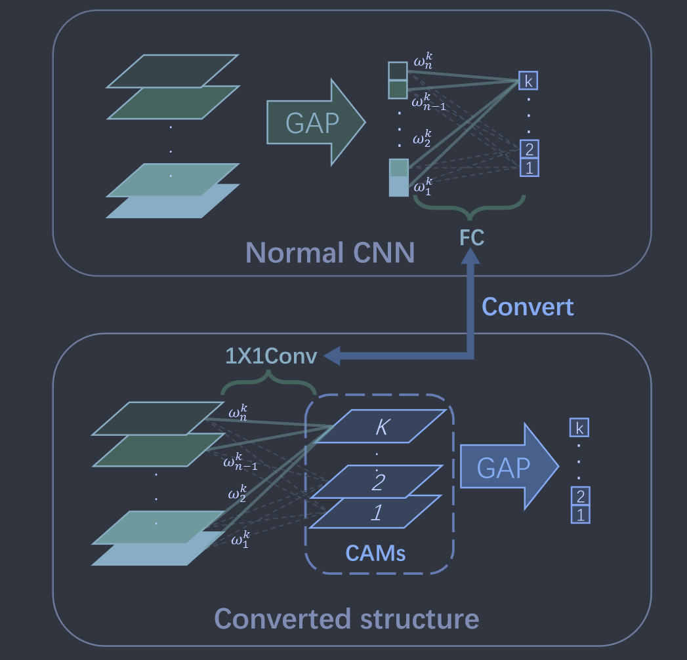
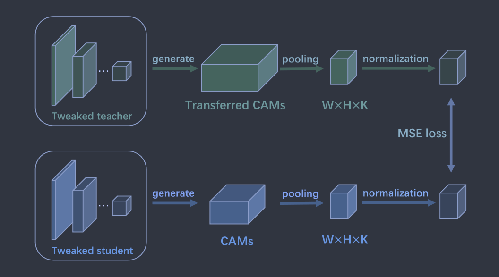

# Class Attention Transfer Based Knowledge Distillation

**[CVPR 2023](https://openaccess.thecvf.com/content/CVPR2023/html/Guo_Class_Attention_Transfer_Based_Knowledge_Distillation_CVPR_2023_paper.html)	[code in github](https://github.com/GzyAftermath/CAT-KD)	CIFAR100  ImageNet**

*Ziyao Guo, Haonan Yan, Hui Li, Xiaodong Lin*

这项工作根据先前工作提出的类别注意力图(CAM 2016CVPR)，提出了类别注意力转换(CAT)调整CAM的生成位置，使之可以作为蒸馏知识教授学生模型，这种方法不仅具有更好的性能还具有更好的可解释性。

## Introduction 

基于Logit和特征的KD方法显示出不错的性能，但由于其不可解释性，很难解释他们转移的知识如何帮助提高学生网络的性能，相对而言基于注意力的KD方法原理更为直观，通过强制学生网络在训练期间模仿转移的注意图来告诉学生网络在分类过程中应该关注输入的哪一部分。

先前的工作AT(2017ICLR)验证了注意力转移的有效性，但其并没有说明注意力在分类过程中所起的作用，我们这项工作的重点是提出一种基于注意力的KD方法，该方法具有更高的可解释性和更好的性能。

> 我们提出了类注意力转移，并用它来证明识别输入的类区分区域的能力对于CNN进行分类至关重要，可以通过转移CAM来获得和增强
>
> 我们介绍了转移CAM的几个特性，有助于更好的理解CNN
>
> 我们将CAT应用于知识蒸馏，并将其命名为CAT-KD，在具有高可解释性的同时还达到了最好的性能。

## Method

我们首先分析了主流的CNN模型结构，并揭示了具有识别类别差异区域的能力对于CNN进行分类至关重要；然后进一步提出了类别注意力转移，来证明这种能力可以通过转移CAM来获得和增强；最后我们将CAT应用于知识蒸馏。

### Revisit the Structure of  CNN

令$F=[F_1, F_2,...,F_C]\in \R^{C\times W\times H}$代表最后一层卷积生成的C通道特征图，$f_j(x,y)$表示F中j通道在(x,y)处的激活值，其中GAP表示全局平均池化层：
$$
L_i= \sum_{1\leq j\leq C}w^i_j \times GAP(F_j) = \frac{1}{W\times H}\sum_{x,y}\sum_{1\leq j\leq C}w^i_j \times f_i(x,y)
$$
$L_i$表示第i类的logit，$w^i_j$是GAP对应于第i类的全连接层的权重，我们计算第i类的类别激活图(class activation map, CAM)如下：
$$
CAM_i(x,y) = \sum_{1\leq j\leq C} w^i_j \times f_j(x,y)
$$
根据上式，$L_i$的计算可以写成：
$$
L_i = \frac{1}{W\times H}\sum_{x,y}CAM_i(x,y) = GAP(CAM_i(x,y))
$$
因此可以通过计算CAM的平均激活来获得logits，受此启发，我们将FC层转换为$1\times 1$的卷积层并移动GAP层的位置，则由转换后模型生成的第i类的logits $\overline{L_i}$:
$$
\overline{L}_i=GAP(Conv_i(F))=\frac{1}{W\times H} \sum_{x,y}(\sum_{1\leq j\leq C}w^i_j\times f_j(x,y)) = GAP(CAM_i)
$$
$Conv_i$表示转换后的1\*1的卷积核，用于将对应于i类别的特征与F分离。***个人理解若不进行CAT的转换得不到CAM特征图而直接得到类别标签。*** **这个地方代码中在原模型中改的**

转换后模型的分类过程分为两步：模型利用其识别**输入的类区分区域的能力**生成CAM；模型通过计算相应**CAM的平均激活**来输出每个类别的预测分数。由于模型通过简单的比较CAM的平均激活来进行预测，因此具有识别输入的类别区分区域的能力对于CNN进行分类至关重要。

### Class Attention Transfer

CAT(Class Attention Transfer)的目的是检查模型是否可以通过仅传输CAM来获得识别输入的类区分区域的能力。因此在CAT期间不需要训练模型来执行分类，并且与训练集中数据类别相关的任何信息都不会到训练模型中，我们利用具有转换结构的预训练模型来生成转移的CAM。

对于给定的输入，$A\in \R^{K\times W\times H}$表示转换后生成的CAM，其中K是分类任务中包含的类别数，W和H分别表示生成的CAM的宽度和高度。$A_i\in \R^{W\times H}$表示A的i通道，即对应i类的CAM。S,T分别表示教师和学生。我们使用平均池化函数$\phi$来降低传输的CAM分辨率，以此来提高CAT的性能，则CAT的损失定义为：
$$
\mathcal{L}_{CAT}=\sum_{1\leq i\leq K}\frac{1}{K}||\frac{\phi(A_i^T)}{||\phi(A_i^T)||_2} - \frac{\phi(A_i^S)}{||\phi(A_i^S)||_2}||^2_2
$$
在$\phi(A^T_i),\phi(A^S_i)$执行l2归一化以确保在CAT期间与输入类别相关的信息不会被释放到训练模型中。我们通过CAT试验的核心发现如下：

> 通过转移CAM可以获得和增强识别输入的类别区分区域的能力
>
> 所有类别的CAM都包含对CAT的有益信息
>
> 传输较小的CAM性能更好
>
> 对于CAT，传输的CAM中包含的关键信息是其中具有高激活区域的空间位置，而不是他们的特定值

### CAT-KD

我们将CAT用于知识蒸馏，损失函数如下：
$$
\mathcal{L}_{KD} = \mathcal{L}_{CE}+\beta\mathcal{L}_{CAT}
$$
