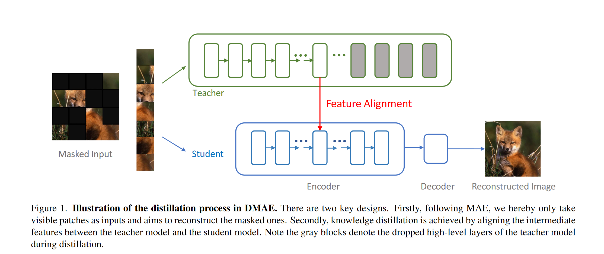

# Masked AutoEncoders Enable Efficient Knowledge Distillers

**[CVPR 2023](https://openaccess.thecvf.com/content/CVPR2023/html/Bai_Masked_Autoencoders_Enable_Efficient_Knowledge_Distillers_CVPR_2023_paper.html)	[code in github](https://github.com/UCSC-VLAA/DMAE)	ImageNet-1k	20240510**

*Yutong Bai, Zeyu Wang, Junfei Xiao, Chen Wei, Huiyu Wang, Alan L. Yuille, Yuyin Zhou, Cihang Xie*

这项工作研究了从预训练模型MAE中提取知识的能力，与先前工作不同，提出对师生模型中间特征表示进行匹配，这使得繁琐的教师模型只需要前几个层进行前向传播，节约了计算开销，通过一个投射层对齐师生模型特征进行匹配，使用L1范数距离来确保中间特征对齐。并且将MAE的掩码率提高到95%进一步减少计算。最终的蒸馏范式符合标签损失+蒸馏损失的形式。

## Introduction

我们研究了从预训练模型中提取知识的潜力，尤其是MAE，与先前的工作不同，这里的教师是一个预训练模型，其预测结果不一定揭示类别之间的细粒度关系，因此师生模型之间的软硬logit对齐方案在这里可能不在有效。提取预训练教师模型的知识后，学生模型需要额外一轮微调才能适应下游任务，这又会引入一笔计算开销。

我们提出DMAE，遵循MAE，让编码器只对一个可见的小块子集进行操作，并使用一个轻量级解码器进行像素重建。不同于MAE中的奢侈设置，我们将预训练从1600轮简化到100，并将掩码率从75%增加到95%，来提取强学生模型；我们寻求匹配中间特征表示，这使得繁琐的教师模型只能通过前几个层向前传播，从而减少计算量。

我们还发现应用L1范数进行距离度量是确保中间特征对齐的关键。

## Method

### Masked AutoEncoders

MAE编码器首先将未掩盖的图像块投影到一个潜在空间，然后将其输入到MAE解码器中，以帮助预测被掩盖的图像块的像素值，核心包括：

#### Masking

MAE对图像令牌进行操作，需要将图像分割成互不重叠的图像块，MAE将保留这些补丁的一个随机小子集其余部分作为MAE解码器的预测目标，通常使用高遮蔽率来防止模型在表示学习中采取捷径

#### MAE encoder

编码器是一个标准的ViT架构，只在那些未屏蔽的补丁上运行，很大程度降低了编码器的计算开销。

#### MAE decoder

MAE解码器接收掩码令牌作为输入，在所有缺失位置共享一个学习向量，掩码token仅在预训练阶段使用

#### Reconstruction

MAE直接重建图像的像素值，简单的均方误差被用于mask token来计算损失

### Knowledge Distillation

我们寻求将知识蒸馏与MAE框架结合，以高效的获得与那些功能强大但笨重模型具有相似性能的小型快速模型，然而现有的方法未能利用MAE中特殊设计来减少计算量。因此我们提出一种替代方案，在训练阶段直接应用知识蒸馏。

令$x\in\R^{3HW\times 1}$为输入的像素值$y\in \R^{3HW\times 1}$为预测的像素值，MAE的重建损失表示为：
$$
L_{MAE} = \frac{1}{\Omega(X_M)}\sum_{i\in M}(y_i-x_i)^2
$$
M表示被遮挡的像素集合，$\Omega(·)$表示元素数量，i为元素索引。$z^S_l, z^T_l\in\R^{LC\times 1}$表示从师生模型第l层抽取的中间特征，L表示patch数量，C表示通道维度，$\sigma(·)$表示投影网络：
$$
L_{Dist} = \sum_l\frac{1}{\Omega(z^T_l)}\sum_i||\sigma(z_l^S)_i - z^T_{l, i}||_1
$$
总损失表示为：
$$
L = L_{MAE} + \alpha·L_{Dist}
$$
