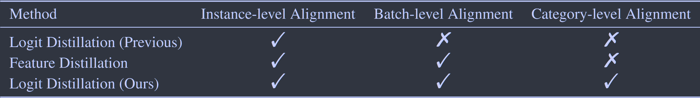
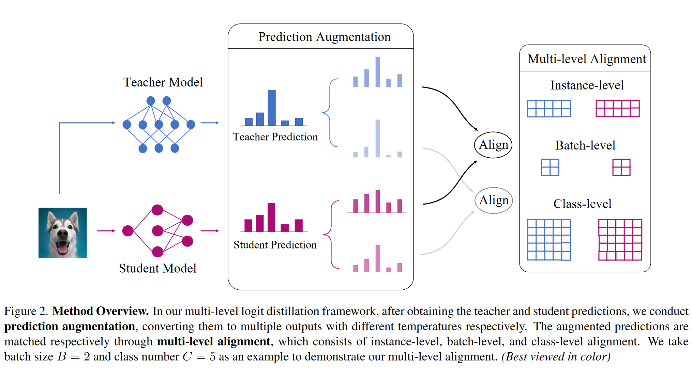
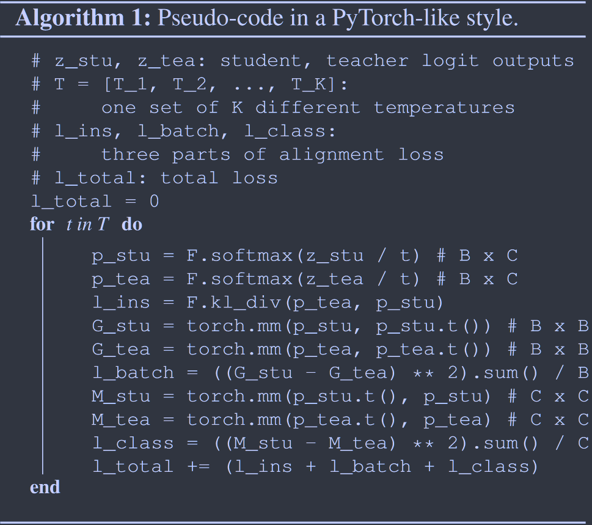

# Multi-level Logit Distillation

**[CVPR 2023](https://openaccess.thecvf.com/content/CVPR2023/html/Jin_Multi-Level_Logit_Distillation_CVPR_2023_paper.html)	[code in github](https://github.com/Jin-Ying/Multi-Level-Logit-Distillation)	CIFAR100  ImageNet  MS-COCO**

*Ying Jin, Jiaqi Wang, Dahua Lin*

这项工作进一步研究了关于logit的蒸馏，先前的方法仅仅是对实例级的师生特征进行对齐，我们认为这是不够的，我们提出一种多层次的对齐方式，在实例级、批次级和类别级对教师模型进行对齐，通过计算批次中样本间相似性、类别间相似性来帮助xue's

## Introduction 

利用中间层的特征可能能达到更好的性能，然而在一些实际应用中，模型的内部结构是不可见的，我们这项工作关注于logit蒸馏，不需要访问中间层的特征。我们提出了多级logit蒸馏，一种简单有效的方法从logit输出中吸收更多的信息。我们提出一种多层次的对齐方式，以减少教师和学生在实例、批次和类别级别上的预测差异。先前的logit蒸馏只进行了实例级的对比，而特征蒸馏结合了批量级的对比。

## Method

我们将logit输出表示为$z\in \R^{B\times C}$，B表示批量大小，C表示类别数量，我们的方法包括两个核心部分：预测增强和多层对齐

### Prediction Augmentation

为了从预测中获得更丰富的知识，我们提出一种预测增强机制，通过该机制我们可以将单个输出扩展为多个输出。我们引入温度系数来实现预测增强：
$$
p_{i,j,k}=\frac{e^{z_{i,j}/T_k}}{\sum^C_{c=1}e^{z_{i,c}/T_k}}
$$
$p_{i,j,k}$是第j个类别上第i个输入的概率值，温度系数为Tk，$T_0,T_1...T_k$k个温度系数形成一个参数池，使得我们可以将一个预测增加到k个不同的输出，上图的预测增强是取K=2的例子。

### Multi-level Alignment

我们将教师输出和相应的学生输出根据温度一一对应，不同于传统的基于KL散度的对齐，我们提出一种新的多级对齐方式，包括实例级对齐、批次对齐和类对齐

#### Instance-level Alignment

我们的方法继承KD的原始机制来实现实例级对齐：
$$
L_{ins}=\sum^N_{i=1}\sum^K_{k=1}KL(p^{tea}_{i,k}||p^{stu}_{i,k}) = \sum^N_{i=1}\sum^K_{k=1}\sum^C_{j=1}p^{tea}_{i,j,k}log(\frac{p^{tea}_{i,j,k}}{p^{stu}_{i,j,k}})
$$
$L_{ins}$表示实例级对齐损失，$p^{tea}_{i,j,k}, p^{stu}_{i,j,k}$表示教师和学生模型由Tk增强，在第i个实例，第j个类别上的输出。实例级对齐迫使学生模仿教师对每个实例的预测。

#### Batch-level Alignment

我们提出通过输入相关性来进行批次级别的对齐，即两个输入之间的关系，我们计算模型预测的格拉姆矩阵：
$$
G^k = p_kp_k^T; \ G^k_{ab}=\sum^C_{j=1}p_{a,j,k}·p_{b,j,k}
$$
其中$G^k\in\R^{B\times B}$， $p_k$表示在Tk下的预测，我们推导出$G^k_{ab}$对第a个和第b个输入被归入同一类别的概率进行建模，这表明了他们之间的关系。然后根据不同的Tk分别计算师生预测的，我们的目标是减少他们之间的差异：
$$
L_{batch} = \frac{1}{B}\sum^K_{k=1}||G^k_{tea} - G^k_{stu}||^2_2
$$
$L_{batch}$为批次级别的对齐损失，$G^k_{tea}, G^k_{stu}$分别是在温度系数Tk下由教师和学生预测计算的格拉姆相关矩阵。

#### Class-level Alignment

模型的预测可以刻画类别之间的关系，即如果一个类别与真实类别非常相似，在预测时会产生两个高峰，模型会变得犹豫不决。我们通过对一批数据的预测建模来估计类别相似性：
$$
M^k = p_k^Tp_k; \ M^k_{ab}=\sum^N_{i=1}p_{i,a,k}·p_{i,b,k}
$$
其中$M^k\in \R^{C\times C}$, $p_k$表示在Tk下的预测，$M^k_{ab}$表示该批次中输入同时被分类到第a类和第b类的概率，量化了两个类别之间的关系。我们设计损失让学生强制从教师模型中学习这部分知识：
$$
L_{class} = \frac{1}{C}\sum^K_{k=1}||M^k_{tea} - M^K_{stu}||^2_2
$$
$L_{class}$为类别级别对齐损失，$M^k_{tea}, M^k_{stu}$分别是在温度系数Tk下由教师和学生预测计算的类别相关矩阵。

#### Multi-level Alignment 

$$
L_{total} = L_{ins} + L_{batch} + L_{class}
$$

