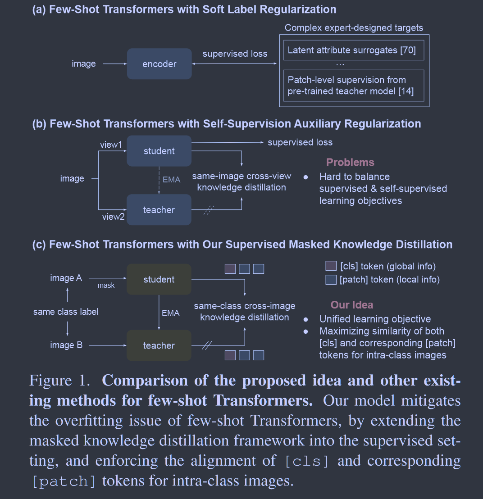
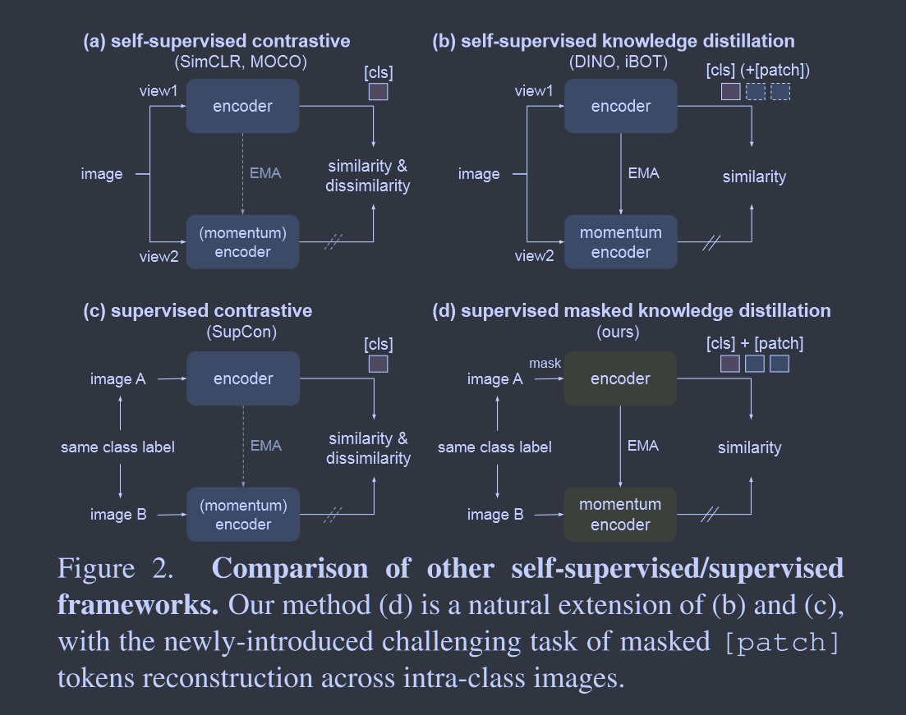
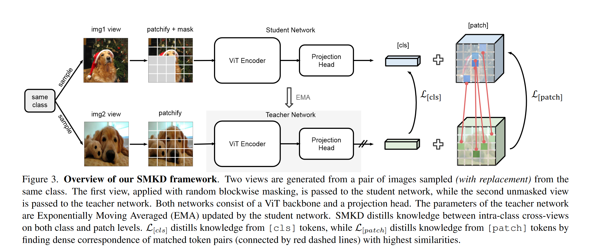

# Supervised Masked Knowledge Distillation for Few-Shot Transformers

**[CVPR 2023](https://openaccess.thecvf.com/content/CVPR2023/html/Lin_Supervised_Masked_Knowledge_Distillation_for_Few-Shot_Transformers_CVPR_2023_paper.html)	[code in github](https://github.com/HL-hanlin/SMKD)	CIFAR-FS  FC100  mini-ImageNet	20240510**

*Han Lin, Guangxing Han, Jiawei Ma, Shiyuan Huang, Xudong Lin, Shih-Fu Chang*

这项工作致力于解决ViT小样本的设定下容易过拟合且缺乏类似归纳偏差的机制而遭受的严重性能下降的问题，这项工作提出了一种用于小样本Transformer的监督掩码知识蒸馏模型SMKD，将标签信息整合到自蒸馏框架中。首先利用师生cls的交叉熵损失和MIM损失进行自监督训练，然后引入掩码图像输入到学生模型中，利用教师模型的cls进行蒸馏，并允许跨类内图像patch之间进行蒸馏，通过余弦相似度找到师生模型类内不同图像相似patch进行蒸馏学习，最终在CIFAR-FS FC100上达到SOTA

## Introduction

ViT是数据饥饿的模型，他需要从大量数据中学习token的依赖关系，这种特性使得训练集较小的数据集容易过拟合，因此我们致力于研究如何使ViT在这些较小的数据集上很好的泛化，尤其是小样本学习FSL。

FSL最近的研究尝试将自监督的任务纳入通过辅助损失的标准监督学习中，然而自监督和监督学习两个目标是相互冲突的，如何平衡他们关系是一个挑战。我们提出了SMKD掩码知识蒸馏框架。

> 我们提出一种新的监督知识蒸馏框架SMKD，该框架将类标签信息纳入自蒸馏中，从而填补了自监督和知识蒸馏于传统监督学习之间的空白
>
> 我们在类别和patch级别设计了两个损失，引入跨类内图像重建掩码patch token的挑战性任务

## Method

### Learning Task Definition

在小样本分类中，我们给定两个数据集$D_{base}, D_{novel}$，以及他们的类别标号$C_{base}, C_{noval}, C_{based} \cap C_{noval} = \varnothing$，使用丰富标记样本的基础数据集$D_{base}$对特征提取器进行训练，然后使用新颖的数据集$D_{novel}$对原型进行评估以及小样本的估计，在一个标准的N-way K-shot任务中，每一个场景的$D_{epi}=(D_S, D_Q)$包括N个来自$C_{novel}$的类别，支持数据集$D_S$包括每个类别的K个样本用于类别原型估计，然后使用查询数据集$D_Q$进行评估，该任务旨在从抽样的场景中正确的将$D_Q$分为N类。本文的主要工作是从$D_{base}$中训练一个具有良好泛化能力的特征提取器。

### Preliminary: Self-Supervised Learning with Knowledge Distillation

给定从训练集I中均匀采样的输入图像x，应用随机数据增强生成两个增强视图$x^1$和$x^2$(图像视图索引表示为上标，patch索引表示为下标)，学生网络具有一个ViT骨干编码器和一个带有三层MLP的投影层以及L2归一化层组成，ViT生成一个cls token，经过投影层后输出到K维的概率分布$P^{[cls]}_s$中。

教师网络是由学生网络的指数移动平均EMA，通过最小化投影层输出的类别分布的交叉熵将知识提炼给学生，H表示交叉熵损失：
$$
\mathcal{L}_{[cls]} = \mathcal{H}(P_t^{[cls]}(x^1), P_s^{[cls]}(x^2)) \tag{1}
$$
掩码图像建模MIM可以通过自蒸馏进行如下操作：给定一幅图像上随机采样的掩码序列$m\in \{0, 1\}^N_{i=1}$，有N个patch令牌$x = \{x_i\}^N_{i=1}$，当mi=1时用可学习的token嵌入$e_{[MASK]}$替换xi，得到一副被遮挡的图像$\hat{x} = \{\hat{x}_i\}^N_{i=1} = \{(1-m_i)x_i + m_ie_{[MASK]}\}^N_{i=1}$，被遮挡的图像和原始为遮挡的图像分别送到学生和教师模型中，MIM的目标是从被遮挡的图对象中恢复被遮挡的部分，等价于最小化学生和教师网络的类别分布在被遮盖图像上输出的交叉熵损失：
$$
\mathcal{L}_{MIM} = \sum^N_{i=1}m_i·\mathcal{H}(P_t^{[patch]}(x)_i, P_s^{[patch]}(\hat{x})_i) \tag{2}
$$

### Supervised Masked Knowledge Distillation

#### Distill the Class Tokens

最近的自蒸馏框架通过Eq1.从跨试图图像中提取关于cls标记的知识，为了将标签信息融入到这种自监督框架中，我们进一步允许从类内交叉视图中提取关于cls标记的知识。

我们采样两幅图像$x, y\sim \mathcal{I}^c$，每幅图像生成一个视图，x',y'分别表示由图像x,y生成的增强视图，在x'上施加额外的随机分块掩码，将被遮挡的视图表示为$\hat{x}'$，将被遮挡的图像$\hat{x}'$和未被遮挡的图像y'送入学生和教师模型，对cls的监督损失变为：
$$
\mathcal{L}_{[cls]} = \mathcal{H}(P_t^{[cls]}(y'), P_s^{[cls]}(\hat{x}')) \tag{3}
$$
当x y来自同一幅图像，我们的方法与Eq1一致，当x y来自不同图像时，我们的损失最小化图像x y之间所有跨视图对之间的cls token的交叉熵损失。

我们的方法可以高效实施，不用刻意的从同一类别中采样图像对，只需要查看一个小批量中的图像找到属于同一类别的图像对，且我们的方法遵循SSL的最新趋势，避免了对负例的需要。

#### Distill the Patch Tokens

在对全局cls标记进行蒸馏的基础上，我们引入跨类内图像的掩码块标记重建这一具有挑战性的任务，以充分利用图像的局部细节进行训练。我们这里源于如下假设：对于类内图像，即使他们语义信息在patch级别有很大差异，但至少应该存在一些具有相似语义的patch。

对于从输入视图y'发送到教师网络的每个patch($f^t_k$) ，我们首先需要从学生网络的掩码视图$\hat{x}'$中找到最相似的补丁k+($f^s_{k+}$)，然后再这两个匹配的token之间进行知识蒸馏。

由于我们没有任何patch级别的标注，我们是由余弦相似度再学生网络的所有补丁中找到k的最佳匹配补丁：
$$
k^+ = \underset{l\in[N]}{arg max}\frac{{f^{t}_k}^Tf^s_l}{||f^t_k||\ ||f^s_l||} \tag{4}
$$
patch损失定义为：
$$
\mathcal{L}_{[patch]} = \sum^N_{k=1}w_{k+}·\mathcal{H}(P_t^{[patch]}(y')_k, P_s^{[patch]}(\hat{x}')_{k+}) \tag{5}
$$
wk+为一个标量，表示赋予每个损失项的权重。

### Training Pipeline

我们模型训练分为两个阶段：自监督训练和监督训练，首先使用MIM进行自监督训练，损失为Eq1,2，第二阶段使用Eq3,5来继续训练。