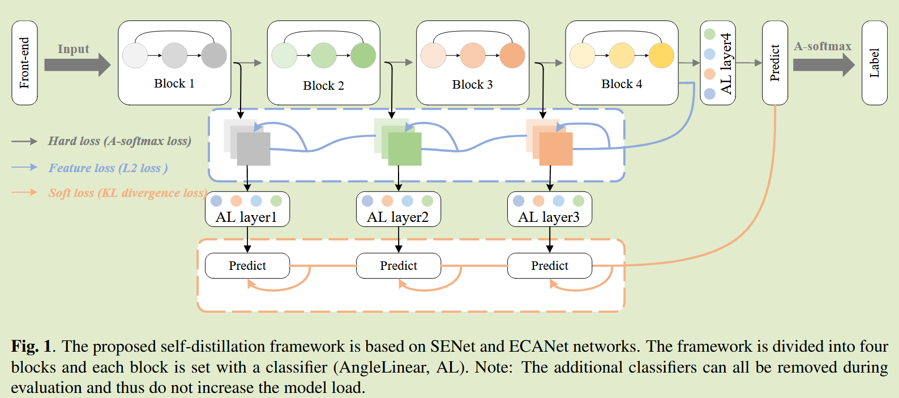
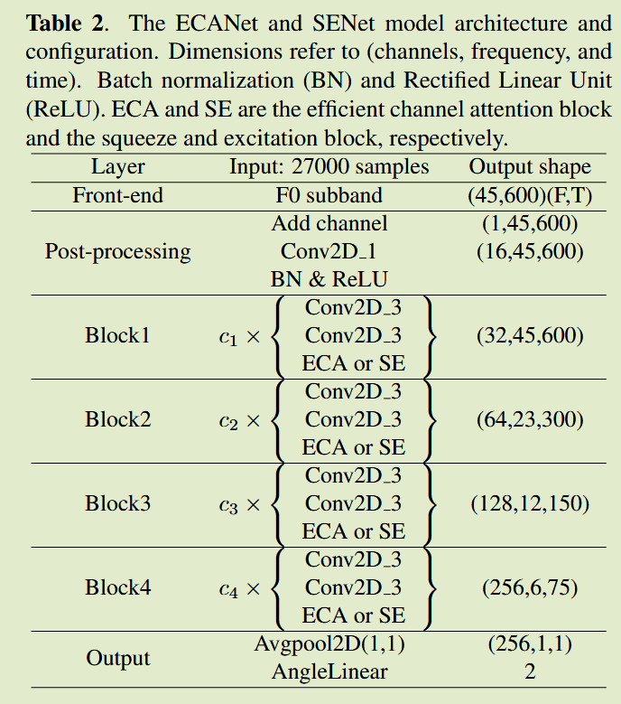

# LEARNING FROM YOURSELF: A SELF-DISTILLATION METHOD FOR FAKE SPEECH DETECTION

[2023 ICCSSP](https://ieeexplore.ieee.org/abstract/document/10096837)	no code 	LA PA	20241107

本文将自蒸馏迁移到假语音检测中，这里为了更好的利用浅层网络的信息，利用深层网络来指导浅层网络更好的提取特征。

## Introduction 

本文提出一种新的假语音检测(Fake Speech Detection, FSD)的自蒸馏框架，先前研究发现声音的浅层特征对FSD至关重要，尽管浅层网络对此类信息很敏感，但捕获能力不如深层网络。

因此我们提出一个自蒸馏框架，利用最深层网络来指导浅层网络，可以进一步加强浅层网络，在训练时为所有浅层网络添加分类器，将最深的网络作为教师模型，将知识传递给浅层网络。在推理时将所有的分类器移除。

## Method

我们将模型分为四个块，在每个块后面设置一个分类器，前三层作为学生模型，第四层的输出作为教师模型，深度网络知识在特征和预测维度上都转化为浅层。我们引入了三个损失：

- 硬损失：通过softmax函数和真实标签计算最后一层网络输出的损失，利用真实标签来完全提取训练数据集中的隐藏知识。
- 特征损失：通过L2范数来约束每个特整层之间的特征映射，将最深层的特征的非显式知识引入浅层特征
- 软损失：KL散度用于计算师生模型之间软标签的匹配

首先计算最深网络和标签的硬损失：
$$
L_{hard} = A-Softmax(p^n, L)
$$
$p^n$为最深网络的输出，L为训练集标签。

软损失使用KL散度，计算每个浅层和最深层网络的KL散度：
$$
L_{soft} = \sum^{n-1}_{i}KL(p^i, p^n)
$$
特征损失用来平衡浅层网络和最深层网络之间的差异，可以反馈到浅层网络的分类输出中：
$$
L_{feature} = \sum^{n-1}_i L_2(F^i, F^n)
$$
总体损失表示为：
$$
L = \alpha * L_{hard} + (1-\alpha)*L_{soft} + \beta*L_{feature}
$$
