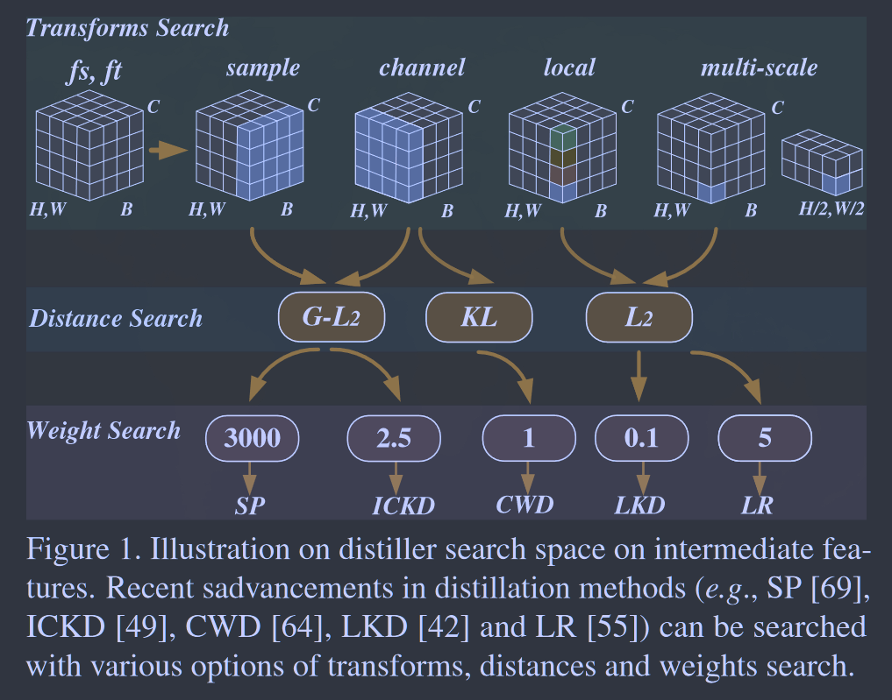
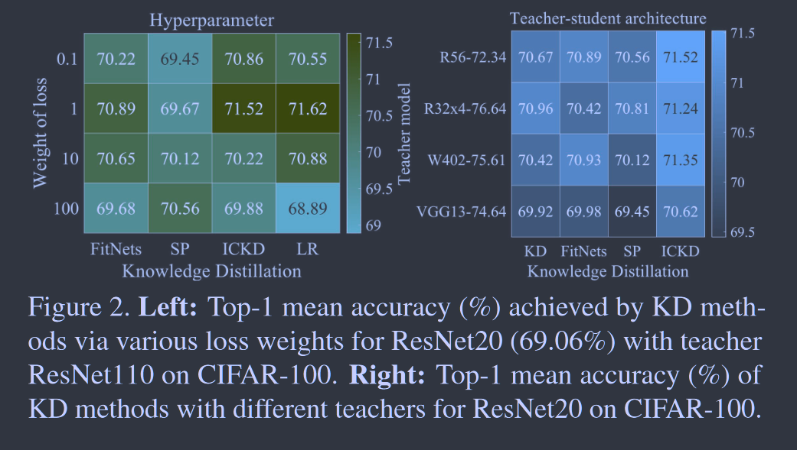
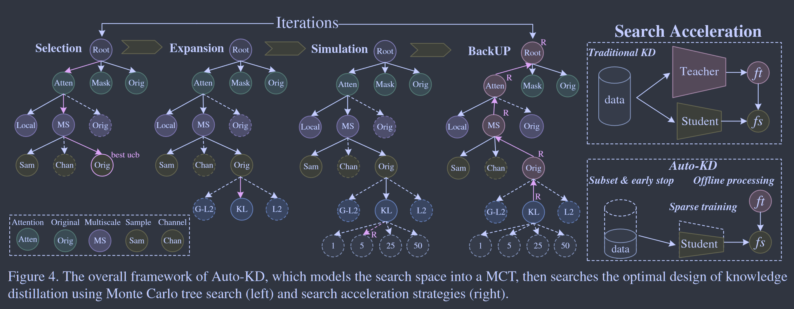
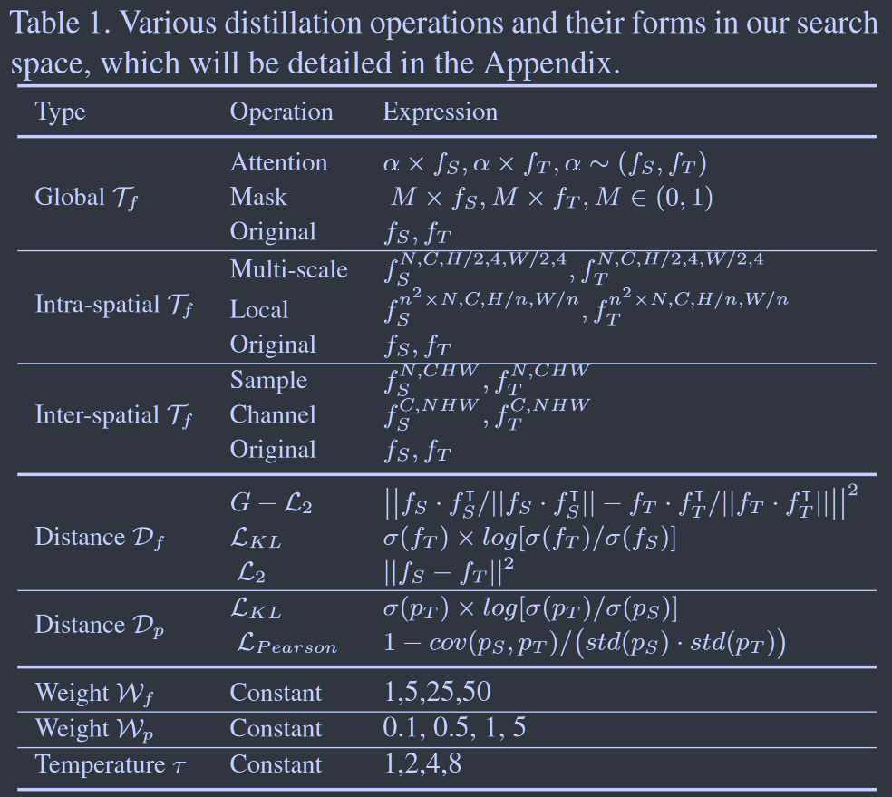
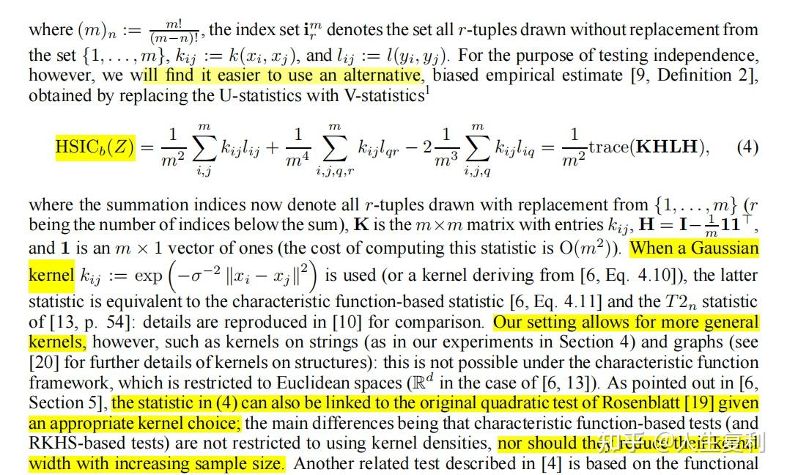

# Automated Knowledge Distillation via Monte Carlo Tree Search

**[ICCV 2023](https://openaccess.thecvf.com/content/ICCV2023/html/Li_Automated_Knowledge_Distillation_via_Monte_Carlo_Tree_Search_ICCV_2023_paper.html)	[code in github EMPTY!](https://github.com/lilujunai/Auto-KD)	CIFAR100  ImageNet  MS-COCO  CityScapes	20240426**

*Lujun Li, Peijie Dong, Zimian Wei, Ya Yang*

这项工作总结了先前的工作，提出了一个搜索空间，通过蒙特卡洛树搜索来自动寻找最佳的模型架构、距离函数等参数，并且为了加快搜索进程，提出了存储教师特征图进行离线推理、使用随机掩码进行稀疏蒸馏以及提前停止等加速策略来加快整个搜索进程。

## Introduction 

现有的许多KD方法的一个主要挑战是其性能对超参数以及师生架构具有敏感性。并且现有的KD依赖于人工设计和专业知识，手工制作的蒸馏可以高度特定于任务或数据集但这限制了在新场景中的使用，因此我们想要探索自动调整方法。

自动调整方法存在着一定的困难，知识蒸馏设计各种超参数的设置、损失函数和变换类型，比传统的超参数优化更复杂，这会导致搜索空间难以设计；且多变量联合搜索的任务需要使用多试验路线来方式权重共享错误和优化崩溃。

我们发现现有工作具有可分解行，大多数是可以分解为基本变换和距离函数的组合，且这些基本单位具有可组合型，基于此提出了我们的自动搜索框架，由梳妆搜索空间，蒙特卡洛搜索算法和搜索加速策略组成。

> 探索了蒸馏的可分解性、可组合性和可简化性，提出一种新的自动化蒸馏搜索框架来用于蒸馏器的设置
>
> auto-KD将整流器搜索空间组织为蒙塔卡罗树，并采用一系列高校策略来加速搜索

## Method

三个关键组件：搜索空间设计、蒙特卡洛树MCT搜索、加速策略

### Search Space Design

对于特征变换，现有的设计可以分解为三类，全局特征变换、空间内变换和空间间变换；对于距离函数，我们为KD和logitsKD选择距离函数，其他的距离函数不做考虑因为他们性能很差；对于损失权重和温度因子的超参数，选择一些常量作为候选值。

### Monte Carlo Tree Search

我们采用MCTS的原因如下：蒙特卡洛树搜索是一种强大而高效的基于采样的树搜索方法，用于解决复杂的决策问题；MCTS可以捕获我们蒸馏器搜索空间中候选操作的相关性，来提高可解释性和稳定性

[MCTS refs](https://zhuanlan.zhihu.com/p/53948964)

#### Selection:

算法使用置信上限UCB公式来从当前树中选择最佳节点，对于节点ni：
$$
\mathcal{v}(n_i) = R_i/N_i + C· \sqrt{2·ln\ N_b/N_i}
$$
其中$R_i$表示节点$n_i$的奖励，而$N_i$和$N_b$分别表示对节点$n_i$和其父节点$n_b$的访问次数，控制参数C为搜索范围，R取决于学生模型的交叉熵损失$L_{CE}(p_S, Y)$以及验证集上教师和学生之间的相似性：
$$
R = 1-(\mathcal{L}_{CE}(p_S, Y) + \mathcal{L}_{CKA}(f_S, f_T))
$$
其中$\mathcal{L}_{CKA}(·)$表示用于表示相似性的中心内核对齐指数：

> $X\in \R^{m\times p}, Y\in \R^{m\times q}$，计算格拉姆矩阵：
>
> $K = XX^T, L = YY^T$，计算他们的Hilbert-Schmidt independence criterion HSIC独立性指标，首先构建一个中心矩阵H：
>
> $H = I_n - \frac{1}{n}11^T$，其中$1\in \R^{m\times 1}$为全1向量，$11^T\in \R^{m\times m}$为全1矩阵，HSIC计算如下：
>
> $HSIC = \frac{1}{m^2}tr(KHLH)$
>
> 
>
> $CKA(K, L) = \frac{HSIC(K, L)}{\sqrt{HSIC(K, K)HISC(L, L)}}$

#### Expansion:

该步骤会选择节点生成额外的子节点表示潜在的未来状态

#### Simulation：

在所选节点扩展后新添加的节点通过随机操作的轨迹进行评估，直到达到最终状态，利用仿真结果来估计子节点的质量

#### Backpropagation:

算法根据仿真结果更新父节点的估计质量，来用于未来选择

### Search Acceleration Strategies

#### Off-line processing and sparse training

我们采用离线处理来降低计算成本而无需教师推理，我们存储教师在单次向前传递后的特征图，并应用训练期间使用的相同数据增强技术来确保空间对齐，还引入了系数训练来减少内存预算和计算量，在蒸馏中首先设置一个随机掩码，来强制学生模型的某些权重为0，配置一个动态策略来保持蒸馏增益。离线处理有效减少了推理参数和训练时间，稀疏的学生蒸馏大大降低了培训成本，且略微提升了准确性。

#### Proxy settings

凭借从教师那里学到的多样化和信息丰富的知识，学生模型在数据效率和训练速度具有优势，基于这些特性，我们采用子集和提前停止策略，一旦学生模型表现足够好就可以确定候选蒸馏的质量并使用中间模型来计算奖励信号，可以减少搜索开销并提高准确性和稳定性。

### Detailed Analysis of Searched Distillation

以下是关于不同师生架构模型我们观察到的一些见解：

> 建议对于更宽的师生网络使用逐通道（channel-wise）蒸馏操作。通过调整师生网络的特征图，这种方法有助于从师网络向学生网络的知识传递。
>
> 当学生与教师模型之间存在语义差异时，多尺度蒸馏是一种有效的方法，可以在大多数情况下获取更多的收益，尤其是对于下游任务
>
> 掩膜蒸馏更适用于蒸馏间隙相对较大的师生，但也可能会造成传递过程中信息的丢失
>
> 注意力蒸馏操作在异构师生架构上更有优势，尤其是对于ViT模型
>
> 建议对于多标签或局部信息关键任务，使用局部蒸馏操作，在诸如CIFAR-10/100等数据集上平均表现良好。
>
> 样本级别的蒸馏操作对不同的模型都有益处，但受到相应任务和批量大小的影响
>
> KL距离对不同的人物具有更好的泛化性，皮尔森距离对复杂人物更具有实用性
>
> 调整温度系数对大多数人物是有用的，特征权重的最优值一般在1-25之间