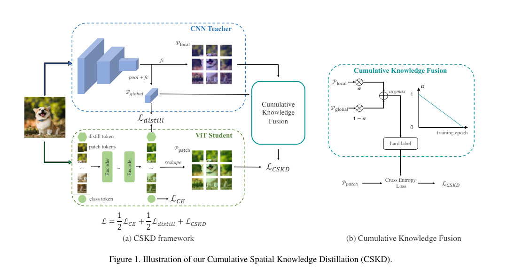
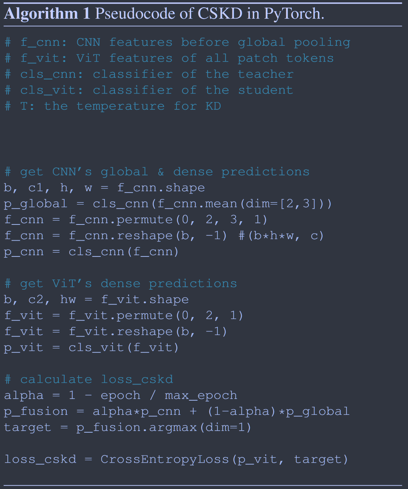

# Cumulative Spatial Knowlwdge Distillation for Vision Transformers

**[CVPR 2024](https://openaccess.thecvf.com/content/ICCV2023/html/Zhao_Cumulative_Spatial_Knowledge_Distillation_for_Vision_Transformers_ICCV_2023_paper.html)	[code in github](https://github.com/Zzzzz1/CSKD)	CIFAR  ImageNet  StanfordCar  iNat19	20240510**

这项工作针对ViT的蒸馏，针对使用CNN教授ViT带来的负面问题进行处理，提出了累计空间知识蒸馏CSKD，将CNN最后一个卷积层经过全局池化和全连接层获得全局特征，直接连接全连接层获得局部特征，利用全局知识向ViT中蒸馏知识，并提出累计知识融合CKF来让蒸馏前期侧重于局部知识而在后期侧重于全局知识，从而克服了先前CNN到ViT蒸馏的负面影响。

## Introduction

从卷积神经网络中提炼知识对ViT来说是一把双刃剑，CNN的图像友好设计具有利于视觉任务的局部归纳偏差；但是也引入了两个问题，CNN与ViT网络设计在三个方面存在差异：感受也的扩展方式、堆叠块的方式、归一化层的类型，这使得中间特征在语义方面难以对齐，因此基于特征蒸馏的方法可能效率低下；其次CNN的局部归纳偏差会阻碍ViT在收敛的长程依赖和位置编码的全部能力，由于ViT强大的自注意力模块，网络能力强于CNN，使其能够正确预测一些CNN无法处理的难训练样本，然而CNN的预测中提取知识提供了负面的监督，这个问题会随着训练的进行越来越严重。

本文提出累计空间知识蒸馏CSKD，CSKD从CNN的最后一个特征中生成空间分类预测，将其作为ViT对应Patch token的监督信号，在不引入中间特征的情况下实现了空间知识迁移。CSKD采用累计知识统合CFK模块，融合了局部响应和全局响应，并且随着训练的进行，越来越强调全局响应的重要性。

> 讨论了从CNN提取到ViT的两个障碍，空间上知识迁移效率低下；训练后期网络收敛受限
>
> 提出累计空间知识蒸馏CSKD，以一种简单有效的方式缓解这两个问题，CSKD在不引入中间特征的情况下传递空间知识，并且越来越强调全局响应对于更好监督的重要性

## Method

### A Double-Edged Sword

CNN的局部归纳偏差有助于ViT学习图像友好的知识，但也带来了一些问题

#### Different Network Architectures

CNN网络与ViT完全不同。CNN和ViT扩展感受野的方式不同，CNN通过对特征逐级下采样来扩展感受野，ViT引入自注意力来扩展感受野，自注意力从开始就具有全局感受野；堆叠块的方式不同，所有模块在ViT中共享相同的架构，但在CNN中彼此不同；CNN与ViT归一化层不同，CNN通常使用批归一化和组归一化而ViT使用层归一化。

这些差异使得CNN和ViT中间特征具有不同的语义层次，使得中间特征很难对齐，基于特征的蒸馏方法可能会因为不对齐而导致效率低下。

#### Different Network Capability

ViT的出色表现得益于自注意力模块提供的全局感受野，而CNN中并没有具有全局关系建模的能力，因此从CNN提炼知识到ViT可能与先前方法不同因为CNN教师更弱，因此教师的监督信号很可能是有害的。

### Cumulative Spatial Knowledge Distillation

我们提出累计空间知识蒸馏CSKD，在不引入中间特征的情况下传递空间维度的知识，并通过累计学习全局维度知识来缓解不匹配的问题

输入图像表示为$\mathcal{X}$，其标签表示为$\mathcal{Y}$，CNN教师和ViT学生分别表示为$\mathcal{T, S}$, C表示图像识别任务的类别数。

#### Spatial-wise Knowledge Transfer

我们首先生成密集的分类预测来提供空间上的知识，稠密预测可以传递空间信息避免复杂特征对齐。CNN最后一个特征图被送入一个全局池化层和一个最终的全连接层分类器来生成全局的输出logits，记为$\mathcal{P^T}_{global}\in \R^{1\times C}$，然后将其输入到分类器中生成每个对应位置的稠密预测，CNN的稠密预测表示为$\mathcal{P^T}\in\R^{1\times H\times W\times C}$，ViT将最后一个Transformer编码器的每个patch token作为对应位置的最终特征，我们进一步将最终的特征输入到全连接分类器中来生成稠密预测，ViT的稠密预测记为$\mathcal{P^S}\in \R^{1\times H\times W\times C}$，将CNN密集预测的硬标签（argmax）作为目标标签Yt，使用交叉熵作为空间知识迁移的损失函数。

#### Cumulative Knowledge Fusion

CNN由于归纳偏差的不同，在训练前期帮助ViT更好的收敛但在后期会限制网络收敛，我们提出累计知识融合，认为CNN也能帮助ViT在后期学到更好的表征，关键因素是使用更好的监督信号。

在后期的训练中，ViT的每个补丁标记已经对其他标记之间的全局关系进行了建模，因此使用全局信息而不是局部信息来监督token可以帮助他们发挥自己的能力来学习更好的表示。CFK在整个训练过程中融合了CNN的全局$\mathcal{P^T}_{global}$和局部$\mathcal{P^T}$响应，在早期偏爱局部特征而在后期侧重于全局特征，生成的稠密标签：
$$
\mathcal{Y^T} = \underset{c}{argmax}(\alpha\mathcal{P^T} + (1-\alpha)\mathcal{P}_{global}^\mathcal{T})
$$
$\alpha$与训练时常有关，如上图所示，CSKD损失表示为：
$$
\mathcal{L}_{CSKD} = CE(\mathcal{P^S}, \mathcal{Y^T})
$$
综合损失表示为：
$$
\mathcal{L} = \frac{1}{2}\mathcal{L}_{CE}+\frac{1}{2}\mathcal{L}_{distill} + \mathcal{L}_{CSKD}
$$
