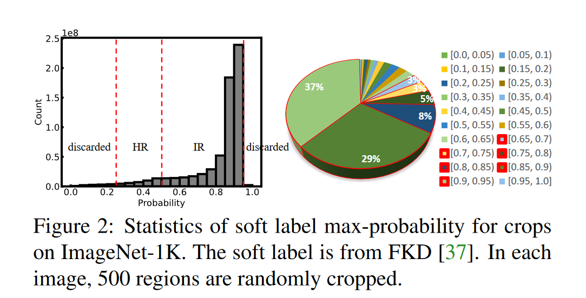
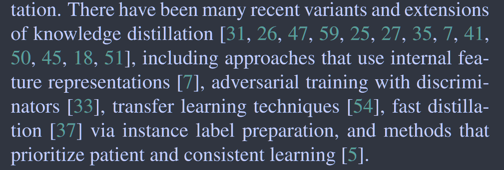
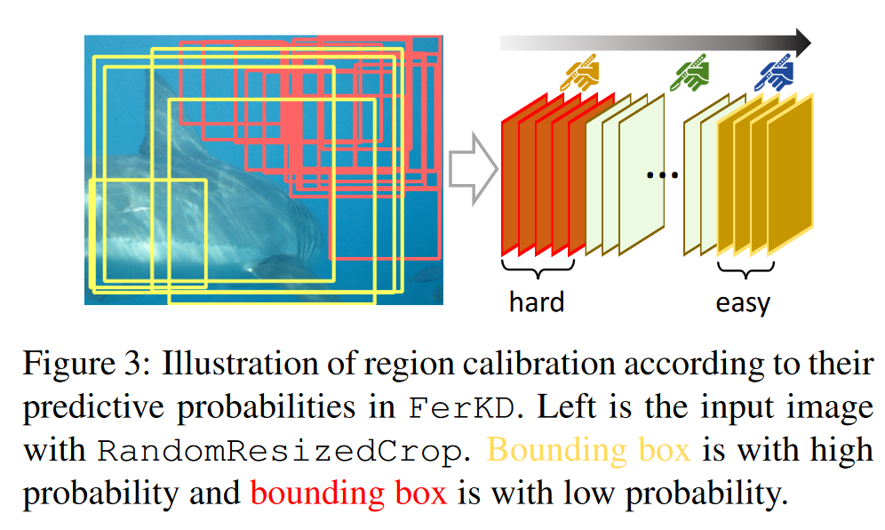
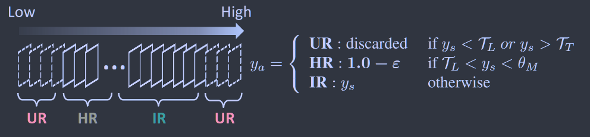
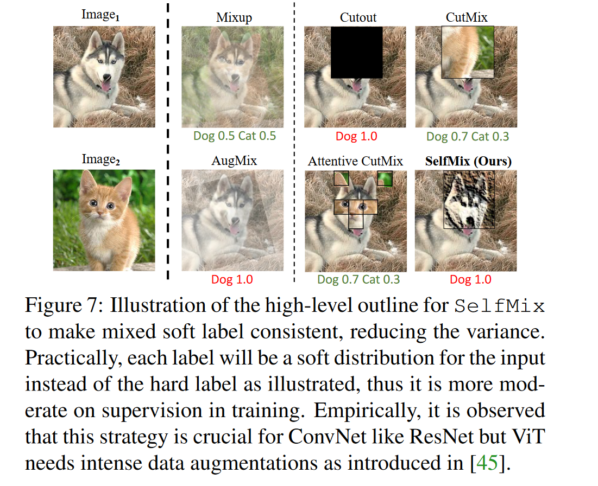
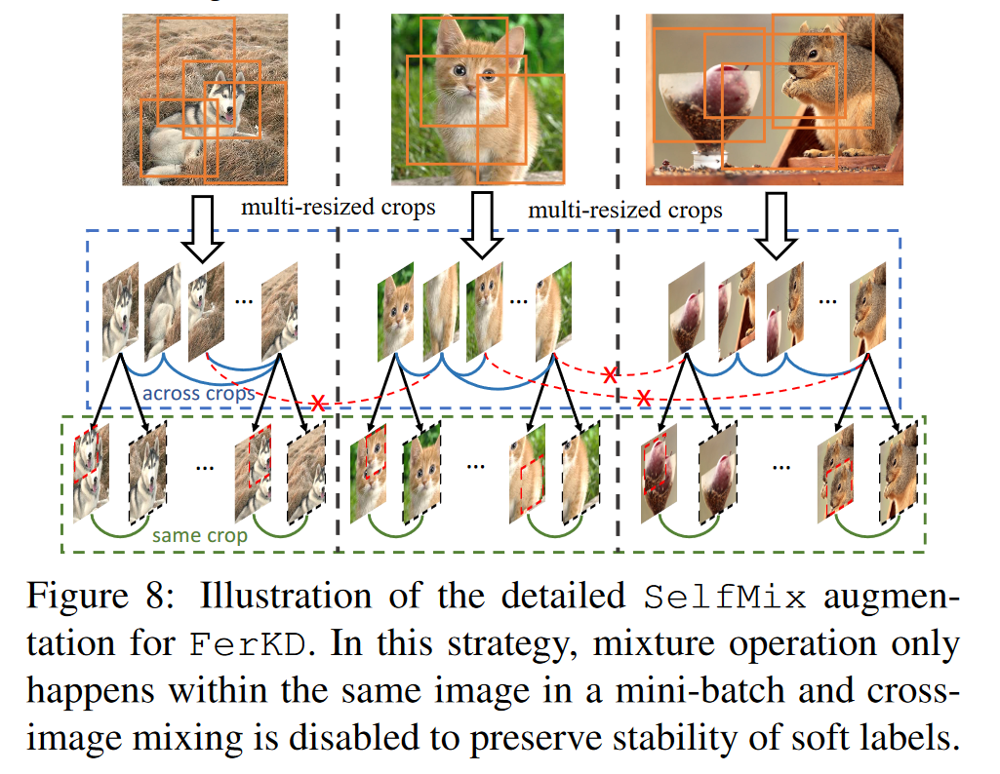

# FerKD: Surgical Label Adaptation for Efficient Distillation

[ICCV 2023](https://openaccess.thecvf.com/content/ICCV2023/html/Shen_FerKD_Surgical_Label_Adaptation_for_Efficient_Distillation_ICCV_2023_paper.html)	[code in github](https://github.com/szq0214/FKD/tree/main/FerKD)	ImageNet-1k	20240412

*Zhiqiang Shen*

这项工作针对传统蒸馏模型中对学生模型进行训练时对输入样本在教师模型上进行计算软标签这一过程引入的额外开销进行了削减，先前的方法FKD提前根据数据增强方法生成一致性区域标签，但是在随机裁剪生成区域时可能包括背景和一些不相关的噪声以及上下文信息等，为了处理这个问题这项工作提出自适应的标签校正，将样本分为四类，丢弃掉非常简单和非常困难的样本，并重点优化另外两种样本；并且还发现非常强的数据增强可能会损害模型性能，我们针对软标签提出了一种新的selfMix增强方法，降低数据增强的强度，同时仍然受益于其效果。

## Introduction

由于教师模型带来的额外计算负担，KD方法通常计算大且效率低，KD的主要优点是它能够生成精确的软目标，从而传达关于输入实例的更多信息细节。

为了克服传统知识蒸馏的计算低效性，FKD被开发用于提前生成区域级别标签，并在训练时重用以消除冗余计算，只需要在一开始准备一次软标签，就可以无限期的重复使用。但是这种方法忽略了一些问题，在使用随机裁剪生成区域时，可能有些是从背景区域裁剪而来，教师模型仍然会根据他们与数据集的类别相似性生成一个软标签。在某些情况下区域可能包含不相关的噪声、补偿性信息或类的上下文信息，软标签可能不能准确的反映他们所携带的上下文信息。

另外，由于采样的随机性，一定比例的过度容易或困难的区域对模型能力没有贡献，这些样本可以舍弃来加速收敛过程，我们对软标签进行改造，将其分为四个组：极其困难的负样本、中等困难的样本（背景 上下文信息）、困难的正样本（被遮挡的对象）和简单的正样本

#### The Role of Background

背景在图像中的作用至关重要，他提供了关键的上下文和空间信息，有助于模型准确的识别场景中的兴趣目标。我们通过精确的监督来谨慎处理背景来实现更高的模型能力

#### Hard Regions Mining and Calibration

困难区域挖掘是指对模型难以准确识别的模糊复杂区域进行识别和分离，通过识别这些区域，模型可以专注于学习这些区域的特征和特性从而获得性能的提升。在困难区域模型的预测可能不太可靠，导致置信度很低，对预测结果进行校准，可以提高模型在这些区域的精度，我们发现丢弃一部分负样本并校准他们的标签来选择讷县困难的正样本，有助于模型的训练。

#### Stable Training on Soft Labels

基于混合模型的增强方法(Mixup CutMix)被广泛的用于硬标签监督下的模型训练，但是在与预生成的软标签一起使用是，Mixup cutMix往往过于强大，这回导致性能的下降，为了减少标签波动提出了selfMix的方案。

> 我们提出FerKD，用于快速知识蒸馏的样本校准框架，对困难样本和简单样本的影响进行了分析
>
> 我们观察到通过RandomResizedCrop操作获得的少数最具挑战性和最简单的区域对模型的学习没有显著贡献，因此可以被删除。我们发现中等难度的区域可以提供至关重要的上下文信息，从而提高模型学习鲁棒表示的能力。

## Related Work

## Method

### Revisiting Hard and Soft Label in Distillation

vanilla KD：
$$
\mathcal{L}_{VKD} = \frac{1}{N}\sum_x(\alpha*\underbrace{\mathcal{L}_h(p_\theta(x), y_h(x))}_{CE\ loss\ with\ hard\ label} + (1-\alpha) * \underbrace{\mathcal{L}_s(p_\theta(x), y_s(x))}_{KL\ loss\ with\ soft\ label})
$$
Fast KD (FKD):
$$
\mathcal{L}_{FKD} = \frac{1}{N}\sum_x(\underbrace{\hat{\mathcal{L}}_s(p_\theta(x), y_s(x))}_{SCE\ loss\ with\ soft\ label} )
$$

### FerKD: Surgical Label Calibration Distillation

与传统的KD不同，我们提出的FerKD只涉及一个损失项，且与FKD不同的是，FerKD将在单个目标项中同时使用硬标签和软标签，并利用其各自的额外信息。我们只保留正样本区域的软标签，因为他们包含着该区域的细粒度信息，对于那些背景或上下文区域，我们将通过人工标注的真实标签来校准他们，避免来自软标签的误导信息：
$$
\mathcal{L}_{FerKD} = \frac{1}{N}\sum_x(\underbrace{\mathcal{L}_{adap:\ h\ or\ s}(p_\theta(x), y_a(x))}_{SCE\ loss\ with\ hard/soft\ label} )
$$
ya是校准后的软标签：
$$
y_a = \begin{cases}
\begin{aligned}
&UR:discard &&if\ y_s<\mathcal{T}_L\ or\ y_s>\mathcal{T}_T \\
&HR:1.0-\epsilon &&if \ \mathcal{T}_L<y_s<\mathcal{T}_M \\
&IR:y_s &&otherwise
\end{aligned}
\end{cases}
$$
其中$\mathcal{T}_L, \mathcal{T}_M, \mathcal{T}_T$分别表示低、中等、高的阈值。

UR表示在训练中会被丢弃的无信息区域，HR表示具有平滑值$\epsilon$ 的困难区域，IR表示重要区域。FerKD的关键是识别正样本区域或背景区域有

在训练模型是，简单的示例运训模型快速学习数据中的模式，困难样本会减慢收敛速度，但会迫使模型学习更加鲁棒的分类边界。

### SelfMix: A Mild and Stable Data Augmentation for Soft Labels

目前流行的数据增强技术是针对硬标签或平滑标签设计的。在动态软标签场景中，需要一种不同的方法来满足预先生成的软标签的独特属性，软标签本身可以减轻过拟合，因此必须开发考虑软标签的定制数据增强技术来提高准确性。

实验表明如果网络已经饱和，强数据增强并不一定能够提高准确性，甚至可能会损害性能，我们的目的是降低数据增强的强度，同时仍然受益于其效果，我们提出selfMix重新设计了数据增强方法

selfMix的混合操作只在单独的图像中进行，来尽量减少混合图像与其对应的混合软标签之间的差异。

