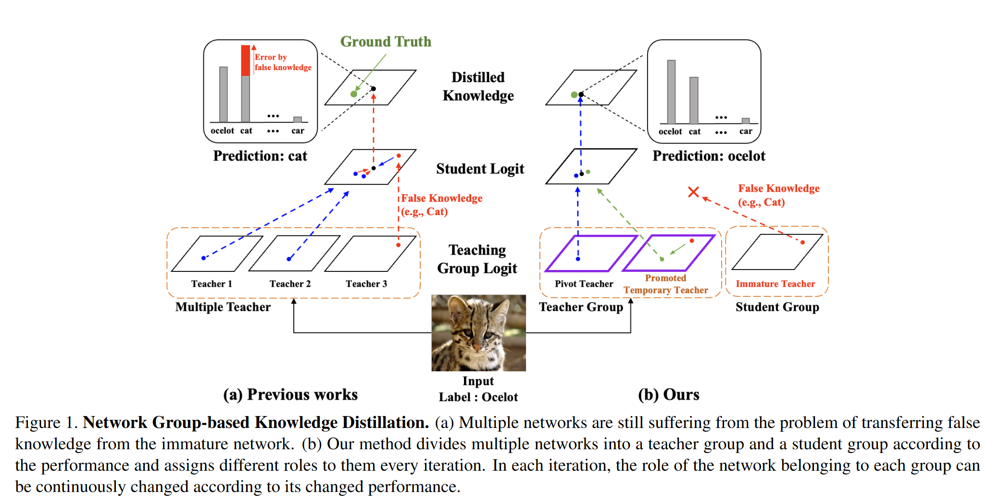
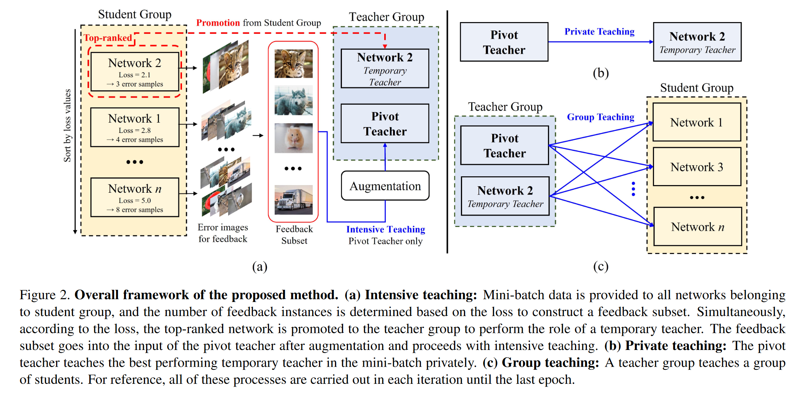
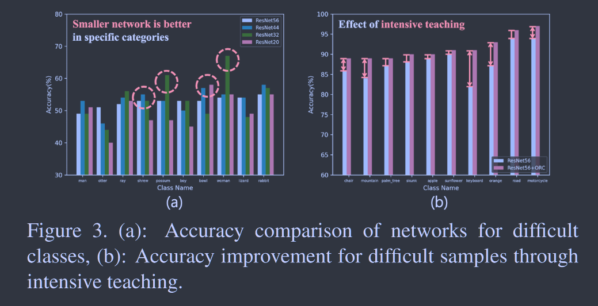

# ORC: Network Group-based Knowledge Distillation using Online Role Change

**[ICCV 2023](https://openaccess.thecvf.com/content/ICCV2023/html/Choi_ORC_Network_Group-based_Knowledge_Distillation_using_Online_Role_Change_ICCV_2023_paper.html)	[code in github EMPTY!](https://github.com/choijunyong/ORCKD)	CIFAR10/100  ImageNet	20240426**

*Junyong Choi, Hyeon Cho, Seokhwa Cheung, Wonjun Hwang*

现有的多教师蒸馏方法会将错误知识传递给学生模型造成性能的下降，这项工作提出一种分组教学的框架，分为学生组和教师组，学生组先反馈出一组易于出错的样本交个教师组加强学习，教师组由预训练的中心教师和性能最好的学生模型的临时教师组成，易错样本经过mixup增强后交给教师组，临时教师由中心教师单独教授，然后两个教师一起教授学生组中的所有学生网络，然后重新评选临时教师。通过这种方式来迭代的训练更好的学生模型。

## Introduction

由于单教师无法解决所有的问题，最近出现了很多基于多教师的知识蒸馏方法，但是他们有时会将错误的知识传授给学生，我们提出一种防止错误知识转移的方法，对网络分组，学生组表现最好的学生会晋升到教师组帮助其他学生学习，并通过强化教学、私人教学来防止错误信息的传递

> 提出一种基于ORC的多网络蒸馏方法，通过在训练过程中将训练排名考前的学生网络提升为临时教师来有效防止错误知识的转移
>
> 通过三种教学方式来实现在线蒸馏的ORC

## Method

我们将网络分为教师组和学生组，教师组包括对整体培训至关重要的中心教师，学生在包括学生网络和不成熟的教师网络。角色转换培训包括三个步骤，强化教学，私人教学和小组教学：

#### Intensive Teaching

教师应当关注学生而不是自己，所有中心教师应当关注学生觉得困难的样本，并转移正确的知识。老师需要知道学生在什么方面有困难，从学生组获取反馈样本。学生在训练前评估mini-batch中样本的性能，计算相应的交叉熵损失而无需更新参数。如果反馈样本仅包含mini-batch中的数据，可能会出现过拟合或是最初预测良好的类别性能下降的问题。我们使用Mix-up数据增强来处理这个问题，反馈样本通过数据增强后对教师模型强化教学，使教师减少了传授有关学生难以理解的样本的错误知识的可能性。
$$
L_1 = \mathcal{H}(\tilde{y}, P_{PT}(\tilde{x})) = \lambda\mathcal{H}(y_t, P_{PT}(\tilde{x})) + (1-\lambda)\mathcal{H}(y_\mathcal{F},P_{PT}(\tilde{x}))
$$
$\tilde{x}, \tilde{y}$表示mixup增强后的样本，$P_{PT}(·)$为中心教师的softmax输出。

#### Private Teaching

学生组表现最好的网络被提升至教师组中的临时教师，未晋升的学生通过小组教学获得任务更正，临时教师不会获得更正，因此其直接获得中心教师的纠正来提高教学能力：
$$
L_P= (1-\beta)L_{CE}(y_t, P_{TT}(x_t)) + \beta L_{KD}(P_{TT}(x_t), P_{PT}(x_t))
$$
$P_{TT}(·)$表示临时教室的softmax输出。

#### Group Teaching

本文让教师组所有网络直接教授学生组的各个网络，前两个步骤已经构建了具有正确知识的教师组：
$$
L^i_{G} = L_{KD}(P_{S_i}(x_t), P_{TT}(x_t)) + L_{KD}(P_{S_i}, P_{PT}(x_t))
$$
学生网络的整体损失：
$$
L_T= \sum_i\{(1-\beta)L_{CE}^{S_i}(y_t, P_{S_i}(x_t)) + \beta L_{G}^i\}
$$
小组学习结束后临时教师降级为学生，重复上述过程在下一轮迭代中寻找新的临时教师。

通过强化教学，中心教师将学生群体中难以理解的样本错误的知识转移性降至最低，并通过私人教学提升临时教师的教育能力来纠正错误知识，最后通过小组教学来纠正学生组的错误知识。
