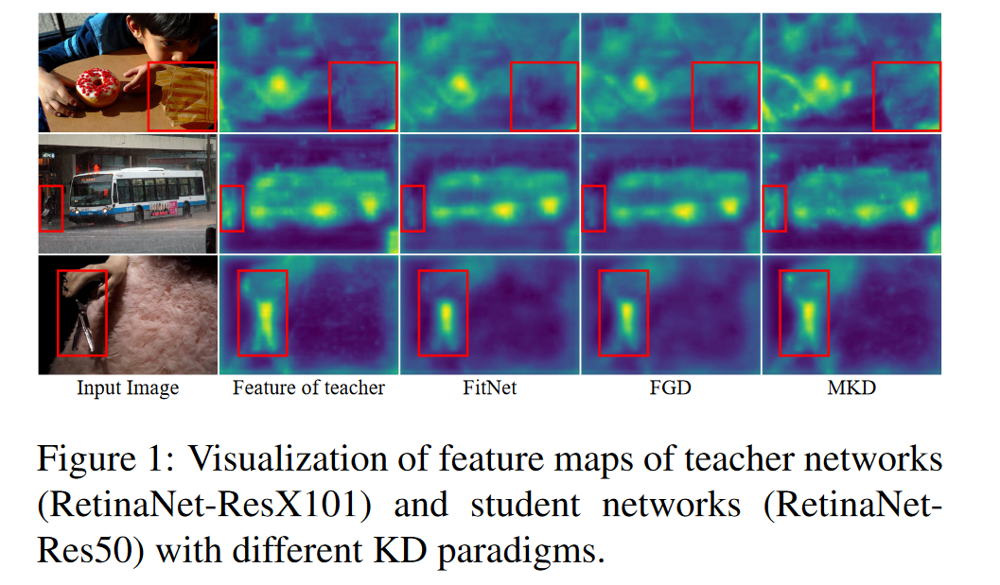
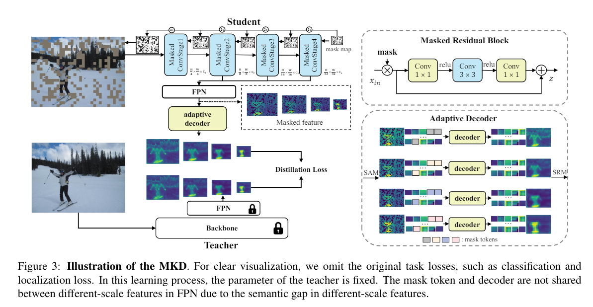
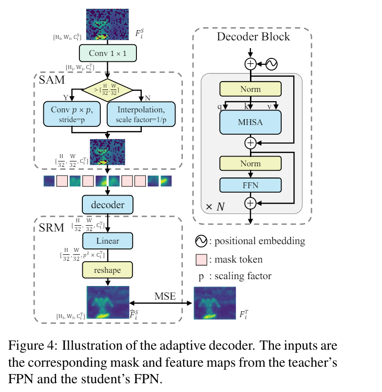

# Masked AutoEncoders Are Stronger Knowledge Distillers

**[ICCV 2023](https://openaccess.thecvf.com/content/ICCV2023/html/Lao_Masked_Autoencoders_Are_Stronger_Knowledge_Distillers_ICCV_2023_paper.html)	no code	MS-COCO	20240510**

*Shanshan Lao, Guanglu Song, Boxiao Liu, Yu Liu, Yujiu Yang*

这项工作认为基于特征的KD方法并没有从教师中学习到完整的知识，重要的知识被简单的样本所压制导致学生很难学习到有效的知识，因此引入掩码图像建模机制来缓解这一问题，在学生图像上随机屏蔽一些块并强制其学习教师的输出来恢复缺失的特征，提出自适应解码器，包括空间对齐模块SAM、Transformers的解码器和空间恢复模块SRM，通过该模块对学生模型FPN提取的带掩码的特征图与教师模型的特征图对齐进行蒸馏学习，并且在总损失中引入了2022CVPR的一项全局损失结构GCBlock来辅助蒸馏学习。

## Introduction

我们实验发现，这种基于特征的KD核心瓶颈在于如何在教师的输出中学习到完整的知识，简单样本占到大多数，而剩下的重要知识被这些简单样本所压制，学生很难进行有效的学习。先前的工作发现了类似的问题，即如果使用同一个蒸馏损失，每个像素贡献是相等的，这将导致网络容易学习到大量的相似信息而难以识别重要信息。先前工作通过注意力图和背景前景解耦缓解这一问题。

我们为了学习完整的信息而不受教师特征中冗余的影响，引入了掩码图像建模机制来促进这些信息的学习。核心思想是在为教师保留整个输入图像的同时，随机屏蔽学生图像上的补丁，通过强制学生模仿教师输出来恢复响应缺失的特征。

> 我们提出一种名为MKD的基于特征的蒸馏范式，使用掩码自动编码来有效的学习教师网络中的完整知识，MKD屏蔽输入图像的随机补丁并通过强制其模仿教师的输出来恢复响应的屏蔽特征
>
> 我们在MKD中引入掩码卷积核自适应解码器模块以便于在细粒度的视觉任务中与不同的架构合作，例如目标检测和语义分割

## Method

### Masked Knowledge Distillation

设$F^S\in\R^{C\times H\times W}, F^T\in\R^{C\times H\times W}$表示学生和教师FPN(特征金字塔网络)输出特征，基于特征的蒸馏表示为：
$$
\mathcal{L}_{feat} = \frac{1}{2N}\sum^{\mathcal{P}}_{i=0}(F^T_i-\phi(F^S_i))^2
$$
P表示FPN特征的数量，$N=C_iH_iW_i$，我们进一步增强KD蒸馏稠密视觉预测，将掩码自动编码任务引入到KD学习中：
$$
\mathcal{L}_{feat} = \frac{1}{2N}\sum^{\mathcal{P}}_{i=0}(F^T_i-f_{dec}(\phi(F^S_i), \mathcal{T}_{mask}))^2
$$
$f_{dec}$为提出的自适应解码器模块，具有空间对齐模块，堆叠的transformer解码器层和空间恢复模块，Tmask为掩码token。

给定一个$H\times W$的图像，以给定的掩码比例随机采样元素生成二元掩码图M，大小为$N =\frac{H}{s}\times \frac{W}{s}$，是为掩码图的下采样因子，我们设为32，逐步对掩码图上采样使其与学生骨干中每个卷积阶段的输出保持一致，然后将学生作为编码器，将带掩码的图像发送给他。FPN生成的掩码特征图被大搜到自适应解码器模块。这种学习方式是通过强制学生的自适应解码器输出来模仿教师的输出来监督的。

#### Masking in the Image Space

我们首先将输入图像划分为规则的非重叠图像块，根据给定的掩码比例随机生成二进制掩码，遮挡部分对学生模型不可见，卷积神经网络采用金字塔方案，不同卷积阶段设置了不同的步长，使得学生前向传播过程有多种不同的空间分辨率。为了与此保持一致，在后期生成的分辨率为$\frac{H}{32}\times \frac{W}{32}$的掩码后，逐渐将掩码采样到更大的分辨率，来匹配不同尺度的特征图。

#### Masked Encoder

为了确保学生网络只在可见的补丁上运行并且只从相邻的补丁重建，MAE仅将可见的部分转发到编码器中，但这并不能直接用与卷积网络，因为我们需要保持图像的空间维度，我们提出屏蔽卷积，使用阿达玛乘积（逐项乘积）来屏蔽来自前一层的输入特征图，有效避免遮蔽区域和可见区域的特征交互混淆，我们假设这有助于编码器学习更具表现力和内容丰富的功能。

#### Adaptive Decoder

自适应解码器的输入是学生的多尺度掩码特征图跟上一个1*1卷积来对齐通道数，在这些多尺度要素中，掩码大小不同导致重建不一致，我们引入一个简单的空间对齐模块SAM，以将它们对齐到相同的空间分辨率。

通过步长为p的卷积或上采样系数为$\frac{1}{p}$来实现，为每个要素比例初始化特定的mask token，多次复制来替换掩码区域的要素，每个mask token都是一个可学习的向量，不会在不同特征尺度之间共享。transformer解码器的最终输出通过空间恢复模块SRM来恢复到原始的多尺度分辨率，通过线性层将通道数改为$p^2\times C^T_i$，将其reshape到与$F^T_i$相同的大小，SRM的输出被迫模仿教师的输出来学习缺失的特征，自适应解码器仅在训练过程中用于执行带掩码的KD任务

#### Distillation Target

SRM的输出表示为$\hat{F}_{i}^S \in \R^{C^T_i\times H_i\times W_i}$，i表示FPN中的特征索引。
$$
\mathcal{L}_{feat} = \frac{1}{2N}\sum^{\mathcal{P}}_{i=0}(F^T_i-\hat{F}_{i}^S )^2
$$
P表示FPN特征的数量，$N=C_iH_iW_i$，$\hat{F}_{i}^S$为$f_{dec}(\phi(F^S_i), \mathcal{T}_{mask})$的输出，我们引入全局损失来辅助蒸馏学习：
$$
\mathcal{L}_{global} = \sum^{\mathcal{P}}_{i=0}(R(F^T_i)-R(\hat{F}_{i}^S) )^2
$$
R表示FGD中的GCBlock[2022 CVPR]，在计算上述损失是，FT FS均在MSE损失之前通过归一化层，总体损失：
$$
\mathcal{L}_{total} = \mathcal{L}_{task}+\lambda\mathcal{L}_{feat}+\gamma\mathcal{L}_{global}
$$
