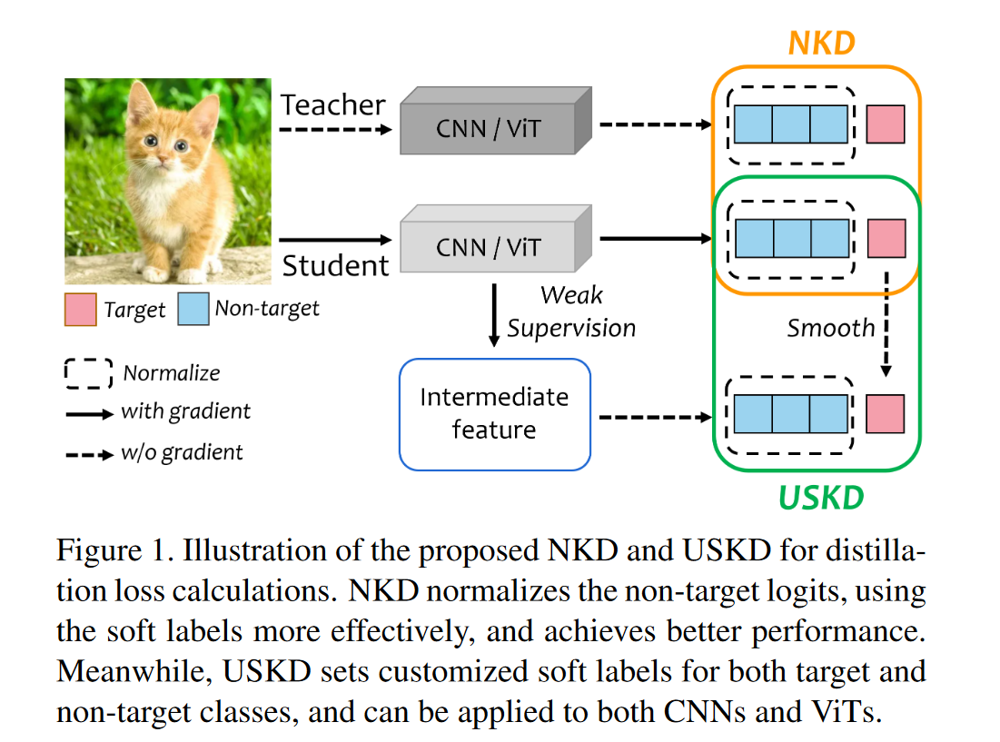
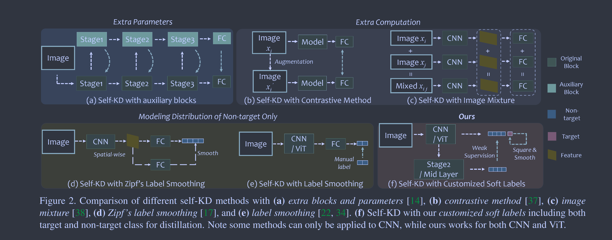

# From Knowledge Distillation to Self-Knowledge Distillation: A Unified Approach with Normalized Loss and Customized Soft Labels

**[ICCV 2023](https://openaccess.thecvf.com/content/ICCV2023/html/Yang_From_Knowledge_Distillation_to_Self-Knowledge_Distillation_A_Unified_Approach_with_ICCV_2023_paper.html)	[code in github](https://github.com/yzd-v/cls_KD)	CIFAR100  ImageNet	20240510**

这项工作针对logit的耦合问题进一步进行研究，先前工作*2022CVPR DKD*虽然有效，但发现非目标类别师生模型的logits和不相同，这阻碍了其分布相似。这项工作对其进行了归一化，并且将其扩展到自蒸馏中，结合齐夫定律标签平滑给出了一套软标签的生成方案，将提出的NKD迁移到自蒸馏任务中。

## Introduction

先前工作将交叉熵损失用于计算目标类的损失，来自教师的软标签分为目标类和非目标类，解耦的方法DKD已被证明有效，我们提出一种更简单且有效的方法来解耦，将KD损失分解为目标损失和CE形式的非目标损失的组合。

先前工作非目标logit的和是不同的，这阻碍了他们进行对齐，因此我们提出归一化处理使其和相等。NKD利用教师的目标logit和标准化的非目标logit指导学生。我们还根据齐夫定理标签平滑给出了自蒸馏的方案，给出了软目标标签的获得方案。

## Method

### Normalized KD for Better Using Soft Labels

用t表示目标类别，C表示类别数，Vi表示每个类别i的标签值，Si表示学生输出的概率，则图像分类的原始损失表示为：
$$
L_{ori} = -\sum^C_iV_ilog(S_i) = -V_tlog(S_t) = -log(S_t)
$$
用Ti表示教师的软标签，蒸馏损失定义为：
$$
L_{kd} = -\sum^C_iT_ilog(S_i) = -T_tlog(S_t) - \sum^C_{i\neq t}T_ilog(S_i)
$$
然而由于$\sum^C_{i\neq t}T_i=1-T_i, \sum^C_{i\neq t}S_i=1-S_i$，由于Si在训练过程中不太可能与Ti完全匹配，两个非目标logits的总和总是不同，阻止了两个分布相似。因此我们对Ti Si进行归一化处理，N(·)表示归一化操作，提出了NKD蒸馏损失：
$$
L_{nkd} = -T_tlog(S_t)-\gamma·\lambda^2·\sum^C_{i\neq t}\mathcal{N}(T^\lambda_i)log(\mathcal{N}(S^\lambda_i))
$$
$\gamma, \lambda$分别为平衡超参数和温度系数，训练总损失为：
$$
L_{all} = L_{ori} + L_{nkd}
$$

### Customized Soft Labels for Self-KD

利用NKD损失我们提出了一种通用有效的self-KD方法，该方法在没有教师的情况下，对目标类和非目标类设置软标签。我们想通过调节学生的目标输出St来提供软标签，Tt和St差异主要集中在两个部分，其一是在训练过程中Tt固定而S他逐渐变化；其二是在训练开始时不同样本S他之间的差异远小于Tt。我们首先对St进行平方来扩大不同样本St之间的差异，然后提出一种调整St的方法，使其更平滑地拟合没有教师的训练集，由此得到软标签Pt，其中Vt为真实标签:
$$
P_t = S^2_t + V_t - mean(S^2_t)
$$
因此NKD的目标loss可以定义为：
$$
L_{target} = -P_tlog(S_t)
$$

### Soft Non-target Labels

来自教师软标签的非目标标签还包括其排名和分布，需要为self-KD设置非目标标签，为了得到排名，首先通过在中间特征上设置弱监督得到一个新的弱logit，用F表示模型中间层的分类标记，GAP表示全局平均池化，FC表示一个新的线性层：
$$
for\ CNN-liked\ model:W_i= softmax(FC(GAP(F))) \\
for\ ViT-liked\ model:W_i=softmax(FC(F))
$$
经过标签平滑处理的原始标签，得到的弱logit损失如下：
$$
L_{weak} = -\mu·\sum^C_iV_ilog(W_i)
$$
在弱logit下，通过归一化和最终的logit得到非目标标签的排序，平衡了两个logit对排名的影响：
$$
R_i = \frac{W_i}{1-W_t} + \frac{S_i}{1-S_t}
$$
非目标的软标签分布遵循齐夫定律，引自文献*2022ECCV Efficient One Pass Self-distillation with Zipf’s Label Smoothing：*
$$
Z_i= \frac{R_i^{-1}}{\sum^C_{i=1}R^{-1}_i}
$$

> 齐夫定律：在自然语言的语料库里，一个单词出现的频率与它在频率表里的排名成反比。所以，频率最高的单词出现的频率大约是出现频率第二位的单词的2倍，而出现频率第二位的单词则是出现频率第四位的单词的2倍。这个定律被作为任何与幂定律概率分布有关的事物的参考。

因此非目标的损失定义为：
$$
L_{non} = -\sum^C_{i\neq t}\mathcal{N}(Z_i)log(\mathcal{N}(S_i))
$$
self-KD总损失定义如下：
$$
L_{all} = L_{ori} + \alpha·L_{target} + \beta·L_{non} + L_{weak}
$$
