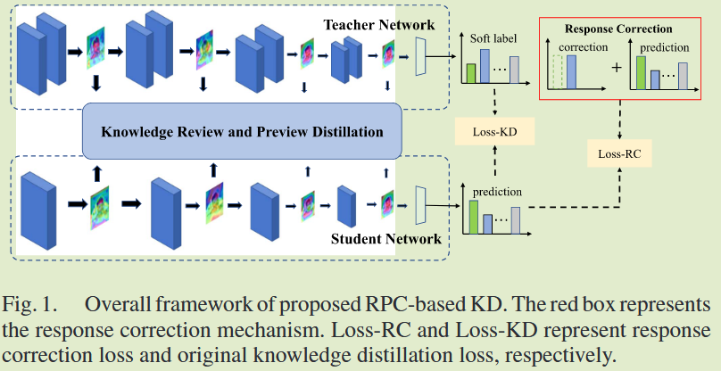
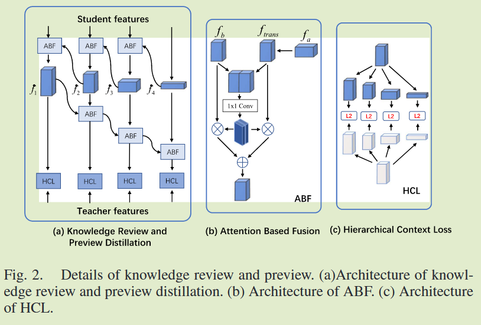

# Be an Excellent Student: Review, Preview, and Correction

**[IEEE Signal Processing 2023](https://ieeexplore.ieee.org/abstract/document/10319075)	[code in github](https://github.com/kbzhang0505/RPC)	CIFAR100	20240909**

*Qizhi Cao; Kaibing Zhang; Xin He; Junge Shen*

本文认为高层次知识对于学生模型很重要，提出知识预习和知识回顾，融合教师模型多个层次的特征，通过先前提出的基于注意力的融合模块ABF和层次上下文损失HCL来实现，并且提出一种纠错机制利用学生模型自身的知识和真实标签进行自我完善，来缓解师生差距带来的影响。

## Introduction

提出一个新的知识蒸馏框架，模拟了优秀学生从老师那里获得知识的全面学习过程，即知识回顾、知识预习和知识修正，来获得更多的信息和补充知识。

我们认识到高层次知识对于学生的重要性，提出了知识预习流程，将教师的高级特征迁移到学生的低级特征。

开发了一种纠错机制，利用学生模型自身知识来进行自我完善，缓解师生差距带来的负面影响。

## Method

### Knowledge Review & Preview Distillation  知识预习和知识回顾

我们设计了一种双向渐进融合策略，该策略考虑了从深层到浅层的反向特征融合（知识复习），还考虑了从浅层到深层的正向特征融合（知识预习），通过**注意力融合ABF**方案来**对不同层次特征进行融合**，并通过**分层上下文损失HCL**从**不同层探索更多的信息细节**。嵌入坐标注意力，在不明显增加计算成本的情况下提取更显著的特征。

#### ABF: Attention Based Fusion  基于注意力的融合

假设输入图像为x，学生网络为S，教师网络为T，我们通过$F_s = S(x)$来表示学生特征$F_s = \{f_1, f_2, ..., f_n \}$，同理用$F_t$表示教师特征，在ABF模块中，G()是用于将特征$f_a$转换为与$f_b$相同形状的变换函数：
$$
f_{trans} = G(f_a)
$$
$f_a, f_b$表示两个不同层对应的特征，$f_{trans}$表示变换后的特征。变换后的特征与$f_b$进行拼接，然后使用卷积Conv()得到两个特征的注意力图，将得到的注意力图与对应特征图进行点乘并求和得到融合特征：
$$
f_{fuse} = Conv(f_{trans}) \times f_{trans} + Conv(f_{b})\times f_b
$$
最终ABF的融合特征可以表示为：
$$
F_{ABF}(f_b, f_a) = Conv(G(f_a)) \times G(f_a) + Conv(f_b) \times f_b
$$

#### Knowledge Review and Preview  知识回顾和知识预习

对学生特征进行知识回顾的过程，通过ABF模块进行向后递进融合，得到一阶融合特征，融合后的特征包含了所有比第i层特征更深层次的特征，可以在数学上表示为：
$$
\dot{f_i} = f_i \circ f_{i+1} \circ ... \circ f_n
$$
其中$f_i \circ f_{i+1} = F_{ABF}(f_i, f_{i+1})$，$f_i$表示第i个一阶特征，由上式可以得到一阶融合特征$\dot{F_s} = \{ \dot{f_1}, \dot{f_2}, ..., \dot{f_n}\}$，。

在知识预习过程中，对一阶特征应用前向渐进式融合路径，得到二阶融合特征，该过程可以表示为：
$$
\ddot{f_i} = \dot{f_1} \diamond  \dot{f_2} \diamond ... \diamond \dot{f_i}
$$
其中$\dot{f_i} \diamond  \dot{f}_{i+1} = F_{ABF}(\dot{f_i},\dot{f}_{i+1})$,$\ddot{f}_i$表示第i个二阶特征，通过知识回顾和知识融合得到的二阶特征$\ddot{F}_s = \{\ddot{f}_1, \ddot{f}_2, ..., \ddot{f}_n \}$包含丰富的各层特征知识。

#### HCL Hierarchical Context Loss  层次上下文损失

二阶特征融合涉及到多个尺度和不同维度特征，直接提取会导致特征传递不充分，提出**层次上下文损失模块HCL**来解决该问题，利用金字塔池化来处理教师和学生在多个尺度和维度上的特征，最大限度的保留了来自不同层初始特征的细节：
$$
L_{RP} = D(P(\ddot{F_s}), P(\ddot{F_t}))
$$
P()表示特征金字塔变换，D()表示对应L2距离函数。

### Response Correction Mechanism  响应修正机制

对于第i个样本学生模型的预测输出为$P = \{p_1, p_2, ..., p_{cls}, ..., p_n \}$,我们将预测分布的最大值与正确类的值相加：
$$
p_{rc} = p_{cls} + MAX(P)
$$
$p_{rc} = \{ p_1, p_2,..., p_{rc}, ..., p_n\}$作为学生学习的标签：
$$
L_{RC} = H(softmax(\frac{P_{rc}}{\tau}), softmax(\frac{P}{\tau}))
$$

### Loss Function

$$
L_{ALL} = L_{KD} + \lambda L_{RP}+\mu L_{RC}
$$

