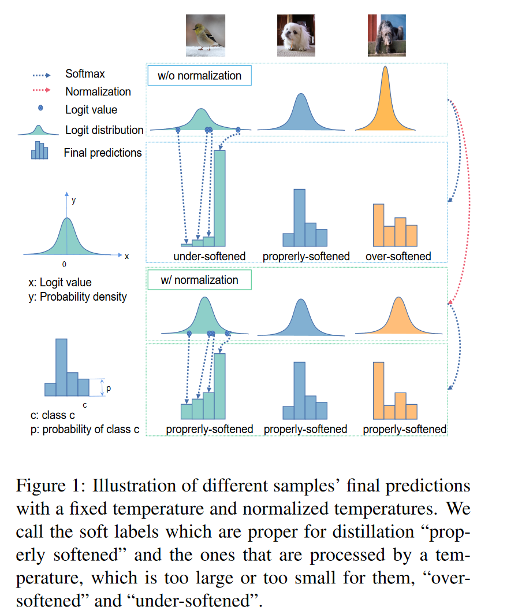
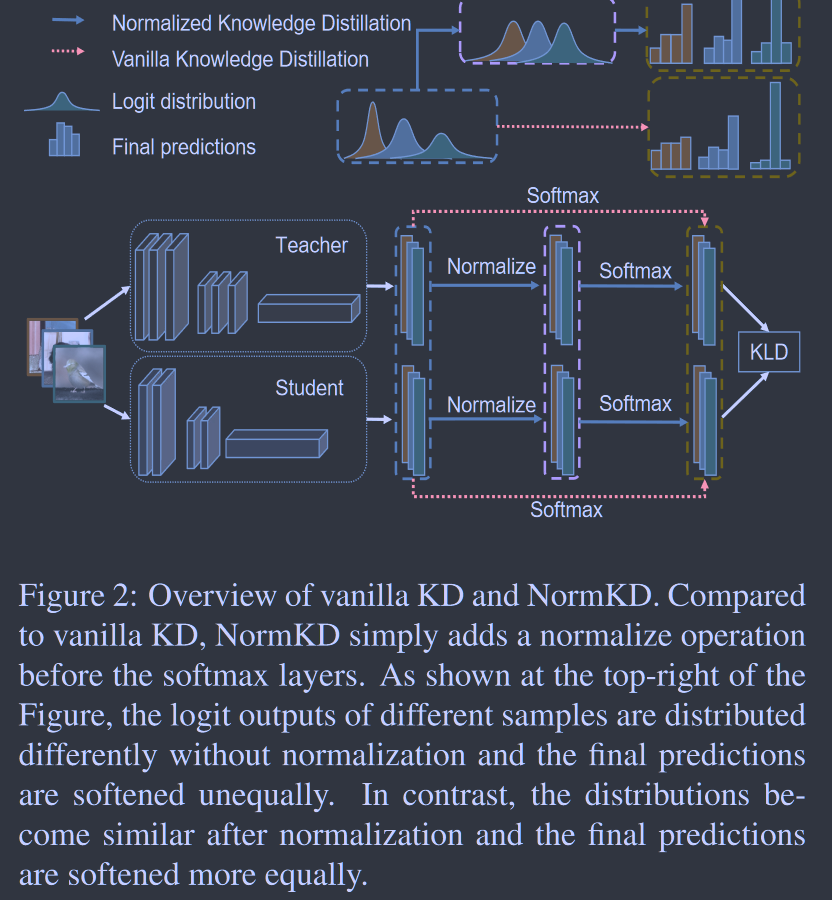
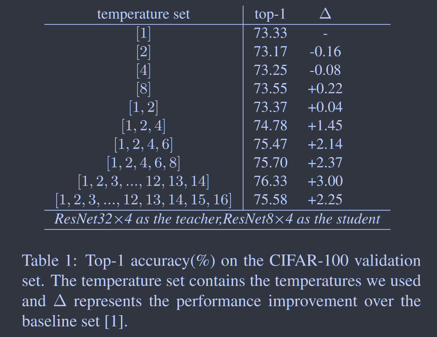
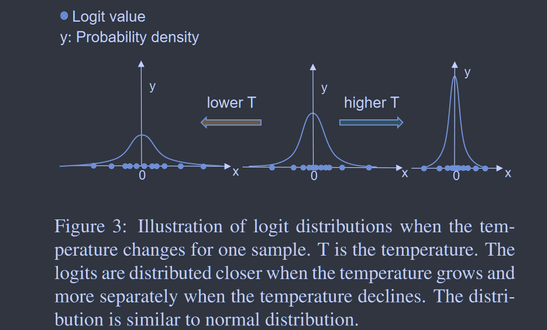
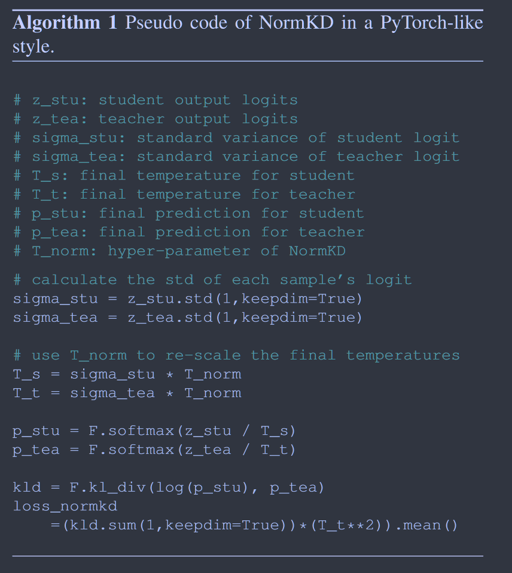

# Norm KD: Normalized Logits for Knowledge Distillation

**[arXiv 2023](https://arxiv.org/abs/2308.00520)	no code	CIFAR100  ImageNet	20240503**

*Zhihao Chi, Tu Zheng, Hengjia Li, Zheng Yang, Boxi Wu, Binbin Lin, Deng Cai*

这项工作针对温度系数进行研究，先前工作将其设为固定值这并不合适，针对不同的样本相同的温度并不能很好的软化所有的样本，因此提出了归一化知识蒸馏，将每个样本的logits分布视为高斯分布对齐标准化，融入到softmax函数中仅需计算每个logits输出的标准差，并且引入一个Tnorm超参数来调整分布，这种方法几乎没有引入额外的计算开销并且可以容易的与其他基于logits的方法向结合。

## Introduction

先前工作都将温度设定为固定值，这并不合适，采用固定值时，对于下述情况，第一个样本有一个接近真实标签的可信预测，由于温度太低，软标签不包含充分的暗知识，第三个样本的置信度较低，固定的温度太高使其丢失了类别信息。不同的样本分布不同，一个温度并不能使所有的logit都达到一个合适的软化程度。我们的目标是为所有的样本获得适当的软化目标，我们提出归一化知识蒸馏，为每个样本设定一个特定的温度。

> 重新研究了知识蒸馏的温度超参数，发现单一温度不足以软化不同样本的输出
>
> 通过样本输出的分布来选择每个样本的温度能够有效提高蒸馏的性能
>
> 提出一种简单有效的基于logits的蒸馏方法，与经典蒸馏相比几乎没有引入额外成本，且可以很好的融入到其他logit蒸馏方法中

## Method

### Distill With Multiple Temperature

先前工作将整个蒸馏过程的温度设定为一个固定值，这并不合理，我们在不同温度下对logit输出z进行多次软化，得到多个预测值，简单的计算这些预测值的平均值：
$$
\overline{p}=\frac{1}{k}\sum^k_{i=1}p_{T=t_i}
$$
其中k是使用温度的个数，ti是选择温度的值，蒸馏损失写为：
$$
\mathcal{L}_{kld} = T^2_{mul}·KLD(\overline{p}^s, \overline{p}^t)
$$
$T^2_{mul}$表示多个温度引入的补偿权重，实验中我们经验性的选择所有温度中的最大值$[t_1, t_2, ..., t_k]_{max}$

通过这种方式，学生同时从被软化到不同程度的软标签中提取知识，选择何时温度是性能得到了相当明显的改善，在合适范围之内，蒸馏性能于温度数量成正相关，若使用过多的温度时精度会下降。

### Normalized Knowledge Distillation

使用单一温度部分样本会被过度软化或软化不足导致其不适合蒸馏，因此选择一个特定的值作为每个样本合适的温度是一个可行的思路，我们观察温度固定时样本logits输出的分布，其类似于正态分布，温度下降时数值更加分散而温度上升时分布更加接近，因此将logits分布近似为位置参数$\mu$和尺度参数$\sigma$是合适的选择

当我们将分布近似看作为正态分布，很容易将其标准化，因此为我们的归一化知识蒸馏在softmax之前增加一个归一化操作：
$$
\begin{aligned}
\tilde{p}_i &= \frac{exp((z_i-\mu)/\sigma)}{\sum^c_{j=1}exp((z_j-\mu)/\sigma)} = \frac{exp(z_i/\sigma)/exp(\mu/\sigma)}{\sum^C_{j=1}(exp(z_j/\sigma)/exp(\mu/\sigma))} \\
&= \frac{exp(z_i/\sigma)/exp(\mu/\sigma)}{(\sum^C_{j=1}exp(z_j/\sigma))/exp(\mu/\sigma)} = \frac{exp(z_i/\sigma)}{\sum^C_{j=1}exp(z_j/\sigma)}
\end{aligned}
$$
其中C表示类别数，$\mu,\sigma$分别表示样本logits输出$[z_i, z_2, ..., z_C]$的均值和标准差，$\tilde{p}_i$表示第i类样本归一化后的最终预测结果。我们的方法于传统的KD唯一区别在温度系数由logits的标准差替换，但是标准正太分布并不总是最好的，因此我们引入一个额外的超参数来调整分布以获得令人满意的结果：
$$
\tilde{p}_i = \frac{exp(z_i/(\sigma·T_{norm}))}{\sum^C_{j=1}exp(z_j/(\sigma·T_{norm}))}
$$
因此最终蒸馏损失可以表述为：
$$
\mathcal{L}_{kld} = \frac{1}{N}·\sum^N_{i=1}((T_{norm}·\sigma^t_i)^2·KLD(\tilde{p}^s, \tilde{p}^t))
$$
NormKD引入的唯一计算是计算每个logits上输出的标准差，这种方法在一定程度上解决了单一温度引入的不平衡问题，与传统的KD相比NormKD具有几乎相同的计算成本、相同的超参数个数和更好的性能，并且它可以很容易的与其他蒸馏方法相结合。

