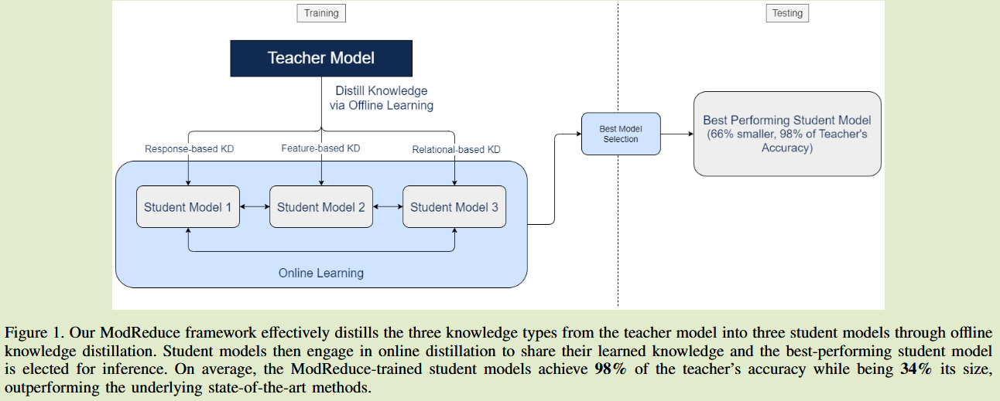

# ModReduce: A Multi-Knowledge Distillation Framework

2024（垃圾期刊）	20240910

**提出了三个模型用三种不同的知识来训练，然后通过在线学习共享融合三个学生的知识。**

只有这一点可以借鉴，在线学习可以用来融合共享多个模型的知识来获得更好的模型，其他的没啥价值。

## Introduction

通常蒸馏知识分为基于输出特征的知识、基于中间特征的知识和基于关系特征的知识，先前的方法都只利用了一种或两种，本文假设利用全部三种知识能够获得更好的学生模型。

本文提出一种离线蒸馏和在线蒸馏相结合的方式，利用三种知识来训练学生模型。

## Method

有一个经过预训练的复杂的教师模型，以及三个未经过训练的学生模型，分为离线蒸馏阶段和在线蒸馏阶段。

首先对每个学生模型使用不同的知识源，对模型进行离线蒸馏，然后进行在线蒸馏，来聚合离线阶段获得的知识，以增强泛化性。

离线蒸馏和在线蒸馏过程直接采用的其他研究方法，这里不在赘述。

## Discussion

- 简单的将知识聚合并不能取得比单一知识更好的结果。需要进一步探索知识的聚合方式
- 通过在线学习让一组不同的学生分享他们之间的知识能够获得比只使用一种或两种知识更好的结果