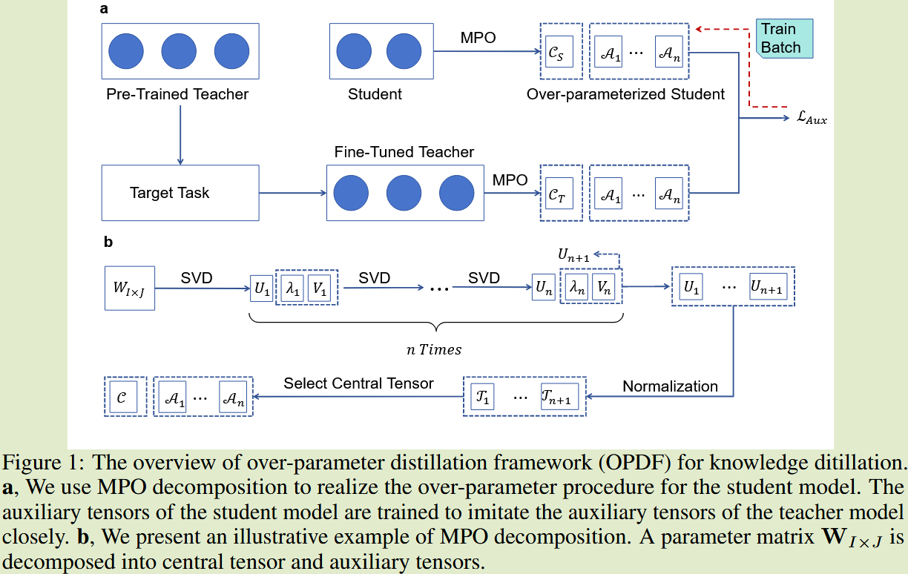

# Over-parameterized Student Model via Tensor Decomposition Boosted Knowledge Distillation

2024 ？ 	[code in github](https://github.com/intell-sci-comput/OPDF)	NLP CV	20241114	蒸馏过程

本文从另一个视角改进了知识蒸馏，使学生模型有超越教师模型的潜力，提出通过MPO矩阵乘积运算分解算法将学生模型的参数矩阵分解为多个张量相乘，其中中间的张量包含大量参数和重要信息，称为中心张量，这部分由真实标签指导进行独立学习；两侧的张量参数较少包含辅助信息，这部分通过教师模型对应的维度相同的张量通过MSE损失进行匹配，使学生模型从教师模型中获取知识。

## Introduction

由于与大模型相比其过参数化程度低，导致其泛化性可能达不到要求，为了解决这一问题，我们要弥补师生模型之间的性能差距，我们提出在训练阶段通过张量分解技术(例如奇异值分解)来增加参数的数量，并在模型收敛后将分解的矩阵进行合并来消除对推理阶段的影响。

我们需要解决两个问题：

- 尽量减少张量分解带来的信息损失，小的计算误差会在学生模型中积累达到指数级别的传播
- 过参数化的学生模型需要保证与教师模型的信息一致性

需要选择合适的分解方法，并为高阶张量设计损失函数，确保知识有效传递。我们提出过参数化蒸馏框架OPDF，通过MPO进行分解进行过参数化，然后通过高阶张量损失对齐师生模型来确保有效的信息传递。

## Method

### OPDF via MPO分解

#### 矩阵乘积运算符分解 MPO

MPO算法能够将$W \in R^{I \times J}$的参数矩阵分解为多个张量的顺序乘积，给定一个矩阵M， MPO将其分解为n个张量的乘积：
$$
MPO(M) = \prod^n_{k=1} T_{(k)}[d_{k-1}, i_j, j_k, d_k]
$$
$ T_{(k)}[d_{k-1}, i_j, j_k, d_k]$为四阶张量，其中$\prod^n_{k=1}i_k=I, \prod^n_{k=1}j_k=J, d_0=d_n=1$,中间维度dk定义为：
$$
d_k = min(\prod^k_{m=1}i_m\times j_m, \prod^n_{m=K+1}i_m\times j_m)
$$
dk在中间很大，而在两侧较小，我们成中间的张量为中心张量，而在两侧的张量成称为辅助张量

#### 过参数化学生模型

我们将学生模型中的一部分参数矩阵利用MPO分解为多个张量，参数的增加量计算为：
$$
N_{add} = \sum^m_{k=1}i_kj_kd_{k-1}d_k - \prod^m_{k=1}i_kj_k
$$
通过这种方式可以在不增加推理时间消耗的前提下增加学生模型的参数数量，在训练收敛后能够以接近无损的形式重建为参数矩阵。

### 知识蒸馏的辅助约束

我们引入了一种MPO分解的高阶张量对齐训练方法，MPO分解的一个关键点在于能够将参数矩阵分解为中心张量（包含大量参数和重要信息）和辅助张量（包含少量参数和附加信息），我们添加了一个约束损失来对齐师生模型的辅助张量：
$$
L_{Aux} = \frac{1}{n}\sum^n_{k=1}MSE(A_{s,k}, A_{t,k})
$$
Ask Atk分别表示师生模型中维度相同的辅助向量，中心向量由学生模型独立学习，利用教师模型辅助学生进行辅助张量的学习