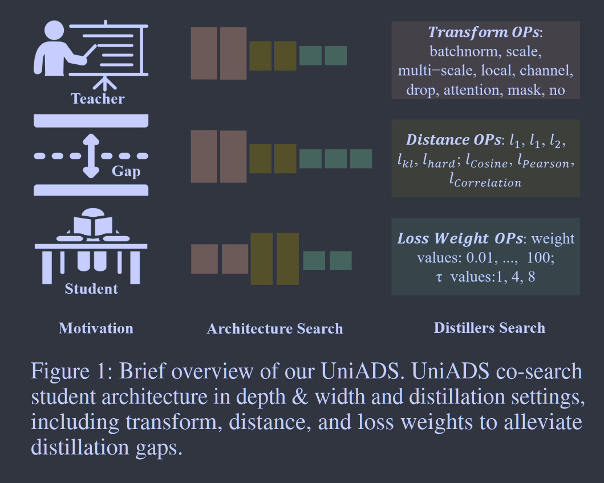
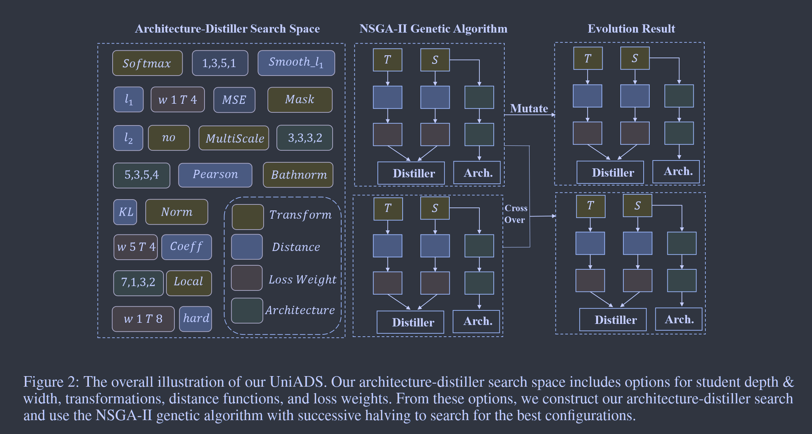

# UniADS: Universal Architecture-Distiller Search for Distillation Gap

**[AAAI 2024](https://ojs.aaai.org/index.php/AAAI/article/view/29327)	no code	CIFAR  ImageNet	20240531**

*Liming Lu  Zhenghan Chen  Xiaoyu Lu  Yihang Rao  Lujun Li  Shuchao Pang*

这项工作为了弥合师生模型之间差距带来的性能损失，提出了一种基于NSGA-II遗传算法的搜索框架，同时考虑优化精度和模型参数来进行搜索，并提出一种连续减半的优化加速策略对其进行剪枝，并且做了消融实验对参数重要性进行测试，最终在CIFAR ImageNet上达到SOTA。

- 使用NSGA-II 遗传算法搜索框架，同时考虑优化精度和模型参数
- 提出连续减半的优化加速策略

## Introduction 

更大更准确的教师往往表现出过度自信，难以有效提高学生模型的表现，这种差距限制了蒸馏的性能。现有方法主要分为辅助模型和蒸馏感知架构搜索，辅助模型在蒸馏过程中引入其他模型来弥合差距，该模型可以充当教师和学生之间的中介，有助于促进知识转移，但这回引入额外的开销；架构搜索侧重于发现专门用于知识蒸馏的最佳学生架构，来改进知识转移过程并减少教师和学生模型之间的差异，这些方法通常使用强化学习、进化算法或者贝叶斯优化等策略来搜索最大限度的提高学生模型性能的框架。

现有的搜索架构只关注架构维度而忽略了蒸馏器设置的影响，我们提出了一个自动搜索框架UniADS，用来解决架构尺寸和蒸馏器这是的联合优化问题，UniADS的搜索空间包括各种架构选择、知识转换、距离函数、损失权重和其他关键设置，我们的发现模型架构维度和蒸馏器设置的组合至关重要。

我们采用NSGA-II多目标优化算法，考虑不同架构，并进行交叉和突变操作生成新的候选方案。

> 引入UniADS自动搜索框架，利用当前知识来发展最佳蒸馏器
>
> 构建一个全面的蒸馏器搜索空间，包括对学生模型的架构搜索，蒸馏策略中的知识转换，距离函数，权重衰减等，利用NSGA-II遗传算法来寻找最佳组合，并采用连续减半算法进行高效的搜索空间修剪。

## Method

### Universal Architecture-Distiller Search Space

#### Search Space Structure

$$
\mathcal{L}_{KD} = \tau^2\times \mathcal{W}\times \mathcal{D}(\mathcal{T}(\mathcal{A}_S/\tau), \mathcal{T}(\mathcal{A}_T/\tau))
$$

W表示损失权重因子，$\tau$为温度系数，T为变换，D(·,·)表示距离函数，A表示师生模型的输出，搜索空间定义如下：

### Accuracy-Efficiency Trade-offs Search

我们旨在同时优化精度和模型参数，NSGA-II被应用为多目标遗传算法，探索了建筑空间，生成了在精度和模型参数之间权衡的多样化架构。我们进行了无梯度的进化搜索算法，有效的从搜索空间中发现最佳蒸馏器$\alpha^*$
$$
\alpha^* = \underset{\alpha \in \mathcal{A}}{arg min}(\mathcal{L}_{CE}(f(\mathcal{A}_S),Y)+ ||Param.(\mathcal{A}_S - \mathcal{C})||)
$$
C表示模型参数的预定义约束。

NSGA-II 初始化种群，基于两个目标评价架构，执行非支配排序和拥挤距离分配，为下一代选择架构，应用遗传因子并替换个体，重复该过程知道满足终止条件。

### Successive Halving Search Acceleration

连续减半被用作底层搜索加速技术，从大量候选蒸馏框架开始：

- 初始化：搜索大量候选框架
- 评估和损失抑制协议：对每个架构进行训练和评估，采用损失抑制协议来加速搜索并过滤掉没有前途的蒸馏器，损失过高或优化崩溃的候选者将被过滤掉。
- 搜索空间缩小：随着连续减半的进行，搜索空间被系统的缩小，损失抑制和性能不佳的相关操作回降低采样概率，使之集中在更有前途的架构上。
- 资源重分配：在不太有前途的蒸馏器被丢弃后，资源被重新分配给剩余的候选者
- 迭代：重复评估、收缩和重新分配步骤（2-4）
- 选择：搜索最终根据其在最终迭代中的表现或满足预定义的终止标准来选择最终架构

减半技术可以高效、加速地寻找最佳蒸馏结构，损失抑制协议可以过滤掉没有希望的候选者，搜索空间收缩将工作集中在更有前途的架构上，这种策略组合有助于简化搜索过程，减轻计算负担，更快的确定最佳蒸馏架构。

### Search Results Analysis

- 变换T：batchnorm  tanh  norm 这些方法经常出现
- 距离函数D：cos kl l2 经常出现
- 损失权重W：16, 5, 1, 0.5为经常出现的权重
- 温度系数：16  8
- 架构： 更宽更深的网络往往具有良好的性能

## Ablation Study

我们对超参数重要性进行了分析，发现：

- 网络的深度和宽度对搜索结果有显著影响，尤其是网络宽度，这与搜索空间设计一致
- 分配给网络知识输出的转换和特征损失的权重具有相当大的影响，于知识本身的特征一致
- 额外的优化参数表现出很小的影响