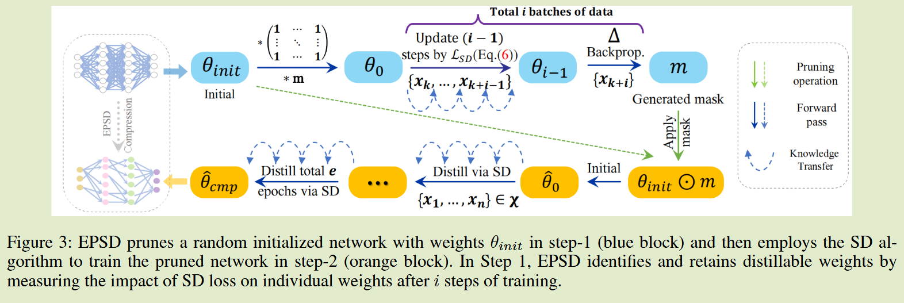
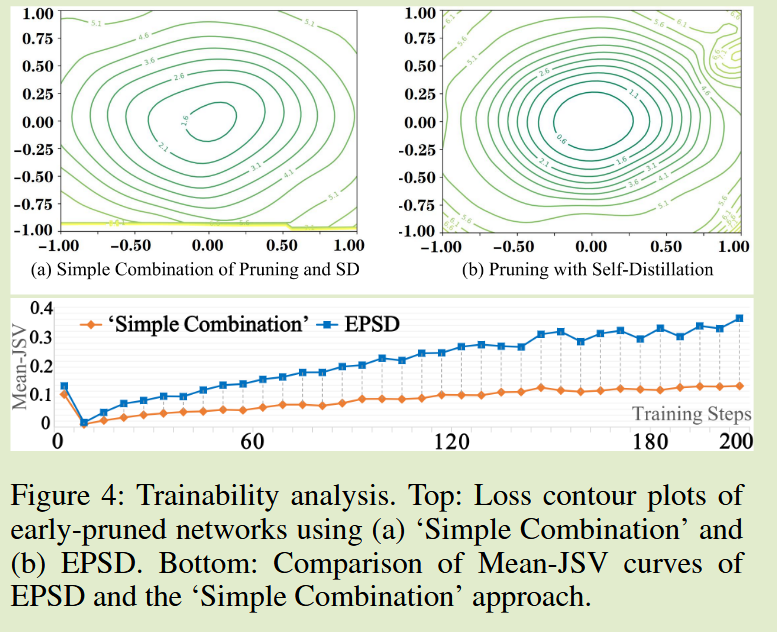

# EPSD: Early Pruning with Self-Distillation for Efficient Model Compression

**[2024 AAAI](https://ojs.aaai.org/index.php/AAAI/article/view/29004)	no code	CIFAR ImageNet	20241023**

*Dong Chen  Ning Liu  Yichen Zhu  Zhengping Che  Rui Ma  Fachao Zhang  Xiaofeng Mou  Yi Chang  Jian Tang*

本文结合了剪枝与自蒸馏来获得更小的学生模型，避免了预训练模型巨大的计算开销吗，测试了将自蒸馏与剪枝直接组合的方案发现性能下降严重，推测由于剪枝时梯度只考虑了与硬标签之间的关系而没有考虑与软标签，因此给出了改进措施，在进行剪枝时通过自蒸馏的迭代来确定权重的可提取性来进行剪枝，最终通过雅可比矩阵的平均奇异值证明了通过这种方式获得的剪枝模型有更好的可训练性。

## Introduction

前期训练成本的问题和师生能力差距的问题限制的KD的性能，因此提出了自蒸馏的概念，学生模型从自身获取知识，实现了更精简的训练过程。但SKD中如果没有适当的正则化，学生模型可能会有过拟合的风险。

网络剪枝能够去除原始网络内部的冗余，生成精度相当的子网络，并且剪枝还有利于降低过拟合的风险，目前的剪枝工作主要集中在早期阶段，初始化后或在几个训练步骤之后不久进行，对于教师模型的预训练需要巨大的计算开销。

因此我们尝试**将剪枝与自蒸馏相结合**来实现高效的模型压缩，对网络进行剪枝，然后用自蒸馏方法对模型进行微调，但是剪枝后的学生很可能表现出弱可训练性，因此简单的结合会导致严重的性能下降。

- 我们提出EPSD，将早期的剪枝与自蒸馏结合起来，且保留了剪枝网络的可训练性，以提高性能。
- 我们给出了定量和可视化分析来证明了EPSD的有效性
- 实验证明EPSD表现出优越的性能和可扩展性

## Method

#### 剪枝自蒸馏简单组合

- 无预训练网络剪枝
- 对自身进行知识蒸馏

##### Step-1 训练前剪枝

先前方法提出了SNIP，用于处理对损失最不必要的权重，通过计算梯度$\Delta$对带随机样本的$x_{rand}$的初始权重$\theta_{init}$生成显著性得分，删除得分最低的权重，对初始权重附上一个全1的掩码，得到$\theta_0 \leftarrow m \odot \theta_{init}$，显著性得分计算为：
$$
\Delta(w_p, x_{rand}) = \frac{\partial L(\theta_0, x_{rand})}{\partial m_p} \\
s_{w_p} = \frac{|\Delta(w_p, x_{rand})|}{\sum_q |\Delta(w_q, x_{rand})|}
$$
m为剪枝掩码，取值为0/1，$\Delta$表示由标签导出的梯度，$w_p$为$\theta_{init}$中第p个权重，$s_{w_p}$为衡量$w_p$重要性的显著性得分

##### Step-2 从软标签中提取知识

我们将输入数据表示为$x \in X$，真实标签表示为$y \in Y = \{1, 2, ..., C \}$，softmax分类预测为：
$$
P(y|x;\theta, \tau) = \frac{exp(l_y(x;\theta)/\tau)}{\sum^C_{i=1}exp(l_i(x;\theta)/\tau)}
$$
$l$表示对应类被的logits，传统KD通过KL散度来从教师模型向学生模型传递知识，而对于自蒸馏同理，我们将自蒸馏损失表示为：
$$
L_{SD} = \frac{1}{n}\sum^n_{i=1}\tau^2·D_{KL}(\tilde{P}(\overline{x}_i;\overline{\theta}_s) || \tilde{P}({x}_i;{\theta}_s))
$$
$\tilde{P}(\overline{x}_i;\overline{\theta}_s)$表示学生模型在自蒸馏方法中产生的软标签

然而实验发现，这种简单组合的方式，在稀疏率95%的情况下，准确率仅有62.67%，比未修建下降了13%，比仅修建下降了8%。

我们认为**剪枝时梯度只考虑了与硬标签之间的关系而没有考虑与软标签**，因此自蒸馏很难从自身进行学习

#### 通过自蒸馏识别可提取权重

获取可提取的权重意味着剪枝后的网络应该与自蒸馏的优化目标一致，我们建立了一个知识传递路径，以方便模型从自身的输出中学习，通过执行几个自蒸馏的迭代来评估权重的重要性，显著性得分可以由上述方案改进得到：
$$
\tilde{\Delta}(w_p, x_{rand}) = \frac{\partial L_{SD}(\theta_0, x_{i})}{\partial m_p} \\
\tilde{s}_{w_p} = \frac{|\tilde{\Delta}(w_p, x_{i})|}{\sum_q |\tilde{\Delta}(w_q, x_{i})|}
$$
将显著性得分较高的权重视为可提取的权重进行保留，我们通过在剪枝过程中同时考虑硬标签影响和网络生成知识来全面评估网络重要性，从而得到更可靠的显著性标准

通过平均雅可比矩阵奇异值来衡量模型的可训练性，理论上越接近于1模型的可训练性越好，

#### 高效的模型压缩

给定随机随机初始化的权重$\theta_{init}$来评估每个可提取的权重来进行剪枝，然后自蒸馏训练剪枝后的网络知道模型收敛

我们强调EPSD是有效的，归因于：

- 没有用于剪枝的预训练
- 取消了教师训练
- 剪枝后的网络具有可提取的权重，有助于提高SD过程中可训练性和更快的收敛性