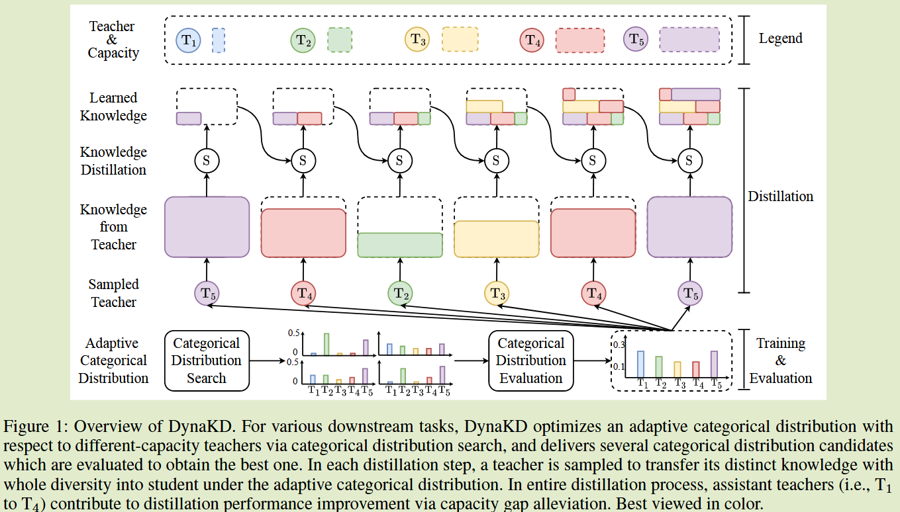
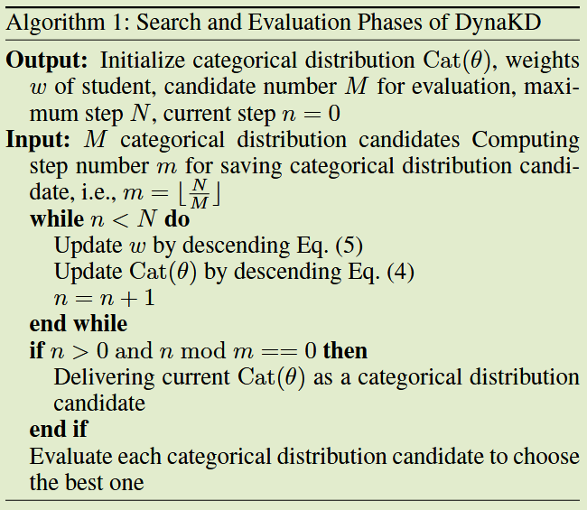

# How to Trade Off the Quantity and Capacity of Teacher Ensemble: Learning Categorical Distribution to Stochastically Employ A Teacher for Distillation

**[2024 AAAI](https://ojs.aaai.org/index.php/AAAI/article/view/29746)	no code	CIFAR100	20241022**

(没太看懂)

学习了一个自适应类别分布，来进行教师的筛选，达到局部单个教师全局多个教师的效果

## Introduction 

我们观察到多教师蒸馏中多教师并不总是更好，单教师蒸馏强教师并不总是更好，为了平衡教师数量和能力：

我们提出DynaKD动态蒸馏，针对每个步骤中的不同下游任务，按照学习到的自适应类别分布，随机雇佣一个来自多层次教师集合的教师，还提出一个可微算法来动态的确定DynaKD中起着重要作用的自适应分类分布

- 提出DynaKD，在自适应分布下，保留局部视图（每一步）中每个教师的多样性，并充分利用全局视图（全过程）中的强教师
- 提出一个可微算法，求解一个双层优化问题来学习最佳自适应类别分布
- 进行了大量实验验证了其有效性和泛化性

## Method

#### 教师越多并不意味着更好

不同教师通过预测多样性来提升蒸馏的性能，然而多个教师的加权平均或平均输出容易丢失每个特征教师的预测多样性，因此在每个蒸馏步骤中，DynaKD对单个教师进行随机采样，来保存预测的多样性

#### 能力强的教师并不总是更好的

能力很强的教师与学生模型存在着能力差距，从而导致了成绩不理想，我们找了几个助教模型来弥补这个性能差距。

### DynaKD

DynaKD采用自适应类别分布$Cat(\theta)$，从n个教师模型中采样一个教师T将知识迁移到学生模型中，目标函数表示为：
$$
L(w) = \sum_{x\in \mathcal{X}}L_d(f_{\hat{T}\in T_{1:n}}(x), f_S(x;w))
$$
与传统KD相比，DynaKD有三点不同之处：

- **全局视角下多教师模型，局部视角下单教师模型，来保证预测的多样性**  在每一步只有抽样的教师为学生提供预测，而在整个过程中，所有教师都用来将知识转化为学生
- **在全局视角下，多级助教来协助教师填补师生差异缺口**  从局部来看，学生由采样得到的教师模型直接教授，而采样到的教师能力可能太强，不利于知识迁移，从全局来看，从助教那里得到的知识有助于将教师的知识转换为学生的知识
- **教师重要性控制自适应类别的分布**  DynaKD采用了一种自适应的类别分布，可以针对不同的下游任务进行优化，从而在局部视图中选择合适的教师。

$Cat(\theta)$，其中$\theta = \{ \theta_{1:n}\}, \sum^n_{i=1}\theta_i = 1$，从教师集合中采样教师，其中$T_i$被采样的概率$p(T_i) = \theta_i$，最佳自适应类别随下游任务而不同，DynaKD采样两阶段训练范式，包括搜索和评估：

#### 搜索阶段

##### 问题描述

DynaKD有两组可学习参数，自适应类别分布$\theta$和学生模型的参数w，$L_{train}, L_{val}$分别表示训练集和验证集的熵损失，DynaKD旨在学习使损失$L_{val}(w^*, Cat(\theta))$最小的最佳类别分布$Cat(\theta)$,而$Cat(\theta)$由$argmin_w L_{train}(w, Cat(\theta))$得到，因此DynaKD可以看作是上层变量为$Cat(\theta)$下层为w的双优化问题：
$$
\underset{Cat(\theta)}{min}\ L_{val}(w^*(Cat(\theta)), Cat(\theta)) \\
s.t.\ w^*(Cat(\theta)) = argmin\ L_{train}(w, Cat(\theta))
$$
我们以交替迭代的方式优化上述方程

##### 类别分布搜索

对于分类分布搜索，w被冻结，我们采用连续松弛CR技术作为优化$Cat(\theta)$技术，通过计算关于教师logits的混合，以可微的方式优化Cat:
$$
\overline{f}_{T_{1:n}}(x;Cat(\theta)) = \sum^n_{i=1}\theta_if_{T_i}(x)
$$

##### 学生蒸馏

训练学生模型是Cat被冻结，
$$
L(w) = \sum_{x\in \mathcal{X}}\hat{\theta}L_d(f_{\hat{T}\in T_{1:n}}(x), f_S(x;w))
$$
$\hat{\theta}$表示教师T从n个教师模型中采样的概率

#### 评估阶段

##### 生成

根据NAS在搜索阶段提供M个类别分布候选

##### 评估

我们对每个候选者进行评估，以选择最优的类别分布Cat*，用Cat的每个候选项来从头训练DynaKD的学生w，并在开发集上评估每个每个候选项

