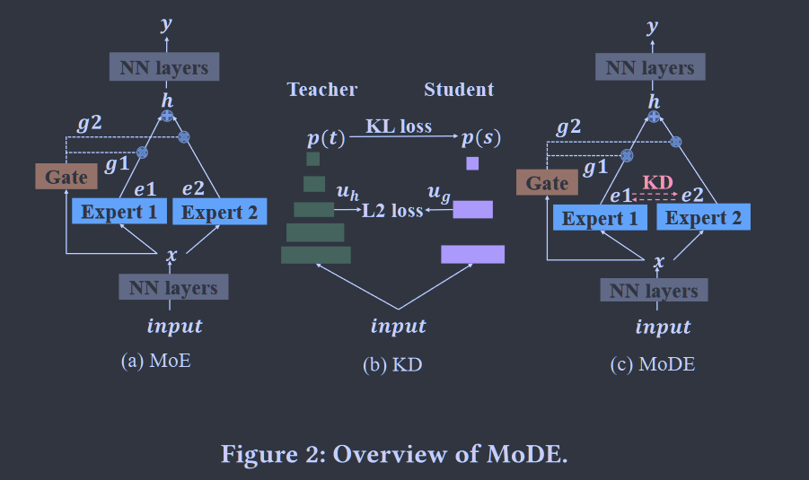

# MoDE: A Mixture-of-Experts Model with Mutual Distillation among the Experts

将蒸馏方法引入到MoE方法中。

- 利用蒸馏方法来提高MoE混合专家模型的泛化性能
- 蒸馏强度的设置很重要

## Introduction

单一模型学习来自不同领域/不同子任务的数据集可能会遇到拟合泛化困难的问题，为解决该问题提出混合专家Mixture of Experts, MoE系统，由多个不同的专家和一个作为路由器的门控网络组成。每一个专家都用来处理某个样本子集。

将有限的样本分配给每位专家的机制会导致每位专家出现“狭隘视野”的问题，专家没有接触到足够多样的数据来发展各自子任务的全面理解，这可能会损害模型的泛化性能。

我们提出了专家混合蒸馏Mixture-of-DIstilled-Experts, MoDE的方法来解决这一问题，这一方法涉及到专家之间的相互蒸馏，从其他专家中获得的特征知识来自于他们分配的样本，这些特征并不存在于分配给该特定专家的样本中，这种知识蒸馏蒸馏能够增强专家对其子任务的感知，提高其整体性能。

- 混合专家模型MoE存在狭隘视野问题，泛化性差
- 提出专家混合蒸馏MoDE来解决这一问题
- 过强的蒸馏策略会让专家给出相似的意见损害模型性能，我们想让各个专家各司其职，并且还能提高泛化能力，施加中等的蒸馏强度

## Preliminary

### Mixture of Experts

Figure 2a

MoE层接收前一层的输出向量x作为输入，向后一层输出一个向量h，y是整个模型的输出：
$$
h = \sum_{i\in \psi}g_i(x)e_i(x)
$$
其中ei(x)表示第i个专家的输出，gi(x)表示由门控分配给第i个专家的权重，$\psi$表示专家集合

密集MoE DMoE，对输入使用所有N个专家，门控网络是使用线性变换的softmax：
$$
g(x) = Softmax(f(x)), |\psi|=N
$$
对于稀疏MoE SMoE，路由策略是仅选择部分专家K:
$$
g(x) = TopK(Softmax(f(x)) + \epsilon), |\psi|=K, K \ll N
$$

## Method

我们的方法定义一个损失L_KD来鼓励专家之间的知识蒸馏，总体损失定义为：
$$
L= L_{task} + \alpha L_{KD}
$$
在设计蒸馏损失时我们使用了协作学习的方式取代了传统的师生模型，每个专家即为老师又为学生相互学习，当专家数量为2时，蒸馏损失定义为专家之间的均方误差：
$$
L_{KD} = mean((e_1-e_2)^2)
$$
当MoE层位于网络末端时，专家输出对应于输出预测，K>2时，将K个专家的平均值作为单个教师：
$$
L_{KD} = \frac{1}{K}\sum^{K}_{i=1}mean((e_i-e_{avg})^2), e_{avg}=\frac{1}{K}\sum^K_{i=1}e_i
$$
对于稀疏MoE蒸馏，只有激活的K个专家参与蒸馏过程.