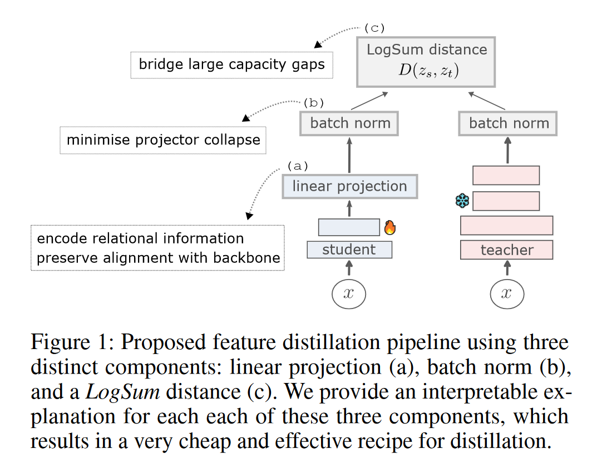
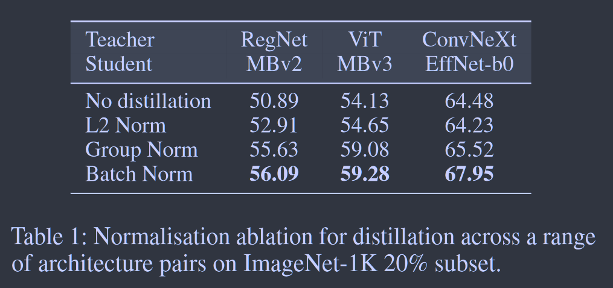
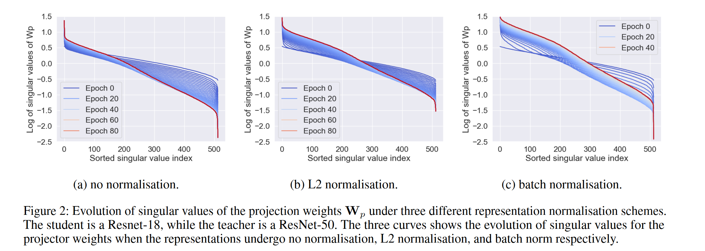
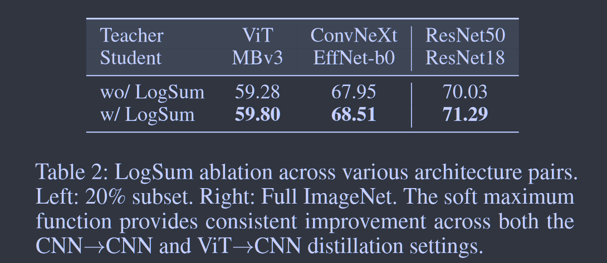

# Understanding the Role of the Projector in Knowledge Distillation

**[AAAI 2024](https://ojs.aaai.org/index.php/AAAI/article/view/28219)	code in github NOT FOUND	CIFAR  ImageNet  COCO	20240517**

*Roy Miles, Krystian Mikolajczyk*

这项工作针对蒸馏中的投影层、归一化层和距离函数进行了探究，将蒸馏中的投影层描述为蒸馏损失本身所需要的信息编码器，从理论层面证明了权重矩阵更新来自于师生模型自相关和互相关的组合，增大投射层的维度并不能显著改善性能，使用线性投射即可；证明了白化的有效性，提出使用batch norm来对特征去相关处理；针对师生模型差距大时性能的下降，归结于学生没有足够的容量来完美对齐教师，提出使用LogSum函数来软化与教师分布的完全对齐

- 投影层的研究，线性投影
- 白化的有效性证明，用BN对特征去相关性
- 使用新的距离函数来弥合师生差距大无法完美对齐的问题，LogSumhan'shu

## Introduction

知识蒸馏已经被证明非常有效，但在构建和评估损失时仍然存在一些与计算和内存开销相关的局限性，以及对基本核心原则的理论解释不足。为了克服这些局限性，我们从函数匹配和度量学习的角度重新审视了知识蒸馏，我们对知识蒸馏的三个重要组成部分进行了广泛的消融实验，即距离度量归一化和投影网络。

我们还通过探索潜在的训练动力学来提供理论视角和这些设计原则统一。我们将这些原则扩展到一些大规模的视觉任务中，来实现与最先进技术相当的性能.

> 我们从知识蒸馏中探索了三种不同的设计原则，即投影、归一化和距离函数，在此过程中，我们通过分析均值和观察训练动态来演示他们之间的耦合
>
> 投影层隐式编码来自先前样本的关系信息，利用这些知识我们可以消除显式构建相关矩阵或内存库带来的开销
>
> 我们提出使用线性投影、批量归一化和LogSum函数进行知识蒸馏的简单方法，能够达到SOTA

## Method

### Understanding the Role of the Projector

投射层最初用于简单的匹配学生和教师的维度，我们将证明它的作用更为重要，即使两个特征维度已经匹配，它也可以带来显著的性能改进。我们提供了理论支持一些简单有效的知识蒸馏设计选择而不需要构造复杂的关系结构。大部分复杂结构都可以通过可学习的投影层和适当的归一化方案紧密耦合和相互作用来隐式学习。

#### The projection weights encode relational information from previous samples

投影层在KD中起着至关重要的作用，因为它提供了先前样本的隐式编码，其权重可以捕获传输有关特征之间的相关性的信息，我们实验表明即使是单个线性投影层也可以显著提高精度。这表明**投射层在蒸馏中的作用可以描述为蒸馏损失本身所需的信息编码器**，我们研究了投影结构的训练更新方程，考虑简单的L2损失和线性无偏投影层：
$$
D(Z_s, Z_t; W_p) = \frac{1}{2}||Z_sW_p - Z_t||^2_2 \tag{1}
$$
$Z_s, Z_t, W_p$分别表示学生表示、教师表示和线性投影矩阵，使用F范数的迹属性有：
$$
D(Z_s, Z_t; W_p) = \frac{1}{2}tr((Z_sW_p - Z_t)^T(Z_sW_p - Z_t)) = \frac{1}{2}tr(W_p^TZ^T_sZ_sW_p - Z_t^TZ_sW_p - W_P^TZ^T_sZ_t + Z^T_tZ_t) \tag{2}
$$
求导有Wp的更新规则：
$$
\dot{W}_p = -\frac{\partial D(W_p)}{\partial W_p} = -Z_s^TZ_sW_p + Z^T_sZ_t \tag{5}
$$
令$C_s = Z^T_SZ_s\in\R^{d_s\times d_s}, C_{st}=Z^T_sZ_t\in\R^{d_s\times d_t}$表示自相关矩阵和互相关矩阵：
$$
\dot{W}_p = C_{st} - C_sW_p \tag{6}
$$

#### Whitened features:

考虑将自监督与蒸馏结合使用，从而将学生特征白化具有完美的去相关性；或者用特征的去相关项对其进行批量归一化和充分正则化，这样权重能够捕获学生和教师特征之间的交叉关系
$$
C_{st} - C_sW_p = 0 \ where\ C_s = I  \\
\Rightarrow W_p = C_{st} \tag{7}
$$

#### The choice of normalization directly affects the training dynamics of $W_p$

Eq6 表明投影权重能编码学生和教师特征之间的关系信息，这表明显示构建内存库更新先前表示是冗余的。通过权重衰减$\eta$和学习率$\alpha_p$可以给出如下更新方程：
$$
W_p \rightarrow W_p + \alpha\dot{W}_p - \eta W_p = (1-\eta)W_p + \alpha\dot{W}_p
$$
我们发现归一化的选择会显著影响着学生的表现。我们认为蒸馏的功效取决于学习权重中可以编码多少关系信息以及通过投影丢失了多少信息。

我们展示了训练期间投影权重的记忆之分解的结果，更好的方法将更少的奇异值缩减到0，这种缩减可以看作是将某个维度折叠而带来的信息丢失

#### Large projector networks learn to decorrelate the input-output feature  ？？？

我们观察到投影结构维度的扩展并不一定能提高学生的表现，为了解释这一结果我们评估了这些投影网络输入和输出特征之间的去相关性度量。

较大的投影网络学会了从输入中分离越来越多的特征，这种去相关性可能导致投影层学习功能不能与学生骨干共享，从而降低蒸馏的有效性。

#### The soft maximum function can address distilling across a large capacity gap

当师生模型差距较大时，蒸馏性能会下降，学生没有足够的容量来完美的对齐这两个空间，并且试图对齐会降低下游任务的性能。我们探索了软最大值函数的使用，该函数将软化批处理中相对接近的匹配项的贡献，我们定义简单的LogSum函数：
$$
D(Z_s, Z_t; W_p) = log\sum_i|Z_sW_p - Z_t|^\alpha_i
$$
$\alpha$为平滑因子

