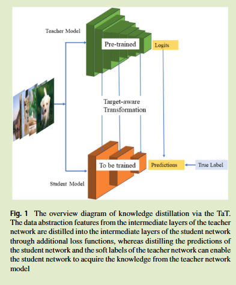
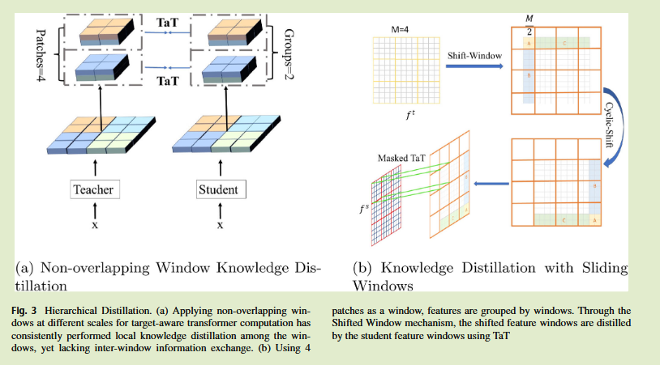
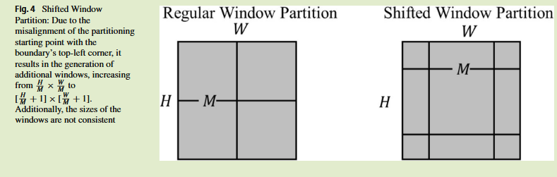
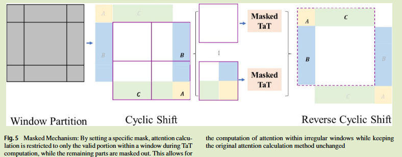

# Efficient knowledge distillation using a shift window target-aware transformer

2024 Applied Intelligence	no code	ImageNet CIFAR VOC COCO	20250223

本文改进了TaT区域感知蒸馏[2022 CVPR]，认为TaT会丢失块间的相关性知识，通过滑动窗口来获得更丰富的局部关系表示，并提出块组特征合并蒸馏来粗略获得全局特征，两者相结合达到最佳的性能

## Introduction

- 利用注意力机制计算教师和学生特征图之间的权重关系，动态指导学生的特征生成，而无需像素级对齐，实现更高效的知识传递
- 引入一种滑动窗口块组蒸馏方法（patch-group distillation），包括滑动窗口特征图蒸馏和区域集成蒸馏，可以捕获局部特征细节和长距离依赖关系
- 我们的方法允许模型学习块组内更丰富的局部关系，显著提高计算效率
- 滑动窗口特征和块组特征组合使学生模型能够学习更全面的表示

## Method

#### KD via the target-aware transformer

我们采用一对多的空间匹配知识蒸馏，教师特征图中的每个像素位置都引导学生特征图的相应区域，目标感知转换器TaT根据教师的空间语义动态调整学生的特征，TaT使学生模型在教师对应位置上重建特征

教师网络与学生网络特征图$F^T \in \R^{H\times W\times C}, F^S\in \R^{H\times W\times C'}$，H W C C'本别表示高 宽和师生模型的通道数，将其变换为2D特征向量：
$$
f^t = \Gamma(F^T) \in \R^{N\times C}, f^s = \Gamma(F^S) \in \R^{N\times C'} \\
N = H \times W
$$
师生模型特征向量之间的加权相关性计算为：
$$
W' = \sigma(<f^s, f^t_i>) \in \R^N
$$
$\sigma$表示softmax函数，$<·,·>$表示内积，因此学生模型的聚合特征表示为：
$$
f^{s'}_i = \sum^N_{j=1}W^i_jf^s_j
$$
TaT蒸馏蒸馏损失表示为：
$$
L_{TaT} = ||f^{s'} - f^t||^2_2
$$
带有TaT的总体损失变为：
$$
L = \alpha L_{Task} + \beta L_{KL} +  \gamma L_{TaT}
$$

#### KD via the shifted window target-aware transformer

TaT重建了学生特征，但也引入了巨大的计算负担，我们通过对特征图进行分区分组进行蒸馏，学生网络从教师网络中获取细粒度的特征信息，计算复杂度也可以显著降低。

##### Patch-Group distillation 块组蒸馏

先前方法直接对特征图分块按组蒸馏，显著减少了注意力计算的序列长度，但他导致了相邻窗口之间的相关性丢失，限制了学生网络在蒸馏过程中对教师网络特征图的建模能力。

##### Shifted window target-aware transformer 滑动窗口目标感知transformer

我们为了保持其相关性，在建立学生网络特征图时引入了跨窗口连接，这种机制减少了块边界的信息损失

两种窗口机制叠加，来降低边界处的相关性缺失。

##### Masking mechanism 掩码机制

由于滑动窗口机制，小于窗口大小的回通过循环移位来填充，这会导致窗口中包含与特征图不相邻的子窗口，这回损害学生模型的性能，因此通过掩码机制来将注意力的机制限制在子窗口内部，屏蔽掉不相邻的部分。

经过改进后的损失表示为：
$$
L = \alpha L_{Task} + \beta L_{KL} + \epsilon L^{SW}_{TaT}
$$

#### Patch merging distillation  块合并蒸馏

我们将教师网络特征图统一划分为窗口，然以后进行下采样，调整通道编号来行程分层设计，这种方法可以捕获全局依赖项，同时还可以节省计算资源，减小了特征图的大小，增加了通道数。

滑动窗口蒸馏有助于学生网络对局部特征的仿真，块合并蒸馏有助于基于粗略区域整合特征的全局表示，两者相互互补来产生最佳的性能：
$$
L_{Seg} = \alpha L_{CE} + \delta L_{TaT}^{SW} + \zeta L_{TaT}^{PM}
$$
