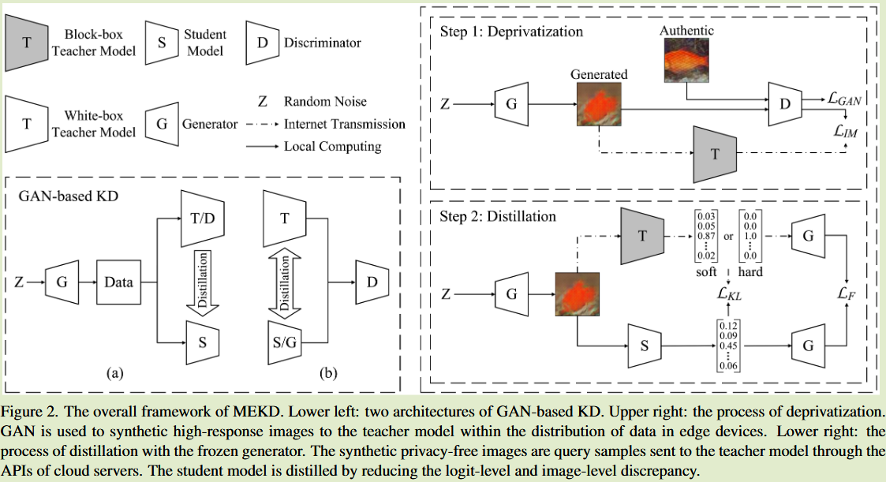
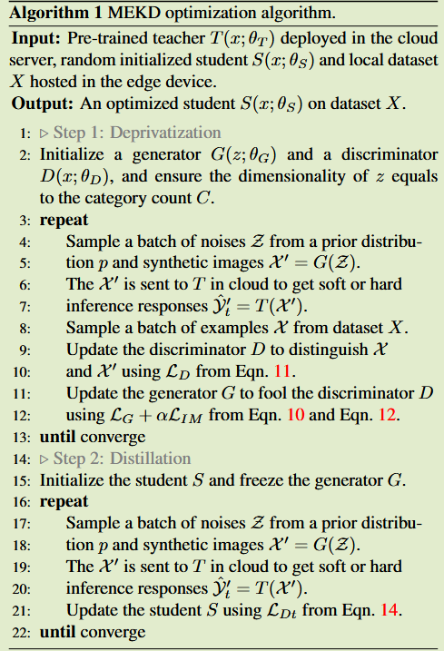

# Aligning Logits Generatively for Principled Black-Box Knowledge Distillation

**[CVPR 2024](https://openaccess.thecvf.com/content/CVPR2024/html/Ma_Aligning_Logits_Generatively_for_Principled_Black-Box_Knowledge_Distillation_CVPR_2024_paper.html)	no code	MNIST CIFAR ImageNet	20240920**

*Jing Ma, Xiang Xiang, Ke Wang, Yuchuan Wu, Yongbin Li*

本文提出了一种黑盒蒸馏方法，主要创新点在于提出一种去私有化的方法来生成合成图像来保护敏感数据不会上传到服务端，通过训练一个GAN网络来构造一个教师模型的逆映射，尽可能的弥合合成图像和真实图像之间的差异，训练好生成器后利用该生成器来向云端服务器发送合成图像来提取知识，供边缘设备上的学生模型学习。

*本文理论性较强，中间的理论推导没有完全看懂*

## Introduction 

黑盒知识蒸馏B2KD是在服务器上存储不可见数据和模型的云模型到边缘模型的模型压缩问题，B2KD面临着有限互联网交换和数据分布的边缘-云差异问题

云服务器承载一个教师模型，其内部结构、组成、层与层之间的连接、模型参数以及用于反向传播的梯度都是不可见的，而在边缘设备上只能承载轻量级的学生模型，且低质、无标签的局部数据无法用于训练可靠的神经网络，因此他必须向云服务器发送api查询请求来进行大量的推理

B2KD面临的挑战：

- 由于互联网延迟和带宽限制，以及查询数据量和API使用收费问题
- 某些情况下查询样本只能提供概率最高的类别索引或语义标签，而不是所有可能的类的概率向量
- 本地用户拒绝向服务器发送敏感数据，本地与云端数据分布难以对齐，导致蒸馏后学生模型在应用中不准确

我们提出一种映射模拟的方法来解决B2KD方法，通过减少高维空间中生成两幅图像之间的距离来驱动低维logits之间的对齐，我们还认为一幅图像包含大量细粒度信息，这些信息可以作为另一种类型的知识，为更新学生模型参数提供不同的梯度方向

## Theory for Mapping-Emulation KD

### Definition 1. (Function Equivalence)  函数等价性

给定师生模型$f_T, f_S$，对于图像空间中的数据分布$\mu\in X$，映射为隐空间中的$P_T\in Y, P_S \in Y$，若$P_T, P_S$之间的[推土机距离](https://blog.csdn.net/hy592070616/article/details/122396193)为0:
$$
W(P_S, P_T) = \underset{\gamma\in \prod(P_S, P_T)}{inf} E_{(y_S, y_T)\sim \gamma}[||y_S - y_T||] = 0
$$
则认定师生模型是等价的，即$f_S = f_T, \prod(P_S, P_T)$是所有联合分布$\gamma(y_S, y_T)$的集合， $\gamma$的边缘分布为$P_S,P_T$

### Definition 2. (Inverse Mapping)  逆映射

给定先验分布$p \in R^C$, 对于数据分布$\mu\in R^n$，如果生成分布$\mu' = (f_G)_{\#p}$与数据分布$\mu$之间的推土机距离为0，则：
$$
W(\mu', \mu) = \underset{\gamma\in\prod(\mu', \mu)}{inf}E_{(x', x) \sim \gamma}[||x' - x||] = 0
$$
则生成器$f_G:R^C \rightarrow R^n$ 是教师函数$f_T: R^n\rightarrow R^C$的逆映射，记为$f_G = f^{-1}_T$, 

(还有三个定理  我没看懂...)

## Method

传统蒸馏从教师模型的现有参数很难推断出映射函数，人们只能通过对不同网络层输入样本的输出或特征之间的关系来猜测映射关系，并将其作为知识来指导学生模型。在黑盒蒸馏中教师模型的logits输出和层特征关系是不可用的，这使得蒸馏更具有挑战性。

#### 去私有化  Deprivatization

对于一个C类分类问题，我们首先从先验分布p在隐空间y中采样随机噪声z作为输入训练一个GAN网络，z的维度与教师网络输出的logit一致，即|z| = C

生成器G利用噪声z合成图像，判别器D最小化生成的$\mu'$和$\mu$之间的推土机距离，将生成的去隐私化的图像发送到云服务器进行推理响应，我们期望合成的图像能够与教师模型的高响应类别相匹配，以便能最大限度的包含真实数据中的模式，信息最大化损失：
$$
L_{IM} = -\frac{1}{m}\sum^m_{i=1}\hat{y_t}^{(i)} log(D(G(z^{(i)}))) \\
\hat{y_t}^{(i)} = max_{c\in C}T(G(z^{(i)}))
$$
$\hat{y_t}^{(i)}$可能为软标签也可能为硬标签，看云端教师模型而定

假设判别器可以完全弥合合成图像和真实图像之间的差异，此时生成器表示一个从潜在空间到图像空间的函数，定义为$f_G:Y\rightarrow X$，此时教师函数为逆映射

生成器和判别器是同时训练的，调整生成器的参数以最小化$log(1-D(G(z)))$，调整判别器参数以最小化$log D(x)$:  *(我认为原文这里公式有书写错误 两者合起来刚好是GAN损失)*
$$
L_D = -\frac{1}{m}\sum^m_{i=1}[logD(x^{i})] \\
L_G = -\frac{1}{m}\sum^m_{i=1}log(1-D(G(z^{(i)})))
$$
去私有化损失可以总结为GAN损失和信息最大化损失，引入一个超参数来平衡两者：
$$
L_{d_p} = (L_G + L_D) + \alpha L_{IM}
$$

#### 蒸馏 Distillation

训练好的生成器G包含有教师模型的知识，相当于一个教师助理，将教师的知识传递给学生。

合成图像$X' = \{ x'^{(i)} = f_G(z^{(i)})\}^m_{i=1}$，送入到向量模型中输出得到高维点特征表示（*提出的定理证明*），通过距离衡量师生模型特征点$X^n_T = f_G \circ f_T(X'), X^n_S = f_G\circ f_S(X')$之间的关系，距离选择L1距离：
$$
L_{D_t} = \frac{1}{m}\sum^m_{i=1}||G(S(x'^{(i)})/\tau) - G(T(x'^{(i)})/\tau)||_1 + \beta\frac{1}{m}\sum^m_{i=1}T(x'^{(i)})log\frac{T(x'^{(i)})}{S(x'^{(i)})}
$$
