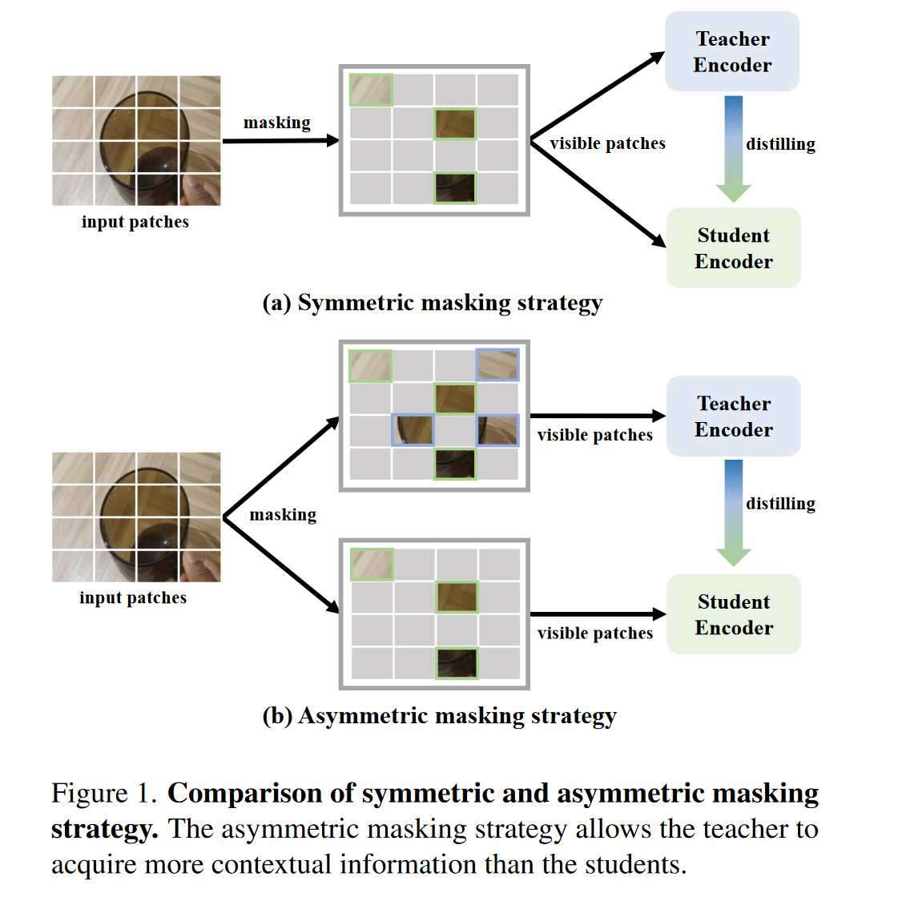
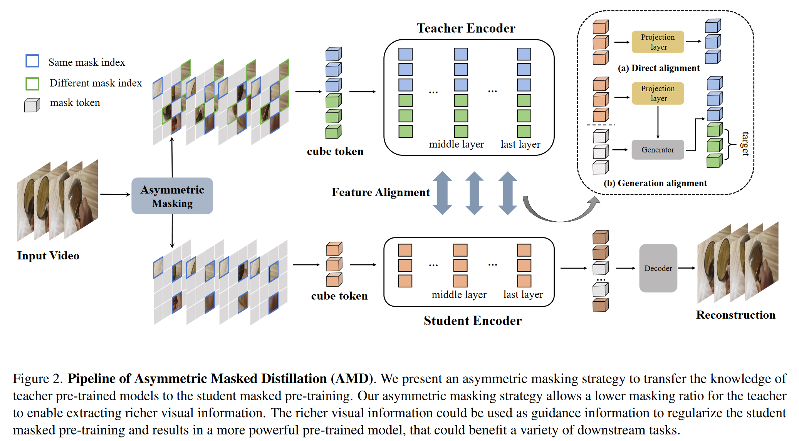

# Asymmetric Masked Distillation for Pre-Training Small Foundation Models

**[CVPR 2024](https://arxiv.org/abs/2311.03149)	[code in github FAKE!](https://github.com/MCG-NJU/AMD)	SSV2  K400  UCF101  HMDB5  AVA	20240517**

*Zhiyu Zhao, Bingkun Huang, Sen Xing, Gangshan Wu, Yu Qiao, Limin Wang*

这项工作针对先前的MAE的重建蒸馏对教师模型的高掩码率会丢失一些重要的结构信息从而导致预训练模型捕获不完整和有偏的视觉信息，这项工作提出了非对称的MAE蒸馏，并提出一套对齐方法，结合直接对齐和生成对齐方法来对师生模型特征进行对齐。

## Introduction

掩码图像建模已经演变成为自监督表示学习的热门方法，但是编码器通常具有高掩码率，只对一小部分的可见令牌进行操作，这种高掩码率增加了任务的难度，鼓励编码器捕获更多对重建有用的高层信息；但我们认为这种高掩码率也可能会丢失一些重要的结构信息，从而导致预训练模型捕获不完整和有偏的视觉信息，且MAE方法通常需要一个大容量的ViT来释放其性能，这些大容量ViT会带来高昂的计算成本和内存消耗。

先前工作通过模型压缩技术来解决这一问题，*2023CVPR DMAE*在重建任务的预训练的同时进行特征蒸馏，允许学生和教师接收对称的未屏蔽补丁，来直接对其特征并降低教师模型的复杂性，但对教师和学生进行相同的屏蔽限制了教师从输入中收集更多上下文信息且仍然面临着信息丢失的风险。

基于此我们提出用于MAE预训练的非对称掩码蒸馏结构，目标是获得一个小而稳健的预训练MAE模型，学生的遮蔽比例保持默认设置而教师的比例相对降低，学生未遮盖补丁是教师的子集。

> 提出一种针对MAE预训练的非对称掩码蒸馏策略，该策略运训教师在保持学生MAE模型重建难度的同时获得更多上下文信息
>
> 提出一种用于非对称掩码策略序列特征对齐方式，来实现MAE预训练的充分知识蒸馏
>
> 成功采用非对称掩码蒸馏获得小且鲁棒AMD，提高了蒸馏效率并改善了下游任务的传输性能。

## Method

### Revisiting VideoMAE

VideoMAE将自动编码器扩展导视频领域，将输入视频随机采样到一个切片中，共有T帧$V\in\R^{T\times H\times W\times 3}$，采样步幅$\tau$由数据集决定。

#### Patch embedding

由于视频具有额外的维度，VideoMAE将$2\times 16 \times 16\times 3$的立方体视为一个补丁，利用3D-CNN进行处理，得到$\hat{T}\times \hat{H}\times \hat{W}$个token, $\hat{T}=\frac{T}{2}  ,\hat{H}=\frac{H}{16},\hat{W}=\frac{W}{16}$

#### Masking strategy

由于视频信息冗余，videoMAE应用了更高的掩码率r，一个随机掩码$\tilde{M}\in\R^{\hat{H}\times \hat{W}}$，为了确保其在给定的时间维度上都被屏蔽，videoMAE简单的在时间维度上重复$\hat{T}$次。

#### Encoder: feature extractor

编码器是一个普通的ViT

#### Decoder: Pixel reconstructor

重建输入，解码器深度比编码器更浅宽度更小，解码器也是一个ViT，通过投影层将尺寸与原视频对齐。

#### Objective function

重建损失表示为： 
$$
L_{recon} = \frac{1}{rN}\sum_{p\in \overline{P}^{vis}}|norm(V(P)) - \hat{V}(p)|^2
$$
$\overline{P}^{vis}$掩码token的索引 $\hat{V}(p)$表示原视频

### Overview of AMD

我们提出一种用于MAE预训练的非对称掩蔽蒸馏

AMD整体框架是一个双流蒸馏结构，有一个学生分支和一个教师分支，教师是一个更大的MAE预训练模型，AMD仅使用教师编码器进行蒸馏，而学生需要使用解码器完成像素重建任务，特征蒸馏发生在学生和教师模型的相应层之间，AMD以串行方式采用直接对齐和生成对齐的方式来响应我们的非对称掩码策略。

#### Asymmetric mask

AMD的输入为下采样的视频切片$V\in\R^{T\times H\times W\times 3}$，经过三次patch编码后将非对称掩码策略应用于V，得到学生和教师的输入序列，学生序列长度小于教师序列，学生可见标记索引$P^{vis}_{stu}$为教师可见标记索引$P^{vis}_{tea}$的子集

#### Serial feature alignment

我们专门为非对称掩码设计的特征对齐策略，它将直接对齐和生成对齐与共享投影的功能相结合。首先将投影函数应用于学生，以对齐教师的维度，实践中采用了线性层，有$\tilde{z}^l_{stu} = \phi(z^l_{stu})$用于直接对齐。然后串行使用这些特征继续生成特征对齐$\mathcal{G}(\tilde{z}^l_{stu})$，这种串行对齐可以适当降低对齐任务的难度。

### Asymmetric Masked Architecture

不对称在于学生和教师的输入之间的差异，教师的掩码率要低于学生，即有更多的可见块，我们为学生和教师生成了token-wise掩码图，其可见标记索引为$P^{vis}_{stu} = \{ p^i_{stu} \}^{\hat{N}_{stu}}_{i=1}, \hat{N}_{stu} = (1-r_{stu})N; P^{vis}_{tea} = \{ p^i_{tea} \}^{\hat{N}_{tea}}_{i=1}, \hat{N}_{tea} = (1-r_{tea})N$：学生索引集合为教师的真子集
$$
P^{vis}_{stu} \subsetneq P^{vis}_{tea}
$$

### Feature Distillation

我们工作的重点是MAE的与训练并采用串行特征对齐来处理不对称掩码蒸馏，直接特征对齐和生成特征对其是按顺序执行的：

#### Direct alignment

假设在对称掩码策略条件下，这意味着教师和学生的输入长度$\hat{N}$长度相同，且他们共享相同的可见标记索引$P^{vis}$，从一对对应层获得的特征分别表示为$z^l_{stu}\in\R^{\hat{N}\times D_{stu}}, z^{l^*}_{tea}\in\R^{\hat{N}\times D_{tea}}$,D表示维度特征，l表示学生层索引，l\*表示与学生层对应的层索引，教师维度一般较大，通过一个投影层来对齐，直接对齐损失：
$$
L_{dir} = \frac{1}{\hat{N}}\sum_{p_i\in {P}^{vis}}|z^{l^*}_{tea}(p_i) - \phi_d(z^l_{stu}(p_i))|^2
$$
z(p)表示输入序列中第p个token中提取的特征

#### Generation alignment

当学生和教师输入长度不匹配时，可以应用生成对齐，长度差记为$\hat{N}_{diff} = \hat{N}_{tea} - \hat{N}_{stu}$，可见标记集合记为差集$P^{diff} = P^{vis}_{tea} \setminus P^{vis}_{stu}$。我们用$z^l_{stu}, z^{l^*}_{tea}$表示学生和教师从对应图层中获得的特征，$\phi_g(·)$表示映射学生特征的投射层。

由于教师标记比学生多，我们利用学生模型生成标记来与教师对齐。我们的生成器G是具有多头自注意力MHA的解码器，我们需要将输入与mask token z_m连接，并添加位置编码：
$$
\tilde{z}^l_{stu} = \phi_g(z^l_{stu}) \in \R^{\hat{N}_{stu}\times D_{tea}} \\
\mathcal{G}(\tilde{z}^l_{stu}) = MHA(concat(\tilde{z}^l_{stu}, repeat(z_m)) + PE)
$$
我们重复了mask token N_diff 次，通过均方误差来作为损失函数对单层特征对齐进行训练：
$$
L_{gen} = \frac{1}{\hat{N}_{diff}}\sum_{p_i\in {P}^{vis}}|z^{l^*}_{tea}(p_i) - \mathcal{G}(z^l_{stu})(p_i)|^2
$$

### Objective function

#### Multi-layer alignment

我们可以选择不止一层进行特征对齐，实验中我们使用中间层和最后一层，不同层的对齐参数不共享：
$$
L_{dir} = \sum_l\frac{1}{\hat{N}_{stu}}\sum_{p_i\in {P}^{vis}_{stu}}|z^{l^*}_{tea}(p_i) - \phi_l(z^l_{stu}(p_i))|^2 \\
L_{gen} = \sum_l\frac{1}{\hat{N}_{diff}}\sum_{p_i\in {P}^{vis}}|z^{l^*}_{tea}(p_i) - \mathcal{G}_l(z^l_{stu})(p_i)|^2
$$

#### Overall

$$
L_{total} = L_{recon} + L_{dir} + L_{gen}
$$

