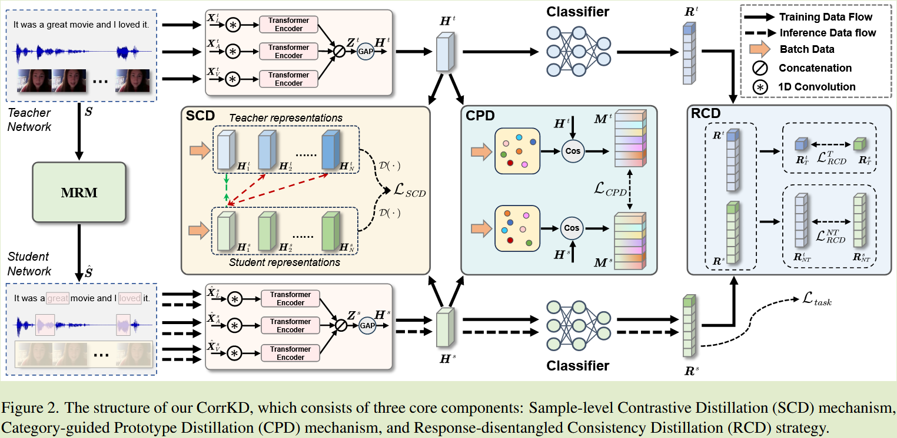

# Correlation-Decoupled Knowledge Distillation for  Multimodal Sentiment Analysis with Incomplete Modalities

**[CVPR 2024](https://arxiv.org/abs/2404.16456)	no code	MOSI MOSEI	20240919**

*Mingcheng Li, Dingkang Yang, Xiao Zhao, Shuaibing Wang, Yan Wang, Kun Yang, Mingyang Sun, Dongliang Kou, Ziyun Qian, Lihua Zhang*

提出一种解耦框架来处理模态缺失的情感分析任务，先前工作只考虑了样本内知识而忽略了跨样本的知识，提出**样本级对比蒸馏来捕获跨样本之间的相似性**来传递有价值的监督信号；情感分析数据本身有着类内多样性和类间相似性的两难问题，先前方法没有考虑这种特征，本文提出**类别原型引导的蒸馏机制**，来传递类内和类间的特征变化得到更好的特征表示；受DKD的启发，提出将**蒸馏损失解耦成目标类与非目标类损失来解耦异构响应**，并通过最大化同构响应之间的互信息来获得更好的决策边界。

## Introduction

多模态情感分析MSA通过多模态数据理解人类情感，大多数MSA基于模态完备性的假设来进行的，然而在应用中会有一些不确定因素导致模态缺失，严重降低模型性能。

本文提出一种相关解耦的知识蒸馏框架来用于模态缺失的MSA任务：

- 提出的**样本级对比蒸馏机制来捕获跨样本相关性**，并通过样本级对比学习传递有价值的监督信号
- 设计了一种**类别引导的原型蒸馏机制**，利用类别原型来传递类内和类间特征变化，从而传递情感相关信息并学习鲁棒的联合多模态表示
- 引入一种**响应解耦的一致性蒸馏策略**，通过解耦异构响应和最大化同构子响应之间的互信息来优化情感决策边界并鼓励分布对齐

## Method

### 问题的形式化描述

给定一个包含三种模态的视频片段$S = [X_L, X_A, X_V], X_L\in\R^{T_L\times d_L}, X_A\in\R^{T_A\times d_A}, X_V\in\R^{T_V\times d_V}$, T()表示序列长度，d()表示特征维度，我们将模态缺失记为$\hat{X}_m$。

定义了两种模态缺失的情况：

- 模态内缺失，表明序列中的某一些帧级特征缺失
- 模态间缺失，某些模态完全缺失

### 模型框架

### 模态表示融合

不完整的模态:$\hat{X}^s_m\in \R^{T_m\times d_m}, m\in \{ L, A, V\}$

首先通过一个$3\times 3$的一维时间卷积核并添加位置表示向量来获得初步表示：$\hat{F}^s_m = W_{3\times 3}(\hat{X}^s_m) + PE(T_m, d) \in \R^{T_m \times d}$

将上述特征输入到Transformer的编码器中来捕获每个模态的特征表示：$E^s_m = \mathcal{F}^s_{\phi}(F^s_m)$

将$E^s_m$拼接起来得到$Z^s = [E^s_L, E^s_A, E^s_V] \in \R^{T_m \times 3d}$

然后将拼接后的特征Zs输入到全局平均池化层中，得到联合多模态表示特征$H^s\in \R^{3d}$

对教师模型同理得到$H^t\in\R^{3d}$

### 样本级对比蒸馏 SCD

先前关于模态缺失的MSA任务只利用了单个样本内的单方面信息，而忽略了考虑跨样本的综合知识。我们提出了样本级对比蒸馏机制，通过学生和教师网络的样本级表征之间的对比学习来丰富整个编码体系，促进模型充分捕获样本内信息和样本间相关性。

在所有小批量内进行对比学习，将来自同一样本的两个特征约束为相似，而来自不同样本的约束为不同：

给定一个包含N个样本的批量$B =\{ S_0, S_1, ..., S_N\}$，得到其在师生模型中的联合多模态特征表示$\{H^w_1, H^w_2, ... ,H^w_N\}, w\in \{t, s \}$，缩小师生模型联合表示之间的距离而扩大不同样本表示之间的距离：
$$
L_{SCD} = \sum^N_{i=1}\sum^N_{j=1, j\neq i}D(H^s_i, H^t_i)^2 + max\{ 0, \eta-D(H^s_i, H^t_j)\}^2 \\
D(H^s, H^t) = ||H^s - H^t||_2
$$
$\eta$表示预定义的距离边界，当样本足够远时可以让模型更多的考虑其他样本对

### 类别指导的原型蒸馏 CPD

MSA数据通常有高类内多样性和高类间相似性的两难问题，先前方法通过约束师生特征一致性来解决模态缺失问题缺乏对数据本身特性的考虑，导致特征分布模糊不清。我们提出基于类别指导的原型蒸馏机制，核心思想是通过别的原型来蒸馏和迁移类内和类间特征变化的知识，类别原型表示为：
$$
c_k= \frac{1}{|B_k|}\sum_{S_i\in B_k}H_i
$$
Bk表示该批次中标签为k的样本，Si表示Bk中的第i个样本，因此有类内和类间特征变化的定义：
$$
M_k(i) = \frac{H_ic^T_k}{||H_i||_2||c_k||_2}
$$
Mk(i)表示样本Si与原型ck之间的相似性，若Si属于类别k则表示样本内的特征变化，否则代表类别之间的特征差异，师生网络分别有相似度矩阵$M^t, M^s$，最小化两者之间的欧氏距离来多模态表示的一致性：
$$
L_{CPD} = \frac{1}{NK}\sum^N_{i=1}\sum^K_{k=1}||M^s_k(i) - M^t_k(i)||_2
$$
K表示该批次的类别数量

### 响应解耦的一致性蒸馏  RCD

受DKD影响，目标类和非目标类损失两者在传统蒸馏中是耦合的，高置信度的目标类会导致低影响的非目标类，我们对异质响应进行解耦并对同质响应进行一致性约束，从信息论的角度看，响应的一致性可以看作师生网络之间的高互信息。

将师生联合模态特征通过softmax层得到响应值$R^w$，根据DKD $R^w$解耦为$R^w_T, R^w_{NT}$, I()表示互信息
$$
L_{RCD} = L^T_{RCD} + L^{NT}_{RCD} = -I(R^t_T, R^s_T)-I(R^t_{NT}, R^s_{NT})
$$
最终的总体损失表示为：
$$
L_{total} = L_{task} + L_{SCD} + L_{CPD} + L_{RCD}
$$
