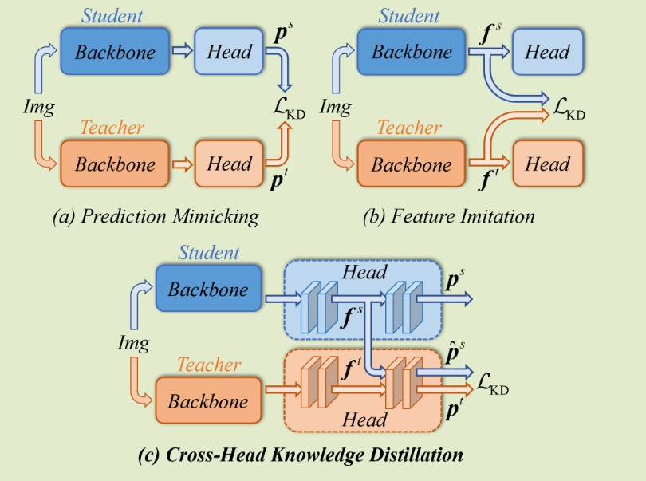
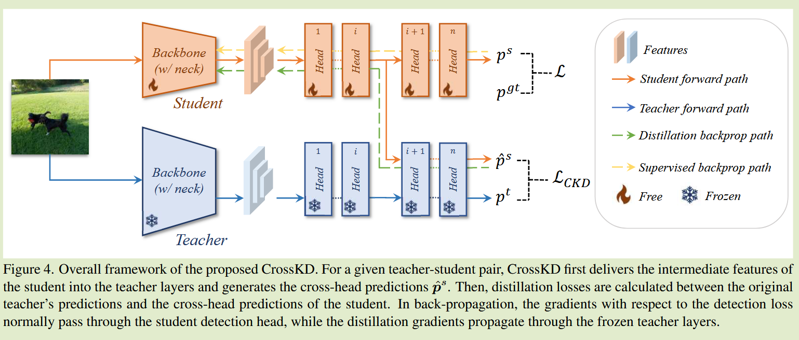

# CrossKD: Cross-Head Knowledge Distillation for Object Detection

**[2024 CVPR](https://openaccess.thecvf.com/content/CVPR2024/html/Wang_CrossKD_Cross-Head_Knowledge_Distillation_for_Object_Detection_CVPR_2024_paper.html)	no code	COCO	20240923**	知识结构

*Jiabao Wang, Yuming Chen, Zhaohui Zheng, Xiang Li, Ming-Ming Cheng, Qibin Hou*

针对传统蒸馏在目标检测中，教师标签和真实标签之间的指导会产生冲突，从而对学生模型产生误导，先前方法削弱对差异区域的权重，但本文认为这些差异区域能提供对学生模型更有利的信息，因此提出将学生中间特征转移到教师模型进行推理，将得到的特征与纯教师模型的特征进行蒸馏来提升师生模型之间的一致性，而完全学生模型输出的结果只与真实标签学习，这样保证最后几层只对真实标签进行优化，从而削弱了教师标签和真实标签之间的冲突。

## Introduction

我们发现在目标检测中传统的蒸馏方法教授学生模型会有真实标签和教师标签的冲突，先前方法在包含中等差异的区域进行蒸馏，然而我们认为高度不确定的区域会包含更多有利于学生模型的信息。

我们提出了CrossKD，我们建议将学生头部特征反馈到教师头部来产生跨头预测信息，在新的交叉头预测和教师预测之间进行KD

## Method

#### Analysis of the Target Conflict Problem	目标冲突问题分析

通常情况下教师模型无法重现真实标签的预测结果，从而产生师生目标之间的冲突，这种冲突扩大了真实目标和蒸馏目标之间的距离。

先前方法直接最小化师生预测之间的差异：
$$
L_{KD} = \frac{1}{|S|}\sum_{r\in R}S(r)D_{pred}(p^s(r), p^t(r))
$$
S(·)是区域选择原则，他在整个图像区域R上每个位置r产生一个权重。S可以在一定程度上通过对差异较大的区域降低权重来缓解冲突问题.

我们认为高度不确定的区域能够包含更多利于学生的信息，需要更优雅的处理这部分信息而不是直接进行降权。

#### Cross-Head Knowledge Distillation	跨头知识蒸馏

CrossKD将学生中间特征传递给教师的检测头，生成跨头的预测来进行蒸馏。给定一个密集检测器，每个检测头由一系列卷积层组成，表示为${C_i}$，为了简单起见，我们假设每个检测头包含n个卷积层，$f_i, \ i\in\{1, 2, ..., n-1\}$表示由$C_i$产生的特征图，$f_0$表示C1的输入特征图，预测结果p由最后一个卷积层Cn生成。

CrossKD将学生模型的中间特征$f^s_i, i\in \{ 1, 2, ..., n-1\}$,传递给教师检测头的第i+1个卷积层，来产生跨头特征$\hat{p}^s$,来代替原本的教师特征，损失表示为：
$$
L_{CrossKD} = \frac{1}{|S|}\sum_{r\in R}S(r)D_{pred}(\hat{p}^s(r), p^t(r))
$$
我们将S设为取值为1的常数函数，根据不同分支使用不同的距离函数。将检测损失和蒸馏损失应用于不同的分支，检测损失梯度通过学生模型的整个头部，而蒸馏损失的梯度从学生中间转移到教师中，来增加师生之间的一致性。

CrossKD允许部分学生检测头只与检测损失相关，能更好的优化对真实标签的优化。

#### Optimization Objectives	优化目标

总体损失表示为：
$$
L = L_{cls}(p_{cls}^s, p_{cls}^{gt}) + L_{reg}(p_{reg}^s, p_{reg}^{gt}) + L_{CrossKD}^{cls}(\hat{p}_{cls}^s, p_{cls}^t) + L_{CrossKD}^{reg}(\hat{p}_{reg}^s, p_{reg}^t)
$$

$$

$$
