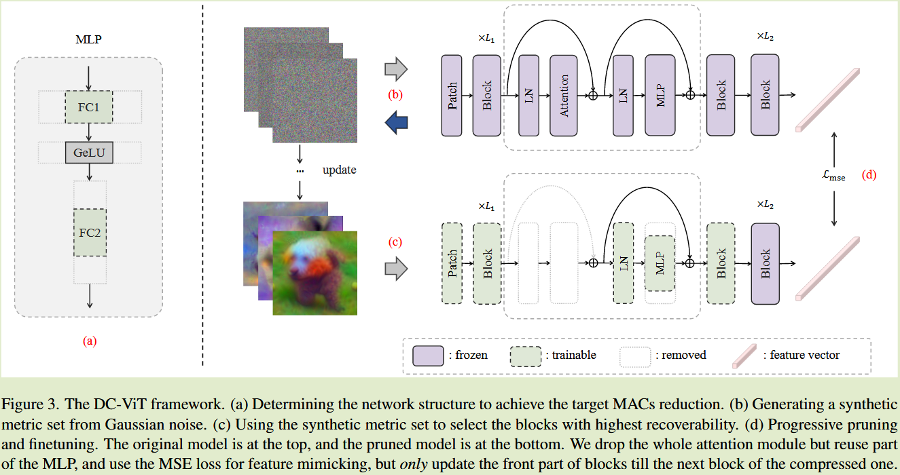
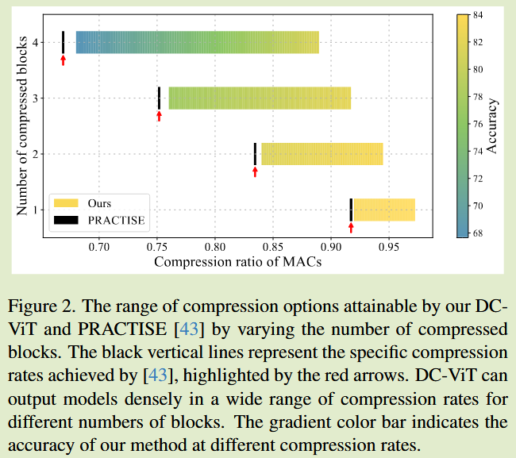
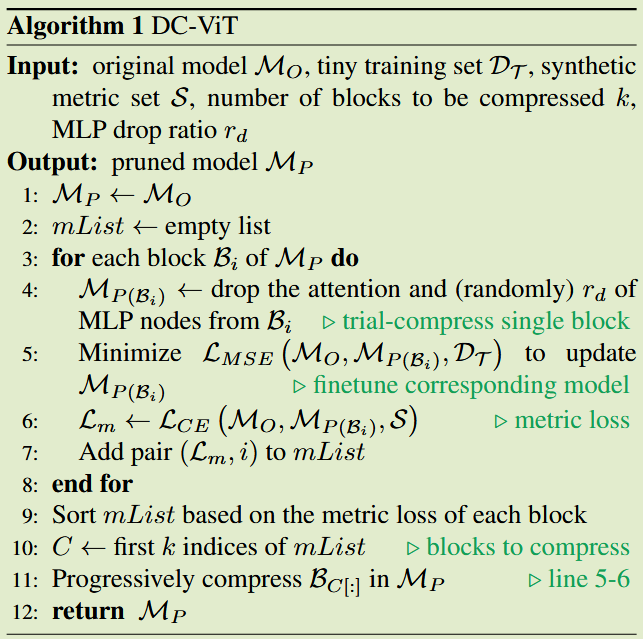

# Dense Vision Transformer Compression with Few Samples

**[CVPR 2024](https://openaccess.thecvf.com/content/CVPR2024/html/Zhang_Dense_Vision_Transformer_Compression_with_Few_Samples_CVPR_2024_paper.html)	no code	ImageNet1k	20240919**

*Hanxiao Zhang, Yifan Zhou, Guo-Hua Wang*

本文提出了一种利用小样本数据集压缩模型的方法，先前方法没有关注到ViT模型的压缩，本文通过消除部分注意力模块并用MLP来做替代进行模型的压缩，通过对原始模型进行特征模仿以及利用原始模型和高斯噪声生成的度量数据集来衡量压缩块的位置，压缩块的数量则根据需要的压缩比来进行计算，最终剪枝得到压缩后的模型。

## Introduction 

小样本模型压缩旨在使用一个很小的训练集，将一个大模型压缩为一个更紧凑的模型；对于ViT模型的小样本压缩存在缺口，并且传统的CNN小样本压缩方法存在稀疏压缩问题，本文提出一种新颖的小样本ViT压缩框架DC-ViT

DC-ViT没有丢弃整个块，而是选择性的消除了注意力模块，同时保留和重用了MLP模块的部分，

## Method

### 确定网络结构

移除一个完整的块会导致一个变化，这个变化通常可以被一个线性层很好的近似，但是**多个块的累计误差可能会上升到一个非线性的数量级，我们提出用一个MLP来块来弥补这一错误**。

ViT的结构使得我们的策略更加契合，先前工作研究表明一个Transformer块的推理延迟注意力块占到了46%，而移除注意力块后刚好是一个MLP层，通过剪枝不仅可以实现密集压缩，而且可以重用原始MLP中的参数

我们的实验突出了参数复用在小样本压缩中的重要性，因此我们的在密集压缩的过程中需要确定要移除那些块以及这些块内的MLP参数要减少到什么程度

计算满足目标压缩的最小块数k：
$$
k = \lceil \frac{MACs_{o} - MACs_{p}}{MACs_{a} + MACs_{m}} \rceil
$$
其中$MACs_o, MACs_p$分别表示源模型和剪枝模型的MAC（乘加运算Multiply-Accumulate Operations， 衡量计算复杂度），$MACs_a, MACs_m$分别表示包含注意力归一化层的ViT块的计算复杂度和不包含归一化层的ViT块的计算复杂度。

我们的实验表明，为了保持原有模型85%的MAC，尽量减少压缩快的数量是更好的选择，我们修建更少的块，但在这些块中保留较小部分的MLP

为了进一步简化，我们将相同的丢弃率分配到k个压缩块的每个MLP中，每个MLP节点的丢弃率：
$$
r_d = \frac{MACs_o - MACs_p - k\cdot MACs_a}{k \cdot MACs_m}
$$
原始的MLP含有两个全连接层，特征维度变化从d到4d在到d，我们**压缩处理后的维度变化为从d到4d(1-rd)到d**

### 块选择

我们通过逐块试探来获得候选模型，我们生成合成图像作为一个微小的度量集，用于评测压缩后不同块的可恢复性。

#### 块试验

结构参数k和rd确定后，我们通过一个分块试探过程来获得候选模型

对于具有C个类别的小样本任务，用$D_T$表示原始训练集的无标签的极小子集，我们用均方误差进行特征模拟，来最小化剪枝模型和原始模型之间的特征差距：
$$
L_{MSE}(M_O, M_P, D_T) = \sum_{x\in D_T} ||M_O(x)-M_P(x)||^2_F
$$
$M_P(x), M_O(x)$分别表示剪枝模型和原始模型所有输出token，通常用CLS token来表示图像的分类，但**用所有的令牌进行特征模仿要比仅使用cls token更好**，我们还发现只更新前几个块个最后一个压缩块，而不是所有的压缩块，不仅能提升微调模型的精度，而且降低反向传播的时间成本。

#### 生成合成度量集合

小样本压缩中训练数据集极其有限，在小样本学习领域存在多种小样本数据增强方法，其主要目标是利用有限的训练样本生成与真实数据分布一致的增强/合成图像。我们提出在不使用外部数据的前提下，利用原始预训练模型生成合成图像作为块选择的度量集S，该度量集用于揭示微调后候选模型的性能。

给定一组高斯噪声作为初始合成图像$S = \{ \hat{x}_1, \hat{x}_2, ..., \hat{x}_n\}$和任意标签$y = \{ y_1, y_2, ..., y_n\}$，最小化下式来合成图像：
$$
L_S = \underset{S}{min}\frac{1}{|S|}\sum^{|S|}_{i=1}(L(\hat{x}_i, y_i) + R(\hat{x}_i))
$$
其中L()表示交叉熵损失，R()表示正则化项：
$$
R(\hat{x}_i) = \alpha_{l_2}R_{l_2}(\hat{x}) + \alpha_{tv}R_{TV}(\hat{x}) \\
R_{l_2} = ||\hat{x}||^2, R_{TV} = \sum_{i, j}((\hat{x}_{i, j+1} - \hat{x}_{ij}) + (\hat{x}_{x+1, j} - \hat{x_{ij}}))^{\frac{\beta}{2}}
$$
$R_{TV}$[CVPR 2015]主要用于图像去噪和图像重建任务。

#### 选择块进行压缩

利用上一步生成的度量集合来进行性能评估：
$$
L_{CE}(M_O, M_{P(B_i)}, S) = - \sum_{x\in S}\sum^C_{c=1}p(M_o(x);c)log(p(M_{P(B_i)}(x);c))
$$
$p(M_{P(B_i)}(x);c)$表示训练样本x被第i个候选模型分类到第c类的概率

### 渐进修剪和微调

我们研究表明，渐进压缩（一个接一个的压缩）更为有效，小样本压缩是一个精细的过程，在单个阶段尽量减少对模型结构的大幅度修改是有益的，采用渐进压缩方法不仅可以减轻潜在的风险，而且能够表现出有益的性能。

我们给出了算法的伪代码，首先确定了网络的压缩结构，然后依次尝试删除原始模型中Mo中不同的块来创建候选模型$M_{B_i}$，并使用小样本训练集Dt对模型进行微调，并生成一个合成的度量数据集来评估每个块**可恢复性**的等级，选择度量值最小的k个块在Mo中进行逐步压缩，最后得到剪枝后的模型Mp

***这里的可恢复性结合前面的度量损失，我理解为剪枝压缩后的模型与原模型的性能差距，度量损失的交叉熵小反应为与原模型相差不大，理解为可恢复性强***

