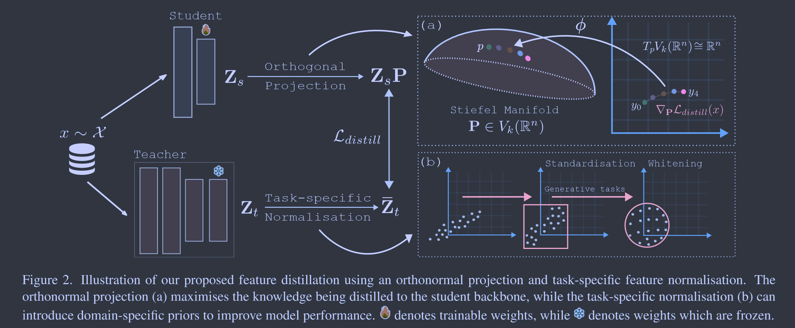
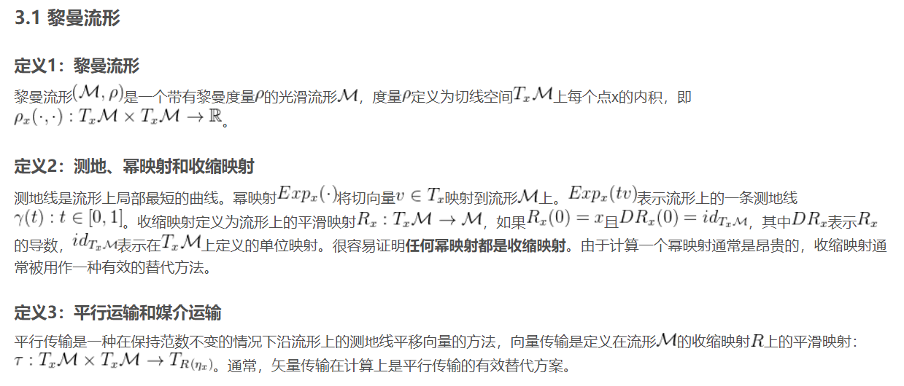
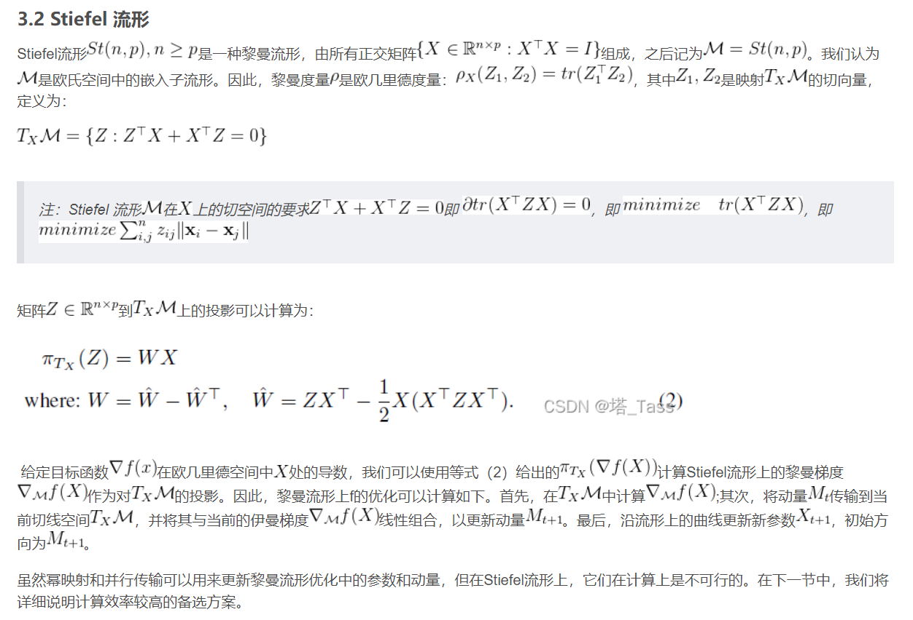
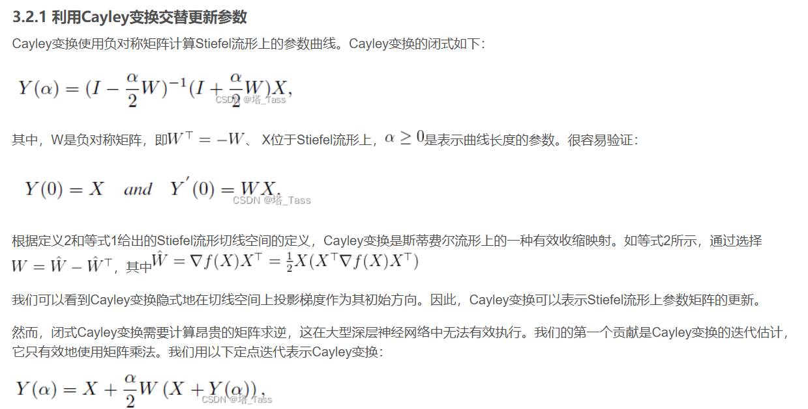
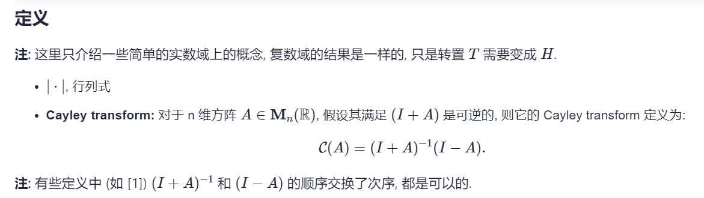
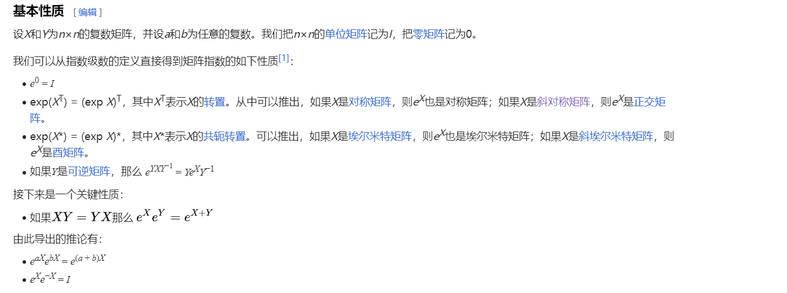
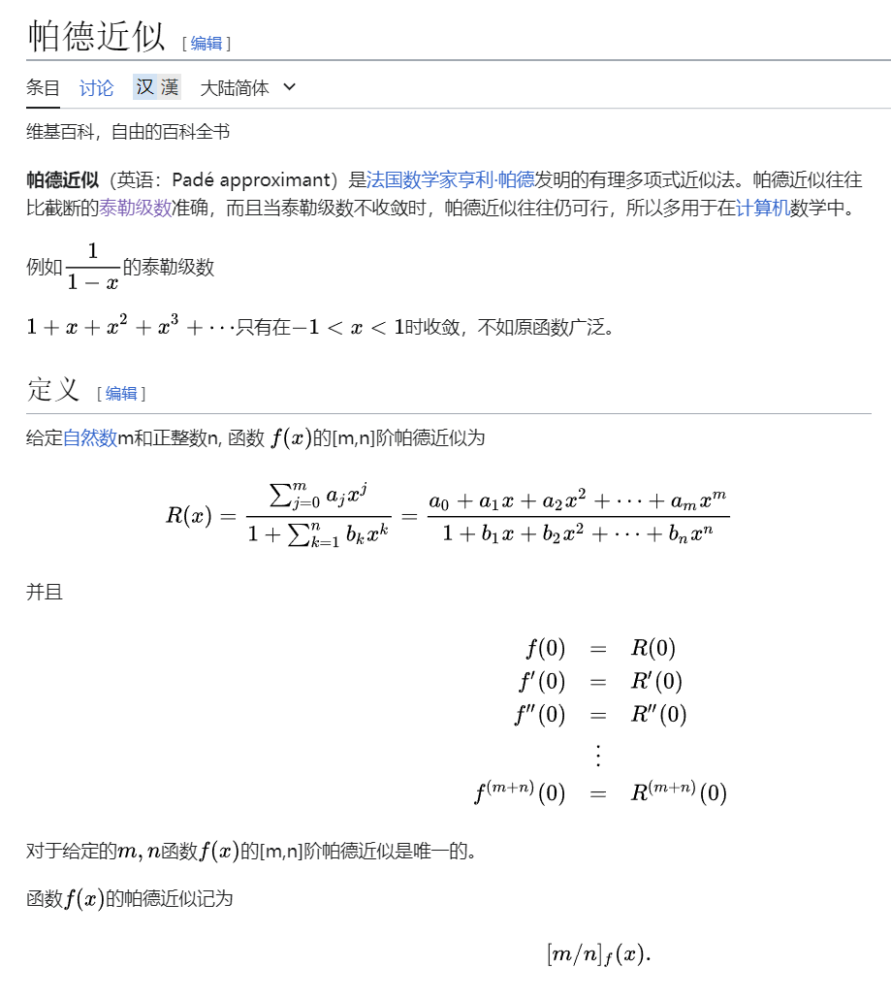
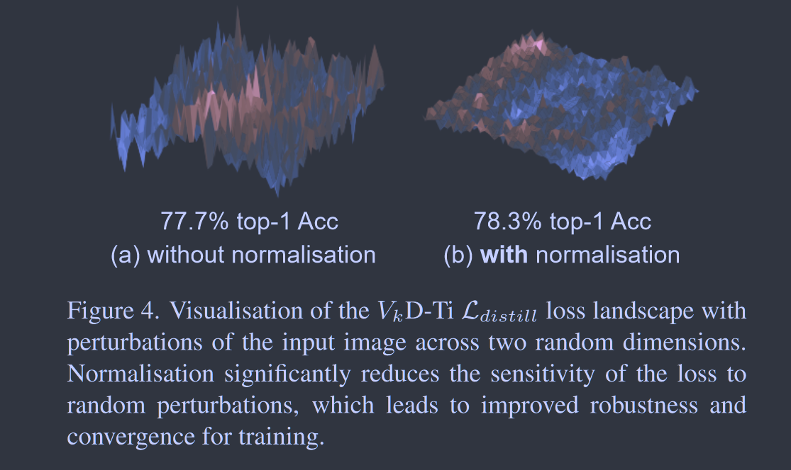

# $V_kD$：Improving Knowledge Distillation using Orthogonal Projections

[CVPR 2024](https://arxiv.org/abs/2403.06213)	[code in github](https://github.com/roymiles/vkd)	MS-COCO  CIFAR100  ImageNet	20240510

Roy Miles, Ismail Elezi, Jiankang Deng

**这项工作涉及到大量的优化理论和数学基础**

这项工作专注于高效的转移知识，提出一个正交投影层使其能够最大限度的将蒸馏知识传递给学生模型，并且针对生成性的工作添加的辅助损失，这项工作认为这些辅助损失会损害蒸馏的性能，提出对教师模型特征进行白化来为这些生成性的任务增加多样性特征，从而避免引入额外损失来损害KD的性能。

## Introduction

这项工作认为传统蒸馏会使蒸馏受限，只适用于特定的模态或任务。这项工作提出一个投影层，核心想法是保留批次内特征的相似性。如果保留特征之间的相似性，投影层不会改变底层的学生改变，这种约束能够最大限度的将知识提取到学生骨干中。

蒸馏损失应用于一个生成性的人物一个常用操作是添加一个额外的辅助损失，这些损失能鼓励多样特征的产生，但是这些损失往往于蒸馏目标相冲突从而降低学生的性能。我们提出一个标准化的步骤将这些辅助目标纳入到蒸馏损失本身，简单的对教师特征进行白化能够有效的鼓励特征的多样性。

> 我们提出一个正交投影层，来最大限度的将提炼的知识传递给学生模型
>
> 使用任务规范化来补充特征知识，使其可以在生成性任务中实现知识蒸馏

## Method

尽管特征蒸馏具有一般性，但其使用往往与许多设计决策和启发式方法相耦合，这些决策来自于中间特征图之间的多重损失的构建，这些损失会带来显著且不必要的训练开销。

### Why use orthogonal projections?

我们的主要目标是减少投影层学习任何不由特征提取器共享的数据的新表示，因为投影层在训练之后就被丢弃了。我们提出通过投影来保留结构信息，我们用一个和$K\in\R^{b\times b}$来描绘这种结构信息，b为批次大小。该核矩阵捕捉了批次内所有特征之间的成对相似度：
$$
K_{ij} = k(Z^s_i, Z^s_j) = \lang Z^s_i, Z^s_j\rang_H
$$
H表示由正定实值核k隐式定义的某个希尔伯特空间，$Z_s\in\R^{b\times d_s}$为ds维的学生特征，我们的目的是利用K的参数的线性变换来保持K，这相当于保持了特征的结构信息。我们可以用泰勒级数展开表示许多核：
$$
 k(Z^s_i, Z^s_j) = \sum^\infty_{n=0}a_n\lang Z^s_i, Z^s_j\rang^n
$$
其中an为系数，这个表达式表明，我们只需要保持内积的变换P，利用在$\R^{d_s}$的标准内积可以得到对P的这个约束：
$$
Z^s_i(Z^s_j)^T = Z^s_iP(Z^s_jP)^T=Z^s_iPP^T(Z^s_j)^T
$$
等式成立需要$P^T = P^{-1}$，这个约束定义了特殊正交群$SO(d_s)$，其中$d_s=d_t$，该组参数化了$\R^{d_s}$中所有旋转的集合，非常自然和直观的保留了结构信息的思想，然而当$d_s\neq d_t$时P不是方阵，不存在正交矩阵使之约束成立。在矩阵的广义逆理论中，右逆矩阵定义了具有正交行的矩阵集合，左逆矩阵定义了具有正交列的矩阵集合，由于需要进行有效的参数化，我们使用右逆矩阵，其转置可以表示为施蒂费尔矩阵流形(Stiefel matrix manifold)表示为$V_{d_t}(\R^{d_s})$，由于Stiefel流形是光滑的可以使用重参数化技术来使用标准的梯度下降（从欧氏空间映射到stiefel流形的满射函数）

> 
>
> 
>
> 

### Orthogonal Reparameterisation

为了保证投影矩阵P的正交性，方法之一是使用Cayley变换，由反对称矩阵构造正交矩阵：$P=(I-W)(I+W)^{-1}, W = -W^T$，但是这种方法需要大量计算矩阵逆或是QR分解使用昂贵的迭代算法，因此我们提出一个方法来避免任何昂贵的矩阵求逆或是因式分解。

> Cayley变换：
>
> 

我们建议改为使用矩阵指数exp(*A*) 对𝑆𝑂(𝑑𝑡)进行廉价参数化映射，这可以使用帕得逼近的方式高效地实现。因为W是反对称的，exp(W)为正交矩阵：
$$
exp(W)·exp(W)^T=exp(W+W^T) = exp(-W^T+W^T)=exp(0) = I
$$

> 矩阵指数的性质
>
> 

> 

我们删除最后的dt-ds行，投影回$V_{d_t}(\R^{d_s})$，即：
$$
\phi:W \stackrel{exp(W)}{\longrightarrow} A\in SO(d_t) \stackrel{A_{:d_s}}{\longrightarrow}P\in V_{d_t}(\R^{d_s})
$$
正交变换确保投影特征$Z^sP$不仅是原始特征的线性组合，而且是保持特征见距离的变换，从几何意义上讲，这意味着投影在任何一个维度上都不会被挤压或扭曲，正交投影保留了底层特征流形

### Introducing Domain-Specific Priors

许多任务需要调用特定领域的先验知识或辅助损失来提高模型性能，但这些辅助损失中许多与蒸馏目标相冲突，我们提出一个通用的正规化框架将这些先验知识纳入蒸馏目标本身，我们认为白化操作是生成任务的关键步骤，提供了多样化特征的隐式鼓励，且白化比引入额外辅助损失更有效且廉价。

#### Standardisation improves model convergence.

我们发现对教师表示的简单归一化处理可以显著提高蒸馏损失对图像的虚假变形的鲁棒性，这些虚假变形往往来自于数据增强策略。最小化该损失方差可以显著提升模型整体的收敛性和性能。

#### Whitening improves feature diversity.

通过对教师特征进行白化，我们得到了一个类似于多样性损失的下界，我们分析$Z_sP\in\R^{b\times d}, Z_t\in\R^{b\times d}$，由于P为正交矩阵具有保范性，分析时省略：
$$
\begin{aligned}
\mathcal{L}_{distill} &= ||Z^s-Z^t||^2 = \sum_{i\neq j}||Z^s_{:,j} - Z^t_{:,i} - Z^t_{:,j} + Z^t_{:,i}||^2 \\
&= \sum_{i\neq j}||Z^s_{:,j} - Z^t_{:,i}||^2 + ||Z^t_{:,j} + Z^t_{:,i}||^2 - 2\lang Z^s_{:,j} - Z^t_{:,i}, Z^t_{:,j} + Z^t_{:,i}\rang
\end{aligned}
$$
由于$Z^t$被白化因此($Z^t)^T(Z^T)=1$，即特征完全去相关：
$$
\begin{aligned}
\mathcal{L}_{distill} 
&= \sum_{i\neq j}||Z^s_{:,j} - Z^t_{:,i}||^2 + 2 - 2\lang Z^s_{:,j} - Z^t_{:,i}, Z^t_{:,j} + Z^t_{:,i}\rang \\
&\geq \sum_{i\neq j}||Z^s_{:,j} - Z^t_{:,i}||^2 + 2 - 2||Z^s_{:,j} - Z^t_{:,i}||^2 ||Z^t_{:,j} + Z^t_{:,i}||^2\  (Cauchy–Schwarz \ inequality) \\
&= const-\lambda\sum_{i\neq j}C^2_{j, i}\ \  where\ C_{i, j}=||Z^s_{:,j} - Z^t_{:,i}||
\end{aligned}
$$
其中const和$\lambda\geq3$均独立于模型参数。C为欧几里得交叉相关矩阵，捕捉了所有学生和教师特征对之间的距离

在对教师特征进行白化约束的情况下，最小化L2损失提供了一个特征关联目标，这个关联目标最大化了交叉相关矩阵中非对角线元素，从而鼓励所有特征相对于教师去相关。
