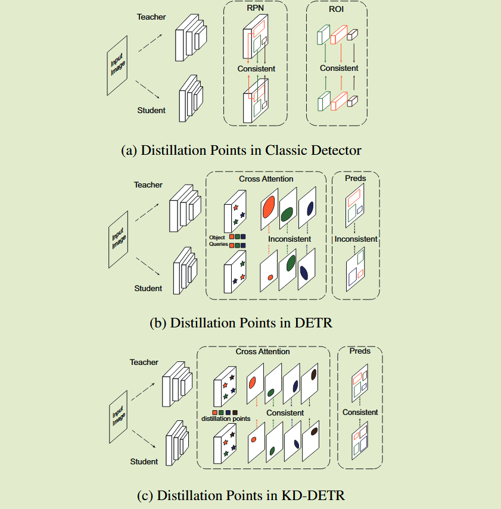
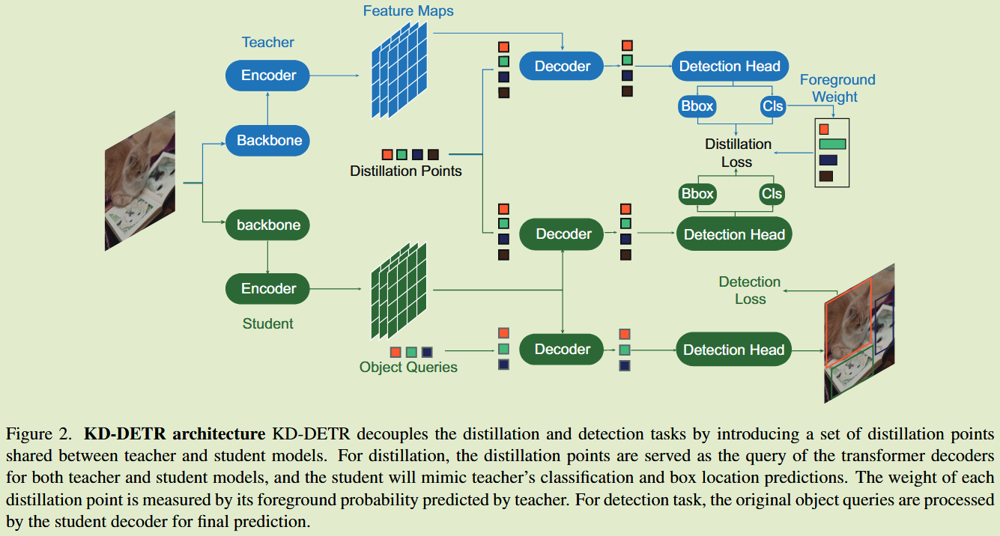

# KD-DETR: Knowledge Distillation for Detection Transformer with Consistent Distillation Points Sampling

**[CVPR 2024](https://openaccess.thecvf.com/content/CVPR2024/html/Wang_KD-DETR_Knowledge_Distillation_for_Detection_Transformer_with_Consistent_Distillation_Points_CVPR_2024_paper.html)	no code	MS COCO	20240924**	知识结构  构造一致蒸馏点

*Yu Wang, Xin Li, Shengzhao Weng, Gang Zhang, Haixiao Yue, Haocheng Feng, Junyu Han, Errui Ding*

本文针对目标检测DERT模型的蒸馏，经典的蒸馏算法大多是基于CNN涉及的，扩展到DERT的目标检测任务上会有蒸馏点不一致的问题，本文针对这一猜想进行了实验验证，提出了通用采样和结合教师查询的具体采样来获得足够的一致性蒸馏点来进行学生模型的学习，并且提出了前景背景权重重分类来降低背景对于检测结果的影响。

## Introduction

DERT有出色的模型性能，但不算增长的模型规模使其难以部署到计算资源有限的边缘应用上，先前工作主要集中在设计高效的DERT框架，减少交叉注意力模块中使用编码器token数量来降低计算开销，以及用RPN中密集先验知识来缩小编码器层。

我们专注于通过知识蒸馏来压缩大规模DERT模型，现在的知识蒸馏大多是基于CNN检测器设计的，将其扩展到DERT的研究有限，我们从经典的logit蒸馏进行切入，研究DERT中的关键点特征，我们发现与经典的蒸馏算法相比，DERT的蒸馏只包含较少的一致蒸馏点。

我们用蒸馏点模拟预测的相应输入，师生模型之间保持一致的丰富的蒸馏点对于有效的蒸馏至关重要，因此**如何获得DERT蒸馏一致且足够的蒸馏点至关重要**。我们提出一种基于一致性蒸馏点采样的DERT通用知识蒸馏范式。

## Method

#### DERT

编码器将来自主干特征图的像素特征作为多头注意力输入来提取上下文特征$X\in \R^{HW \times D}$, 其中HW表示特征图的分别率，D表示特征维度，解码器将编码器的特征和一组可学习的对象查询$Q = \{q_i \in \R^D | i=1, ..., N\}$，N表示查询个数。

每个查询对象都是描述某个实例的抽象特征，通过交叉注意力对编码器的特征进行探测和池化，对类别$C = \{c_i \in \R^K | i=1, ..., N \}$和位置$B = \{ b_i = (bx_i, by_i, bw_i, bh_i)|i=1, ..., N \}$进行预测，K表示类别数，最后使用**匈牙利算法**在真是数据和目标查询的预测数据之间找到一个二分匹配

#### Consistent Distillation Points   一致蒸馏点

我们将知识蒸馏的核心解释为将学生和教师的映射函数与一组蒸馏点相匹配，蒸馏点是指预测结果对应的输入x，$y = f(x)$，f表示模型，教师和学生之间的蒸馏点应该在数量上保持足够和一致来进行有效的匹配，然而DERT蒸馏的困难之一就是缺乏一致的蒸馏点。

#### Distillation with Inconsistent Distillation Points	通过不一致的蒸馏点蒸馏

我们进行了相关实验，发现不一致的蒸馏点会导致在教师模型知识不可靠时，学生模型性能严重下降。

#### KD-DERT

为了解决缺乏一致蒸馏点的问题，提出KD-DERT框架，KD-DERT引入一组教师和学生模型之间共享的特殊对象$\tilde{q}$来构造蒸馏点，将蒸馏任务和检测任务解耦，KD-DERT可以提供充足且一致的蒸馏点，原始蒸馏点和采样蒸馏点分别表示为：$x = \{I, q\}, \tilde{x} = \{I, \tilde{q}\}$

对于检测任务，首先利用学生模型的原始检测任务对其进行优化，将原始数据x输入到学生模型中进行类别和框位置预测，并将其赋给真值进行二分匹配，计算损失$L_{det}$.

对于蒸馏任务，采样的蒸馏点$\tilde{x}$将被输入到学生和教师模型中，进行类别和位置的预测：
$$
c^s, b^s = f^s(I, \tilde{q}) \\
c^t, b^t = f^t(I, \tilde{q})
$$
$f^t, f^s$分别表示教师模型和学生模型。
$$
L_{distill} = \sum^M_{i=1}[\lambda_{cls}L_{KD}(\hat{c}^t_i || \hat{c}^s_i) + \lambda_{L_1}L_{L_1}(b^s_i, b^t_i) + \lambda_{GIoU}L_{GIoU}(b^s_i, b^t_i)]
$$
M表示蒸馏点数，总体损失损失表示为：
$$
L = L_{distill} + L_{det}
$$

#### Distillation Points Sampling  蒸馏点采样

现有工作将对象查询理解为锚点或参考点，揭示每个对象查询都对特征图上特定区域敏感，我们将蒸馏点采样提供了一种从一般到特殊的综合采样策略：$\tilde{q} = \{ q_g, q_s\}$

##### 随机初始化的一般采样

我们希望通过对整个特征图的稀疏扫描来探测教师对特征不同位置的反应，因此我们在均匀分布上随机初始化一组对象查询来构建通用蒸馏点，为了获得更多通用知识，我们在每一轮都重新采样。

##### 结合教师查询进行具体采样

聚焦于教师模型关注较多的区域，采样直接重用教师模型的查询，当教师模型被学习以更加专注于这些目标查询，这些区域的预测将会更加精确和丰富。

##### 前景权重平衡

前景背景不平衡是目标检测蒸馏中的一个关键问题，我们将分类分数较高的点视为前景点，包含更多对检测有用的信息：
$$
w_i = \underset{c\in[0, K]}{max}p^t(y_c|q_i)
$$
$p^t(y_c|q_i)$表示教师模型预测qi被分到类别c的概率，wi表示qi的前景再平衡权重，损失函数改写为：
$$
L_{distill} = \sum^M_{i=1}w_i[\lambda_{cls}L_{KD}(\hat{c}^t_i || \hat{c}^s_i) + \lambda_{L_1}L_{L_1}(b^s_i, b^t_i) + \lambda_{GIoU}L_{GIoU}(b^s_i, b^t_i)]
$$
CNN检测器中的锚点和DETR中的对象查询都表示图像上的某些位置，具有空间一致性。因此我们还将该方法推广到CNN于DERT之间的蒸馏上。